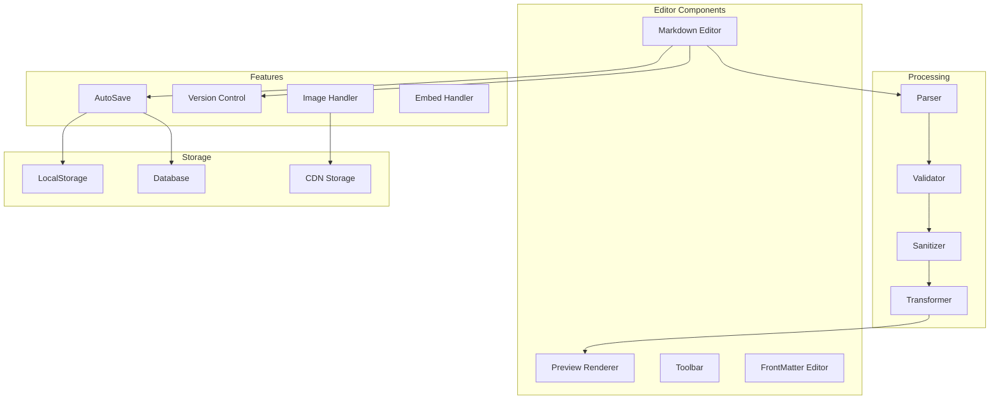
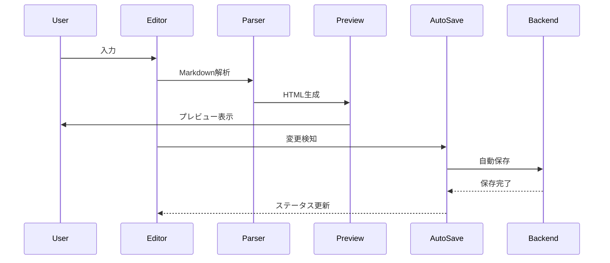

# 記事作成・編集システム設計書

## 1. 概要

### 1.1 目的
Zennクローンにおける記事・書籍・スクラップの作成、編集、公開システムの完全な設計を定義し、優れた執筆体験を提供する。

### 1.2 スコープ
- Markdownエディター実装
- リアルタイムプレビュー
- フロントマター管理
- 画像・ファイルアップロード
- 自動保存・下書き管理
- バージョン管理
- 記事テンプレート
- 公開・非公開設定

### 1.3 対応コンテンツタイプ
- **記事 (Articles)**: テック記事、アイデア記事
- **書籍 (Books)**: チャプター形式の長文コンテンツ
- **スクラップ (Scraps)**: ディスカッション形式の短文

## 2. エディターアーキテクチャ

### 2.1 システム構成



### 2.2 データフロー



## 3. Markdownエディター実装

### 3.1 エディターコンポーネント

```tsx
// components/Editor/MarkdownEditor.tsx
import React, { useCallback, useEffect, useRef, useState } from 'react';
import CodeMirror from '@codemirror/view';
import { markdown } from '@codemirror/lang-markdown';
import { oneDark } from '@codemirror/theme-one-dark';
import { EditorView, keymap } from '@codemirror/view';
import { defaultKeymap } from '@codemirror/commands';
import { 
  autocompletion, 
  completionKeymap,
  CompletionContext 
} from '@codemirror/autocomplete';

interface MarkdownEditorProps {
  initialValue?: string;
  onChange?: (value: string) => void;
  onSave?: (value: string) => void;
  placeholder?: string;
  theme?: 'light' | 'dark';
  readOnly?: boolean;
}

export const MarkdownEditor: React.FC<MarkdownEditorProps> = ({
  initialValue = '',
  onChange,
  onSave,
  placeholder = '記事を書き始めましょう...',
  theme = 'light',
  readOnly = false,
}) => {
  const editorRef = useRef<HTMLDivElement>(null);
  const viewRef = useRef<EditorView>();
  const [value, setValue] = useState(initialValue);

  // エディター拡張機能
  const extensions = [
    markdown(),
    keymap.of([
      ...defaultKeymap,
      ...completionKeymap,
      {
        key: 'Ctrl-s',
        mac: 'Cmd-s',
        run: () => {
          if (onSave) {
            onSave(viewRef.current?.state.doc.toString() || '');
            return true;
          }
          return false;
        },
      },
    ]),
    autocompletion({
      override: [zennCompletions],
    }),
    EditorView.updateListener.of((update) => {
      if (update.docChanged) {
        const value = update.state.doc.toString();
        setValue(value);
        onChange?.(value);
      }
    }),
    theme === 'dark' ? oneDark : [],
    EditorView.theme({
      '&': {
        fontSize: '16px',
        fontFamily: 'Monaco, Menlo, monospace',
      },
      '.cm-content': {
        padding: '16px',
        minHeight: '500px',
      },
      '.cm-focused .cm-cursor': {
        borderLeftColor: '#2563eb',
      },
      '.cm-line': {
        lineHeight: '1.8',
      },
    }),
  ];

  useEffect(() => {
    if (editorRef.current && !viewRef.current) {
      viewRef.current = new EditorView({
        doc: initialValue,
        extensions,
        parent: editorRef.current,
      });
    }

    return () => {
      viewRef.current?.destroy();
    };
  }, []);

  return (
    <div className="markdown-editor">
      <EditorToolbar 
        onInsert={(text) => insertText(viewRef.current!, text)}
        onFormat={(format) => applyFormat(viewRef.current!, format)}
      />
      <div ref={editorRef} className="editor-content" />
      <EditorStatusBar 
        characterCount={value.length}
        wordCount={countWords(value)}
        lineCount={value.split('\n').length}
      />
    </div>
  );
};

// Zenn専用のオートコンプリート
function zennCompletions(context: CompletionContext) {
  const word = context.matchBefore(/\w*/);
  if (!word || (word.from === word.to && !context.explicit)) return null;

  return {
    from: word.from,
    options: [
      { label: '```', apply: '```\n\n```', detail: 'コードブロック' },
      { label: ':::message', apply: ':::message\n\n:::', detail: 'メッセージ' },
      { label: ':::message alert', apply: ':::message alert\n\n:::', detail: 'アラート' },
      { label: ':::details', apply: ':::details タイトル\n\n:::', detail: '詳細' },
      { label: '@[card]', apply: '@[card](URL)', detail: 'カード埋め込み' },
      { label: '@[tweet]', apply: '@[tweet](URL)', detail: 'ツイート埋め込み' },
      { label: '@[youtube]', apply: '@[youtube](VIDEO_ID)', detail: 'YouTube埋め込み' },
      { label: '@[slideshare]', apply: '@[slideshare](KEY)', detail: 'SlideShare埋め込み' },
      { label: '@[speakerdeck]', apply: '@[speakerdeck](ID)', detail: 'Speaker Deck埋め込み' },
      { label: '@[jsfiddle]', apply: '@[jsfiddle](URL)', detail: 'JSFiddle埋め込み' },
      { label: '@[codepen]', apply: '@[codepen](URL)', detail: 'CodePen埋め込み' },
      { label: '@[codesandbox]', apply: '@[codesandbox](ID)', detail: 'CodeSandbox埋め込み' },
      { label: '@[stackblitz]', apply: '@[stackblitz](ID)', detail: 'StackBlitz埋め込み' },
      { label: '@[figma]', apply: '@[figma](URL)', detail: 'Figma埋め込み' },
    ],
  };
}
```

### 3.2 エディターツールバー

```tsx
// components/Editor/EditorToolbar.tsx
import React from 'react';
import {
  Bold,
  Italic,
  Code,
  Link,
  Image,
  List,
  ListOrdered,
  Quote,
  Minus,
  Table,
  FileText,
  Eye,
  Save,
  Settings,
} from 'lucide-react';

interface EditorToolbarProps {
  onInsert: (text: string) => void;
  onFormat: (format: string) => void;
}

export const EditorToolbar: React.FC<EditorToolbarProps> = ({
  onInsert,
  onFormat,
}) => {
  const tools = [
    { icon: Bold, label: '太字', action: () => onFormat('bold') },
    { icon: Italic, label: '斜体', action: () => onFormat('italic') },
    { icon: Code, label: 'コード', action: () => onFormat('code') },
    { type: 'separator' },
    { icon: Link, label: 'リンク', action: () => onInsert('[](url)') },
    { icon: Image, label: '画像', action: () => onInsert('') },
    { type: 'separator' },
    { icon: List, label: '箇条書き', action: () => onInsert('- ') },
    { icon: ListOrdered, label: '番号付きリスト', action: () => onInsert('1. ') },
    { icon: Quote, label: '引用', action: () => onInsert('> ') },
    { icon: Minus, label: '水平線', action: () => onInsert('---\n') },
    { icon: Table, label: 'テーブル', action: () => insertTable() },
  ];

  const insertTable = () => {
    const table = `| Header 1 | Header 2 |
|----------|----------|
| Cell 1   | Cell 2   |`;
    onInsert(table);
  };

  return (
    <div className="editor-toolbar">
      {tools.map((tool, index) => {
        if (tool.type === 'separator') {
          return <div key={index} className="toolbar-separator" />;
        }
        
        const Icon = tool.icon;
        return (
          <button
            key={index}
            onClick={tool.action}
            className="toolbar-button"
            title={tool.label}
          >
            <Icon size={18} />
          </button>
        );
      })}
      
      <div className="toolbar-spacer" />
      
      <button className="toolbar-button" title="プレビュー">
        <Eye size={18} />
      </button>
      <button className="toolbar-button" title="保存">
        <Save size={18} />
      </button>
      <button className="toolbar-button" title="設定">
        <Settings size={18} />
      </button>
    </div>
  );
};
```

### 3.3 Zenn記法サポート

```typescript
// utils/zenn-markdown.ts

export interface ZennEmbed {
  type: string;
  url: string;
  id?: string;
}

export class ZennMarkdownProcessor {
  // Zenn独自記法の処理
  processZennSyntax(markdown: string): string {
    let processed = markdown;
    
    // メッセージブロック
    processed = this.processMessageBlocks(processed);
    
    // 詳細ブロック
    processed = this.processDetailsBlocks(processed);
    
    // 埋め込み記法
    processed = this.processEmbeds(processed);
    
    // 脚注
    processed = this.processFootnotes(processed);
    
    // 数式
    processed = this.processMathExpressions(processed);
    
    return processed;
  }

  private processMessageBlocks(markdown: string): string {
    const messageRegex = /:::message(\s+alert)?\n([\s\S]*?)\n:::/g;
    
    return markdown.replace(messageRegex, (match, alert, content) => {
      const className = alert ? 'message-alert' : 'message';
      return `<div class="${className}">${this.parseMarkdown(content)}</div>`;
    });
  }

  private processDetailsBlocks(markdown: string): string {
    const detailsRegex = /:::details\s+(.+)\n([\s\S]*?)\n:::/g;
    
    return markdown.replace(detailsRegex, (match, title, content) => {
      return `<details>
        <summary>${title}</summary>
        ${this.parseMarkdown(content)}
      </details>`;
    });
  }

  private processEmbeds(markdown: string): string {
    const embedRegex = /@\[(\w+)\]\(([^)]+)\)/g;
    
    return markdown.replace(embedRegex, (match, type, param) => {
      return this.generateEmbed(type, param);
    });
  }

  private generateEmbed(type: string, param: string): string {
    switch (type) {
      case 'card':
        return `<div class="link-card" data-url="${param}"></div>`;
      
      case 'tweet':
        return `<div class="twitter-embed" data-url="${param}"></div>`;
      
      case 'youtube':
        return `<div class="youtube-embed">
          <iframe src="https://www.youtube.com/embed/${param}" 
            frameborder="0" allowfullscreen></iframe>
        </div>`;
      
      case 'codepen':
        return `<div class="codepen-embed" data-url="${param}"></div>`;
      
      case 'codesandbox':
        return `<iframe src="https://codesandbox.io/embed/${param}" 
          class="codesandbox-embed"></iframe>`;
      
      case 'stackblitz':
        return `<iframe src="https://stackblitz.com/edit/${param}?embed=1" 
          class="stackblitz-embed"></iframe>`;
      
      case 'figma':
        return `<iframe src="${param}" class="figma-embed"></iframe>`;
      
      default:
        return match;
    }
  }

  private processFootnotes(markdown: string): string {
    const footnoteDefRegex = /\[\^(\d+)\]:\s+(.+)/g;
    const footnoteRefRegex = /\[\^(\d+)\]/g;
    
    const footnotes: Map<string, string> = new Map();
    
    // 脚注定義を収集
    markdown = markdown.replace(footnoteDefRegex, (match, id, text) => {
      footnotes.set(id, text);
      return '';
    });
    
    // 脚注参照を置換
    markdown = markdown.replace(footnoteRefRegex, (match, id) => {
      const text = footnotes.get(id);
      if (text) {
        return `<sup><a href="#fn-${id}" id="fnref-${id}">${id}</a></sup>`;
      }
      return match;
    });
    
    // 脚注リストを追加
    if (footnotes.size > 0) {
      let footnotesList = '<div class="footnotes"><ol>';
      footnotes.forEach((text, id) => {
        footnotesList += `<li id="fn-${id}">${text} 
          <a href="#fnref-${id}">↩</a></li>`;
      });
      footnotesList += '</ol></div>';
      markdown += '\n' + footnotesList;
    }
    
    return markdown;
  }

  private processMathExpressions(markdown: string): string {
    // インライン数式
    markdown = markdown.replace(/\$([^$]+)\$/g, (match, expr) => {
      return `<span class="math-inline" data-expr="${expr}"></span>`;
    });
    
    // ブロック数式
    markdown = markdown.replace(/\$\$\n([\s\S]+?)\n\$\$/g, (match, expr) => {
      return `<div class="math-block" data-expr="${expr}"></div>`;
    });
    
    return markdown;
  }

  private parseMarkdown(content: string): string {
    // 基本的なMarkdown処理（実際にはmarked.jsなどを使用）
    return content;
  }
}
```

## 4. フロントマター管理

### 4.1 フロントマター定義

```yaml
# 記事のフロントマター例
---
title: "Next.js 13のApp Routerを完全理解する"
emoji: "🚀"
type: "tech" # tech or idea
topics: ["nextjs", "react", "typescript", "webdev"]
published: true
published_at: "2024-01-15 09:00"
publication_name: "my_publication" # Publication投稿の場合
---
```

### 4.2 フロントマターエディター

```tsx
// components/Editor/FrontMatterEditor.tsx
import React, { useState } from 'react';
import { Calendar, Hash, Smile, Eye, EyeOff } from 'lucide-react';
import { EmojiPicker } from './EmojiPicker';
import { TagSelector } from './TagSelector';

interface FrontMatter {
  title: string;
  emoji?: string;
  type: 'tech' | 'idea';
  topics: string[];
  published: boolean;
  published_at?: string;
  publication_name?: string;
}

interface FrontMatterEditorProps {
  frontMatter: FrontMatter;
  onChange: (frontMatter: FrontMatter) => void;
}

export const FrontMatterEditor: React.FC<FrontMatterEditorProps> = ({
  frontMatter,
  onChange,
}) => {
  const [showEmojiPicker, setShowEmojiPicker] = useState(false);
  const [showScheduler, setShowScheduler] = useState(false);

  const updateField = (field: keyof FrontMatter, value: any) => {
    onChange({
      ...frontMatter,
      [field]: value,
    });
  };

  return (
    <div className="frontmatter-editor">
      <div className="form-group">
        <label htmlFor="title">タイトル</label>
        <input
          id="title"
          type="text"
          value={frontMatter.title}
          onChange={(e) => updateField('title', e.target.value)}
          placeholder="記事のタイトル"
          maxLength={100}
          className="input-title"
        />
        <span className="char-count">
          {frontMatter.title.length}/100
        </span>
      </div>

      <div className="form-row">
        <div className="form-group">
          <label>アイコン絵文字</label>
          <button
            onClick={() => setShowEmojiPicker(!showEmojiPicker)}
            className="emoji-button"
          >
            {frontMatter.emoji || <Smile size={20} />}
          </button>
          {showEmojiPicker && (
            <EmojiPicker
              onSelect={(emoji) => {
                updateField('emoji', emoji);
                setShowEmojiPicker(false);
              }}
              onClose={() => setShowEmojiPicker(false)}
            />
          )}
        </div>

        <div className="form-group">
          <label>記事タイプ</label>
          <div className="radio-group">
            <label className="radio-label">
              <input
                type="radio"
                value="tech"
                checked={frontMatter.type === 'tech'}
                onChange={(e) => updateField('type', e.target.value)}
              />
              Tech
            </label>
            <label className="radio-label">
              <input
                type="radio"
                value="idea"
                checked={frontMatter.type === 'idea'}
                onChange={(e) => updateField('type', e.target.value)}
              />
              Idea
            </label>
          </div>
        </div>
      </div>

      <div className="form-group">
        <label>
          <Hash size={16} />
          トピック（最大5つ）
        </label>
        <TagSelector
          tags={frontMatter.topics}
          onChange={(topics) => updateField('topics', topics)}
          maxTags={5}
          suggestions={popularTopics}
        />
      </div>

      <div className="form-group">
        <label>公開設定</label>
        <div className="publish-controls">
          <button
            onClick={() => updateField('published', !frontMatter.published)}
            className={`publish-toggle ${frontMatter.published ? 'published' : 'draft'}`}
          >
            {frontMatter.published ? (
              <>
                <Eye size={16} />
                公開中
              </>
            ) : (
              <>
                <EyeOff size={16} />
                下書き
              </>
            )}
          </button>

          {frontMatter.published && (
            <button
              onClick={() => setShowScheduler(!showScheduler)}
              className="schedule-button"
            >
              <Calendar size={16} />
              予約投稿
            </button>
          )}
        </div>

        {showScheduler && (
          <div className="schedule-picker">
            <input
              type="datetime-local"
              value={frontMatter.published_at || ''}
              onChange={(e) => updateField('published_at', e.target.value)}
              min={new Date().toISOString().slice(0, 16)}
            />
          </div>
        )}
      </div>

      <div className="form-group">
        <label>Publication（任意）</label>
        <select
          value={frontMatter.publication_name || ''}
          onChange={(e) => updateField('publication_name', e.target.value)}
        >
          <option value="">個人で投稿</option>
          <option value="my_publication">My Publication</option>
        </select>
      </div>
    </div>
  );
};

const popularTopics = [
  'javascript',
  'typescript',
  'react',
  'nextjs',
  'vue',
  'nodejs',
  'python',
  'go',
  'rust',
  'aws',
  'docker',
  'kubernetes',
  'terraform',
  'git',
  'github',
];
```

## 5. プレビューシステム

### 5.1 リアルタイムプレビュー

```tsx
// components/Editor/PreviewPane.tsx
import React, { useEffect, useState } from 'react';
import { marked } from 'marked';
import hljs from 'highlight.js';
import DOMPurify from 'dompurify';
import { ZennMarkdownProcessor } from '@/utils/zenn-markdown';

interface PreviewPaneProps {
  markdown: string;
  frontMatter?: any;
  theme?: 'light' | 'dark';
}

export const PreviewPane: React.FC<PreviewPaneProps> = ({
  markdown,
  frontMatter,
  theme = 'light',
}) => {
  const [html, setHtml] = useState('');
  const processor = new ZennMarkdownProcessor();

  useEffect(() => {
    const renderMarkdown = async () => {
      // Markdownレンダリング設定
      marked.setOptions({
        highlight: (code, lang) => {
          const language = hljs.getLanguage(lang) ? lang : 'plaintext';
          return hljs.highlight(code, { language }).value;
        },
        breaks: true,
        gfm: true,
        headerIds: true,
        mangle: false,
      });

      // Zenn記法の処理
      let processed = processor.processZennSyntax(markdown);
      
      // Markdownをパース
      let rendered = marked(processed);
      
      // サニタイズ
      rendered = DOMPurify.sanitize(rendered, {
        ADD_TAGS: ['iframe', 'details', 'summary'],
        ADD_ATTR: ['target', 'rel', 'frameborder', 'allowfullscreen'],
      });

      setHtml(rendered);
      
      // 埋め込みコンテンツの遅延読み込み
      setTimeout(() => {
        loadEmbeds();
      }, 100);
    };

    renderMarkdown();
  }, [markdown]);

  const loadEmbeds = () => {
    // Twitter埋め込み
    const twitterEmbeds = document.querySelectorAll('.twitter-embed');
    twitterEmbeds.forEach(embed => {
      const url = embed.getAttribute('data-url');
      if (url && window.twttr) {
        window.twttr.widgets.createTweet(
          url.split('/').pop(),
          embed as HTMLElement
        );
      }
    });

    // リンクカード生成
    const linkCards = document.querySelectorAll('.link-card');
    linkCards.forEach(async (card) => {
      const url = card.getAttribute('data-url');
      if (url) {
        const metadata = await fetchOGPData(url);
        renderLinkCard(card as HTMLElement, metadata);
      }
    });

    // MathJax数式レンダリング
    if (window.MathJax) {
      window.MathJax.typesetPromise();
    }
  };

  return (
    <div className={`preview-pane ${theme}`}>
      {frontMatter && (
        <div className="preview-header">
          {frontMatter.emoji && (
            <span className="preview-emoji">{frontMatter.emoji}</span>
          )}
          <h1 className="preview-title">{frontMatter.title}</h1>
          <div className="preview-meta">
            <span className="preview-type">{frontMatter.type}</span>
            {frontMatter.topics?.map((topic: string) => (
              <span key={topic} className="preview-topic">
                #{topic}
              </span>
            ))}
          </div>
        </div>
      )}
      
      <div 
        className="preview-content"
        dangerouslySetInnerHTML={{ __html: html }}
      />
    </div>
  );
};

// OGPデータ取得
async function fetchOGPData(url: string) {
  try {
    const response = await fetch(`/api/ogp?url=${encodeURIComponent(url)}`);
    return await response.json();
  } catch (error) {
    return {
      title: url,
      description: '',
      image: '',
    };
  }
}

// リンクカードレンダリング
function renderLinkCard(container: HTMLElement, metadata: any) {
  container.innerHTML = `
    <a href="${metadata.url}" target="_blank" rel="noopener noreferrer" class="link-card-content">
      ${metadata.image ? `` : ''}
      <div class="link-card-info">
        <div class="link-card-title">${metadata.title}</div>
        <div class="link-card-description">${metadata.description}</div>
        <div class="link-card-url">${new URL(metadata.url).hostname}</div>
      </div>
    </a>
  `;
}
```

### 5.2 分割ビューレイアウト

```tsx
// components/Editor/EditorLayout.tsx
import React, { useState } from 'react';
import { MarkdownEditor } from './MarkdownEditor';
import { PreviewPane } from './PreviewPane';
import { FrontMatterEditor } from './FrontMatterEditor';
import { 
  Maximize2, 
  Minimize2, 
  Columns, 
  FileText, 
  Eye,
  Settings 
} from 'lucide-react';

type ViewMode = 'editor' | 'preview' | 'split';

interface EditorLayoutProps {
  article?: any;
  onSave: (article: any) => void;
}

export const EditorLayout: React.FC<EditorLayoutProps> = ({
  article,
  onSave,
}) => {
  const [viewMode, setViewMode] = useState<ViewMode>('split');
  const [showFrontMatter, setShowFrontMatter] = useState(false);
  const [content, setContent] = useState(article?.content || '');
  const [frontMatter, setFrontMatter] = useState(article?.frontMatter || {
    title: '',
    emoji: '',
    type: 'tech',
    topics: [],
    published: false,
  });

  const handleSave = () => {
    onSave({
      ...article,
      content,
      frontMatter,
      updatedAt: new Date(),
    });
  };

  return (
    <div className="editor-layout">
      <div className="editor-header">
        <div className="view-controls">
          <button
            onClick={() => setViewMode('editor')}
            className={`view-button ${viewMode === 'editor' ? 'active' : ''}`}
            title="エディターのみ"
          >
            <FileText size={18} />
          </button>
          <button
            onClick={() => setViewMode('split')}
            className={`view-button ${viewMode === 'split' ? 'active' : ''}`}
            title="分割ビュー"
          >
            <Columns size={18} />
          </button>
          <button
            onClick={() => setViewMode('preview')}
            className={`view-button ${viewMode === 'preview' ? 'active' : ''}`}
            title="プレビューのみ"
          >
            <Eye size={18} />
          </button>
        </div>

        <button
          onClick={() => setShowFrontMatter(!showFrontMatter)}
          className="frontmatter-toggle"
        >
          <Settings size={18} />
          記事設定
        </button>
      </div>

      {showFrontMatter && (
        <div className="frontmatter-panel">
          <FrontMatterEditor
            frontMatter={frontMatter}
            onChange={setFrontMatter}
          />
        </div>
      )}

      <div className={`editor-body view-${viewMode}`}>
        {(viewMode === 'editor' || viewMode === 'split') && (
          <div className="editor-pane">
            <MarkdownEditor
              initialValue={content}
              onChange={setContent}
              onSave={handleSave}
            />
          </div>
        )}

        {(viewMode === 'preview' || viewMode === 'split') && (
          <div className="preview-pane-wrapper">
            <PreviewPane
              markdown={content}
              frontMatter={frontMatter}
            />
          </div>
        )}
      </div>
    </div>
  );
};
```

## 6. 画像アップロード・管理

### 6.1 画像アップローダー

```tsx
// components/Editor/ImageUploader.tsx
import React, { useCallback, useState } from 'react';
import { useDropzone } from 'react-dropzone';
import { Upload, X, Copy, Check } from 'lucide-react';
import { uploadImage, optimizeImage } from '@/services/image.service';

interface ImageUploaderProps {
  onUpload: (url: string) => void;
  onClose: () => void;
}

export const ImageUploader: React.FC<ImageUploaderProps> = ({
  onUpload,
  onClose,
}) => {
  const [uploading, setUploading] = useState(false);
  const [uploadedImages, setUploadedImages] = useState<Array<{
    id: string;
    url: string;
    size: number;
    name: string;
  }>>([]);
  const [copiedId, setCopiedId] = useState<string | null>(null);

  const onDrop = useCallback(async (acceptedFiles: File[]) => {
    setUploading(true);

    try {
      const uploadPromises = acceptedFiles.map(async (file) => {
        // クライアントサイドで画像を最適化
        const optimized = await optimizeImage(file, {
          maxWidth: 1920,
          maxHeight: 1080,
          quality: 0.8,
          format: 'webp',
        });

        // アップロード
        const response = await uploadImage(optimized);
        
        return {
          id: response.id,
          url: response.url,
          size: optimized.size,
          name: file.name,
        };
      });

      const results = await Promise.all(uploadPromises);
      setUploadedImages([...uploadedImages, ...results]);
    } catch (error) {
      console.error('Upload failed:', error);
    } finally {
      setUploading(false);
    }
  }, [uploadedImages]);

  const { getRootProps, getInputProps, isDragActive } = useDropzone({
    onDrop,
    accept: {
      'image/*': ['.png', '.jpg', '.jpeg', '.gif', '.webp', '.svg'],
    },
    maxSize: 10 * 1024 * 1024, // 10MB
    multiple: true,
  });

  const copyToClipboard = async (image: any) => {
    const markdown = ``;
    await navigator.clipboard.writeText(markdown);
    setCopiedId(image.id);
    setTimeout(() => setCopiedId(null), 2000);
  };

  const insertImage = (image: any) => {
    const markdown = ``;
    onUpload(markdown);
    onClose();
  };

  return (
    <div className="image-uploader-modal">
      <div className="modal-content">
        <div className="modal-header">
          <h3>画像のアップロード</h3>
          <button onClick={onClose} className="close-button">
            <X size={20} />
          </button>
        </div>

        <div className="modal-body">
          <div
            {...getRootProps()}
            className={`dropzone ${isDragActive ? 'active' : ''} ${uploading ? 'uploading' : ''}`}
          >
            <input {...getInputProps()} />
            <Upload size={48} />
            <p>
              {isDragActive
                ? 'ドロップして画像をアップロード'
                : 'クリックまたはドラッグ＆ドロップで画像を選択'}
            </p>
            <span className="dropzone-hint">
              PNG, JPG, GIF, WebP, SVG（最大10MB）
            </span>
          </div>

          {uploadedImages.length > 0 && (
            <div className="uploaded-images">
              <h4>アップロード済みの画像</h4>
              <div className="image-grid">
                {uploadedImages.map((image) => (
                  <div key={image.id} className="image-item">
                    
                    <div className="image-info">
                      <span className="image-name">{image.name}</span>
                      <span className="image-size">
                        {(image.size / 1024).toFixed(1)} KB
                      </span>
                    </div>
                    <div className="image-actions">
                      <button
                        onClick={() => copyToClipboard(image)}
                        className="action-button"
                        title="Markdownをコピー"
                      >
                        {copiedId === image.id ? (
                          <Check size={16} />
                        ) : (
                          <Copy size={16} />
                        )}
                      </button>
                      <button
                        onClick={() => insertImage(image)}
                        className="action-button primary"
                      >
                        挿入
                      </button>
                    </div>
                  </div>
                ))}
              </div>
            </div>
          )}
        </div>
      </div>
    </div>
  );
};
```

### 6.2 画像最適化サービス

```typescript
// services/image.service.ts
export class ImageService {
  async uploadImage(file: File | Blob): Promise<{ id: string; url: string }> {
    const formData = new FormData();
    formData.append('image', file);

    const response = await fetch('/api/images/upload', {
      method: 'POST',
      body: formData,
      headers: {
        'Authorization': `Bearer ${getAuthToken()}`,
      },
    });

    if (!response.ok) {
      throw new Error('Image upload failed');
    }

    return await response.json();
  }

  async optimizeImage(
    file: File,
    options: {
      maxWidth?: number;
      maxHeight?: number;
      quality?: number;
      format?: 'jpeg' | 'png' | 'webp';
    }
  ): Promise<Blob> {
    return new Promise((resolve, reject) => {
      const img = new Image();
      const canvas = document.createElement('canvas');
      const ctx = canvas.getContext('2d');

      img.onload = () => {
        // サイズ計算
        let { width, height } = img;
        const { maxWidth = 1920, maxHeight = 1080 } = options;

        if (width > maxWidth || height > maxHeight) {
          const aspectRatio = width / height;
          if (width > height) {
            width = maxWidth;
            height = width / aspectRatio;
          } else {
            height = maxHeight;
            width = height * aspectRatio;
          }
        }

        canvas.width = width;
        canvas.height = height;

        // 描画
        ctx?.drawImage(img, 0, 0, width, height);

        // 出力
        canvas.toBlob(
          (blob) => {
            if (blob) {
              resolve(blob);
            } else {
              reject(new Error('Failed to optimize image'));
            }
          },
          `image/${options.format || 'webp'}`,
          options.quality || 0.8
        );
      };

      img.onerror = reject;
      img.src = URL.createObjectURL(file);
    });
  }

  // ペースト画像の処理
  handlePaste(event: ClipboardEvent): File | null {
    const items = event.clipboardData?.items;
    if (!items) return null;

    for (const item of items) {
      if (item.type.startsWith('image/')) {
        const file = item.getAsFile();
        if (file) {
          return new File([file], `paste-${Date.now()}.png`, {
            type: file.type,
          });
        }
      }
    }

    return null;
  }
}
```

## 7. 自動保存・下書き管理

### 7.1 自動保存実装

```typescript
// hooks/useAutoSave.ts
import { useEffect, useRef, useCallback } from 'react';
import { debounce } from 'lodash';

interface AutoSaveOptions {
  interval?: number;
  debounceMs?: number;
  localStorageKey?: string;
  onSave?: (data: any) => Promise<void>;
  onRestore?: () => any;
}

export function useAutoSave(
  data: any,
  options: AutoSaveOptions = {}
) {
  const {
    interval = 30000, // 30秒
    debounceMs = 2000, // 2秒
    localStorageKey = 'article-draft',
    onSave,
    onRestore,
  } = options;

  const lastSavedRef = useRef<string>('');
  const saveStatusRef = useRef<'saved' | 'saving' | 'error'>('saved');

  // LocalStorageに保存
  const saveToLocalStorage = useCallback(() => {
    const serialized = JSON.stringify(data);
    if (serialized !== lastSavedRef.current) {
      localStorage.setItem(localStorageKey, serialized);
      localStorage.setItem(`${localStorageKey}-timestamp`, new Date().toISOString());
      lastSavedRef.current = serialized;
    }
  }, [data, localStorageKey]);

  // サーバーに保存
  const saveToServer = useCallback(async () => {
    if (!onSave) return;

    const serialized = JSON.stringify(data);
    if (serialized === lastSavedRef.current) return;

    saveStatusRef.current = 'saving';
    try {
      await onSave(data);
      lastSavedRef.current = serialized;
      saveStatusRef.current = 'saved';
    } catch (error) {
      console.error('Auto-save failed:', error);
      saveStatusRef.current = 'error';
      // LocalStorageにフォールバック
      saveToLocalStorage();
    }
  }, [data, onSave, saveToLocalStorage]);

  // デバウンスされた保存
  const debouncedSave = useRef(
    debounce(saveToServer, debounceMs)
  ).current;

  // 定期保存
  useEffect(() => {
    const intervalId = setInterval(saveToServer, interval);
    return () => clearInterval(intervalId);
  }, [saveToServer, interval]);

  // 変更時の自動保存
  useEffect(() => {
    debouncedSave();
  }, [data, debouncedSave]);

  // LocalStorageから復元
  const restore = useCallback(() => {
    if (!onRestore) {
      const saved = localStorage.getItem(localStorageKey);
      if (saved) {
        try {
          return JSON.parse(saved);
        } catch (error) {
          console.error('Failed to parse saved data:', error);
        }
      }
    } else {
      return onRestore();
    }
    return null;
  }, [localStorageKey, onRestore]);

  // アンロード時の保存
  useEffect(() => {
    const handleUnload = () => {
      saveToLocalStorage();
    };

    window.addEventListener('beforeunload', handleUnload);
    return () => window.removeEventListener('beforeunload', handleUnload);
  }, [saveToLocalStorage]);

  return {
    saveStatus: saveStatusRef.current,
    restore,
    forceSave: saveToServer,
  };
}
```

### 7.2 下書き復元UI

```tsx
// components/Editor/DraftRecovery.tsx
import React from 'react';
import { AlertCircle, RefreshCw } from 'lucide-react';

interface DraftRecoveryProps {
  onRecover: () => void;
  onDiscard: () => void;
  timestamp: string;
}

export const DraftRecovery: React.FC<DraftRecoveryProps> = ({
  onRecover,
  onDiscard,
  timestamp,
}) => {
  const formatTimestamp = (ts: string) => {
    const date = new Date(ts);
    const now = new Date();
    const diff = now.getTime() - date.getTime();
    
    if (diff < 60000) return 'たった今';
    if (diff < 3600000) return `${Math.floor(diff / 60000)}分前`;
    if (diff < 86400000) return `${Math.floor(diff / 3600000)}時間前`;
    return date.toLocaleDateString('ja-JP');
  };

  return (
    <div className="draft-recovery-banner">
      <div className="recovery-icon">
        <AlertCircle size={20} />
      </div>
      <div className="recovery-message">
        <strong>未保存の下書きが見つかりました</strong>
        <span className="recovery-timestamp">
          {formatTimestamp(timestamp)}に自動保存
        </span>
      </div>
      <div className="recovery-actions">
        <button onClick={onRecover} className="btn-recover">
          <RefreshCw size={16} />
          復元する
        </button>
        <button onClick={onDiscard} className="btn-discard">
          破棄する
        </button>
      </div>
    </div>
  );
};
```

## 8. バージョン管理

### 8.1 履歴管理

```typescript
// services/version.service.ts
export interface ArticleVersion {
  id: string;
  articleId: string;
  version: number;
  content: string;
  frontMatter: any;
  message?: string;
  createdAt: Date;
  createdBy: string;
}

export class VersionService {
  async saveVersion(
    articleId: string,
    content: string,
    frontMatter: any,
    message?: string
  ): Promise<ArticleVersion> {
    const response = await fetch(`/api/articles/${articleId}/versions`, {
      method: 'POST',
      headers: {
        'Content-Type': 'application/json',
        'Authorization': `Bearer ${getAuthToken()}`,
      },
      body: JSON.stringify({
        content,
        frontMatter,
        message,
      }),
    });

    return await response.json();
  }

  async getVersions(articleId: string): Promise<ArticleVersion[]> {
    const response = await fetch(`/api/articles/${articleId}/versions`);
    return await response.json();
  }

  async getVersion(articleId: string, versionId: string): Promise<ArticleVersion> {
    const response = await fetch(
      `/api/articles/${articleId}/versions/${versionId}`
    );
    return await response.json();
  }

  async restoreVersion(
    articleId: string,
    versionId: string
  ): Promise<void> {
    await fetch(
      `/api/articles/${articleId}/versions/${versionId}/restore`,
      {
        method: 'POST',
        headers: {
          'Authorization': `Bearer ${getAuthToken()}`,
        },
      }
    );
  }

  async compareVersions(
    articleId: string,
    fromVersion: string,
    toVersion: string
  ): Promise<{ additions: number; deletions: number; diff: string }> {
    const response = await fetch(
      `/api/articles/${articleId}/versions/compare?from=${fromVersion}&to=${toVersion}`
    );
    return await response.json();
  }
}
```

### 8.2 差分表示

```tsx
// components/Editor/VersionDiff.tsx
import React from 'react';
import { diffLines } from 'diff';

interface VersionDiffProps {
  oldVersion: string;
  newVersion: string;
}

export const VersionDiff: React.FC<VersionDiffProps> = ({
  oldVersion,
  newVersion,
}) => {
  const diff = diffLines(oldVersion, newVersion);

  return (
    <div className="version-diff">
      {diff.map((part, index) => (
        <div
          key={index}
          className={`diff-line ${
            part.added ? 'added' : part.removed ? 'removed' : 'unchanged'
          }`}
        >
          <span className="diff-marker">
            {part.added ? '+' : part.removed ? '-' : ' '}
          </span>
          <pre className="diff-content">{part.value}</pre>
        </div>
      ))}
    </div>
  );
};
```

## 9. テンプレート機能

### 9.1 記事テンプレート

```typescript
// templates/article-templates.ts
export const articleTemplates = {
  'technical-article': {
    name: '技術記事',
    frontMatter: {
      title: '',
      emoji: '📝',
      type: 'tech',
      topics: [],
      published: false,
    },
    content: `## はじめに

この記事では、〇〇について解説します。

## 前提条件

- 必要な知識
- 環境

## 本題

### セクション1

内容

### セクション2

内容

## まとめ

- ポイント1
- ポイント2

## 参考資料

- [リンク1](url)
- [リンク2](url)`,
  },

  'tutorial': {
    name: 'チュートリアル',
    frontMatter: {
      title: '〇〇入門：ステップバイステップガイド',
      emoji: '🎓',
      type: 'tech',
      topics: [],
      published: false,
    },
    content: `## このチュートリアルで学べること

- 学習項目1
- 学習項目2

## 前提条件

\`\`\`bash
# 必要なツールのインストール
npm install xxx
\`\`\`

## Step 1: セットアップ

手順の説明

\`\`\`javascript
// コード例
\`\`\`

## Step 2: 実装

手順の説明

## Step 3: テスト

手順の説明

## 完成！

おめでとうございます！

## 次のステップ

- 発展的な内容へのリンク`,
  },

  'library-introduction': {
    name: 'ライブラリ紹介',
    frontMatter: {
      title: '【2024年最新】〇〇の使い方と活用事例',
      emoji: '🚀',
      type: 'tech',
      topics: [],
      published: false,
    },
    content: `## 〇〇とは

ライブラリの概要説明

## 特徴

- 特徴1
- 特徴2
- 特徴3

## インストール

\`\`\`bash
npm install library-name
\`\`\`

## 基本的な使い方

\`\`\`javascript
import { Something } from 'library-name';

// 基本的な例
\`\`\`

## 実践的な例

### ユースケース1

コード例と説明

### ユースケース2

コード例と説明

## Tips & Tricks

- Tip 1
- Tip 2

## まとめ

使用した感想や推奨される使用場面`,
  },
};
```

## 10. ショートカットキー

### 10.1 キーバインディング

```typescript
// utils/editor-shortcuts.ts
export const editorShortcuts = {
  // ファイル操作
  'Ctrl+S': 'save',
  'Ctrl+Shift+S': 'saveAs',
  'Ctrl+N': 'new',
  'Ctrl+O': 'open',
  
  // 編集
  'Ctrl+Z': 'undo',
  'Ctrl+Y': 'redo',
  'Ctrl+X': 'cut',
  'Ctrl+C': 'copy',
  'Ctrl+V': 'paste',
  
  // フォーマット
  'Ctrl+B': 'bold',
  'Ctrl+I': 'italic',
  'Ctrl+K': 'link',
  'Ctrl+Shift+C': 'code',
  
  // ビュー
  'Ctrl+P': 'preview',
  'Ctrl+\\': 'splitView',
  'F11': 'fullscreen',
  
  // 特殊
  'Ctrl+Space': 'autocomplete',
  'Ctrl+/': 'comment',
  'Tab': 'indent',
  'Shift+Tab': 'outdent',
};

export function registerShortcuts(
  editor: any,
  handlers: Record<string, () => void>
) {
  Object.entries(editorShortcuts).forEach(([key, action]) => {
    const handler = handlers[action];
    if (handler) {
      // キーバインディング登録
      editor.addKeyBinding({
        key,
        command: action,
        handler,
      });
    }
  });
}
```

## 11. パフォーマンス最適化

### 11.1 仮想スクロール対応

```typescript
// components/Editor/VirtualizedEditor.tsx
import { VariableSizeList } from 'react-window';

export const VirtualizedEditor: React.FC = () => {
  // 大きなドキュメントの仮想化
  const renderRow = ({ index, style }) => (
    <div style={style}>
      {/* 行のレンダリング */}
    </div>
  );

  return (
    <VariableSizeList
      height={600}
      itemCount={lineCount}
      itemSize={getLineHeight}
      width="100%"
    >
      {renderRow}
    </VariableSizeList>
  );
};
```

### 11.2 Web Worker活用

```typescript
// workers/markdown.worker.ts
self.addEventListener('message', async (event) => {
  const { type, payload } = event.data;

  switch (type) {
    case 'parse':
      const parsed = await parseMarkdown(payload);
      self.postMessage({ type: 'parsed', result: parsed });
      break;
      
    case 'validate':
      const errors = await validateMarkdown(payload);
      self.postMessage({ type: 'validated', result: errors });
      break;
  }
});
```

---

*最終更新: 2025-09-05*
*バージョン: 1.0.0*