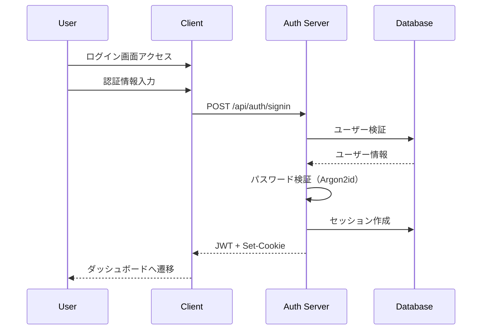
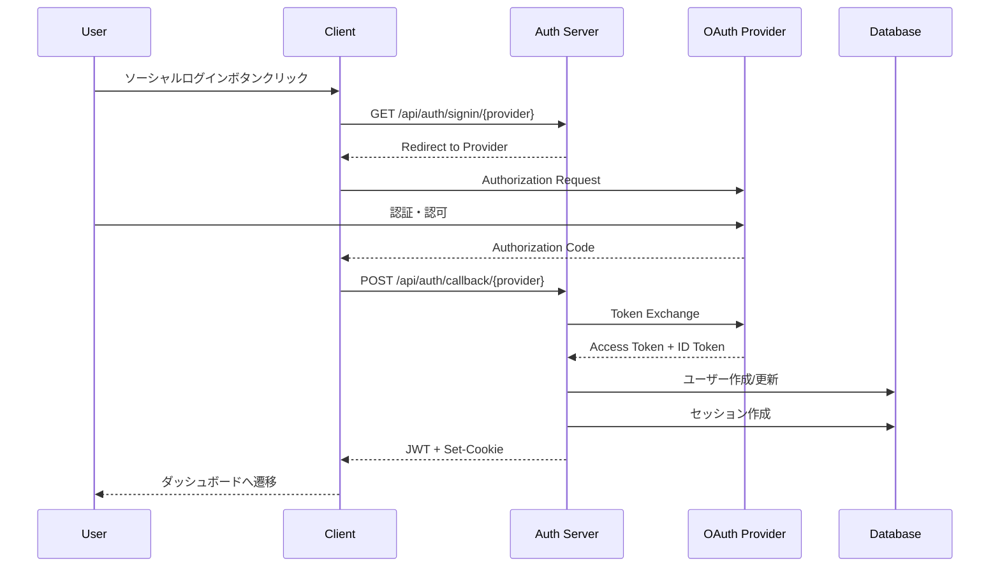
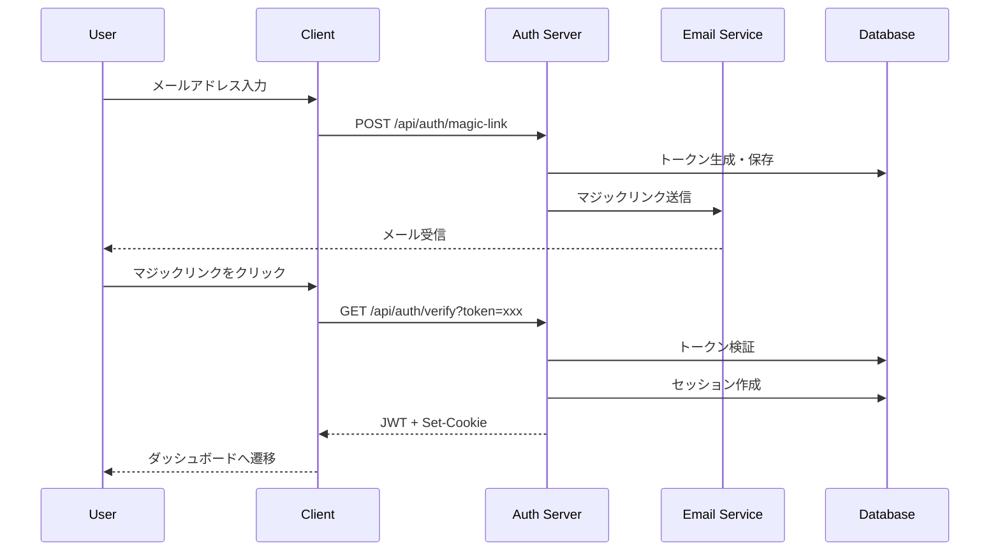
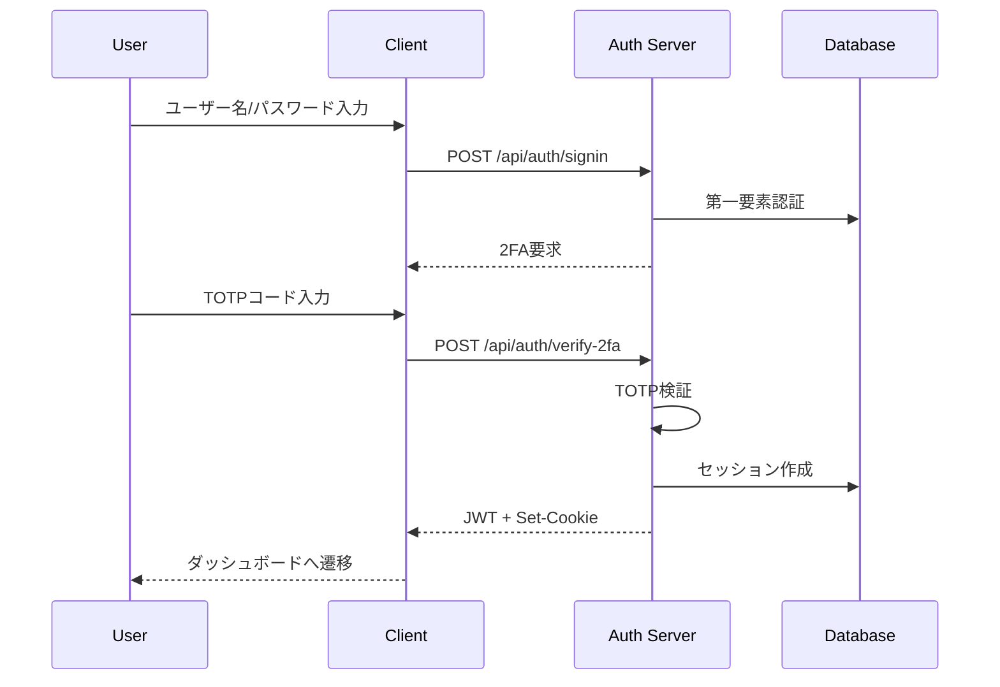

# 認証・認可アーキテクチャ設計書

## 目次
1. [概要](#概要)
2. [技術選定](#技術選定)
3. [認証フロー](#認証フロー)
4. [認可システム](#認可システム)
5. [セキュリティ設計](#セキュリティ設計)
6. [実装仕様](#実装仕様)

## 概要

### 設計方針
- **セキュリティファースト**: 安全性を最優先に設計
- **ユーザビリティ**: シンプルで使いやすい認証フロー
- **拡張性**: 将来的な機能追加に対応可能
- **標準準拠**: OAuth 2.0、OpenID Connect準拠

### 要件
- メールアドレス/パスワード認証
- ソーシャルログイン（GitHub、Google）
- 二要素認証（2FA）対応
- パスワードレス認証（マジックリンク）
- セッション管理
- 権限ベースアクセス制御（RBAC）

## 技術選定

### 認証ライブラリ
**NextAuth.js v5 (Auth.js)**
- Next.js完全対応
- 豊富なプロバイダー対応
- セキュアなデフォルト設定
- TypeScript完全サポート

### セッション管理
**ハイブリッド方式**
- JWTトークン（ステートレス）
- データベースセッション（ステートフル）
- Redis キャッシュ（高速化）

### 暗号化
- **パスワード**: Argon2id
- **トークン**: RS256 (RSA + SHA-256)
- **通信**: TLS 1.3

## 認証フロー

### 1. メールアドレス/パスワード認証



### 2. OAuth認証（GitHub/Google）



### 3. マジックリンク認証



### 4. 二要素認証（2FA）



## 認可システム

### 権限モデル（RBAC）

```typescript
// 権限定義
enum Role {
  GUEST = 'guest',
  USER = 'user',
  PREMIUM_USER = 'premium_user',
  AUTHOR = 'author',
  MODERATOR = 'moderator',
  ADMIN = 'admin'
}

// 権限階層
const RoleHierarchy = {
  admin: ['moderator', 'author', 'premium_user', 'user', 'guest'],
  moderator: ['author', 'premium_user', 'user', 'guest'],
  author: ['premium_user', 'user', 'guest'],
  premium_user: ['user', 'guest'],
  user: ['guest'],
  guest: []
};

// リソース権限
interface Permission {
  resource: string;
  action: 'create' | 'read' | 'update' | 'delete';
  scope?: 'own' | 'all';
}
```

### 権限マトリックス

| リソース | アクション | Guest | User | Premium | Author | Moderator | Admin |
|---------|----------|-------|------|---------|---------|-----------|-------|
| Article | Read Public | ✓ | ✓ | ✓ | ✓ | ✓ | ✓ |
| Article | Read Private | - | Own | Own | Own | ✓ | ✓ |
| Article | Create | - | ✓ | ✓ | ✓ | ✓ | ✓ |
| Article | Update | - | Own | Own | Own | ✓ | ✓ |
| Article | Delete | - | Own | Own | Own | ✓ | ✓ |
| Book | Read Free | ✓ | ✓ | ✓ | ✓ | ✓ | ✓ |
| Book | Read Paid | - | Purchased | ✓ | Own | ✓ | ✓ |
| Book | Create | - | - | ✓ | ✓ | ✓ | ✓ |
| Book | Update | - | - | Own | Own | ✓ | ✓ |
| Book | Delete | - | - | Own | Own | ✓ | ✓ |
| Comment | Create | - | ✓ | ✓ | ✓ | ✓ | ✓ |
| Comment | Update | - | Own | Own | Own | ✓ | ✓ |
| Comment | Delete | - | Own | Own | Own | ✓ | ✓ |
| User | Read Profile | ✓ | ✓ | ✓ | ✓ | ✓ | ✓ |
| User | Update Profile | - | Own | Own | Own | - | ✓ |
| User | Delete Account | - | Own | Own | Own | - | ✓ |
| Admin Panel | Access | - | - | - | - | ✓ | ✓ |

### 認可ミドルウェア

```typescript
// src/middleware/auth.ts
import { NextRequest, NextResponse } from 'next/server';
import { getToken } from 'next-auth/jwt';

export async function authMiddleware(
  request: NextRequest,
  requiredRole?: Role
) {
  const token = await getToken({ req: request });
  
  if (!token) {
    return NextResponse.json(
      { error: 'Unauthorized' },
      { status: 401 }
    );
  }
  
  if (requiredRole && !hasRole(token.role, requiredRole)) {
    return NextResponse.json(
      { error: 'Forbidden' },
      { status: 403 }
    );
  }
  
  return NextResponse.next();
}
```

## セキュリティ設計

### 1. パスワードポリシー

```typescript
interface PasswordPolicy {
  minLength: 12;
  requireUppercase: true;
  requireLowercase: true;
  requireNumbers: true;
  requireSpecialChars: true;
  preventCommonPasswords: true;
  preventUserInfoInPassword: true;
  passwordHistory: 5;
  maxAge: 90; // days
}
```

### 2. セッション管理

```typescript
interface SessionConfig {
  // セッション設定
  maxAge: 30 * 24 * 60 * 60; // 30 days
  updateAge: 24 * 60 * 60; // 24 hours
  
  // トークン設定
  access_token: {
    maxAge: 60 * 60; // 1 hour
    algorithm: 'RS256';
  };
  
  refresh_token: {
    maxAge: 30 * 24 * 60 * 60; // 30 days
    algorithm: 'RS256';
    rotation: true; // トークンローテーション
  };
  
  // セキュリティ設定
  secure: true; // HTTPS only
  sameSite: 'lax';
  httpOnly: true;
}
```

### 3. レート制限

```typescript
interface RateLimitConfig {
  signin: {
    windowMs: 15 * 60 * 1000; // 15 minutes
    max: 5; // 5 attempts per window
    skipSuccessfulRequests: true;
  };
  
  signup: {
    windowMs: 60 * 60 * 1000; // 1 hour
    max: 3; // 3 attempts per hour
  };
  
  passwordReset: {
    windowMs: 60 * 60 * 1000; // 1 hour
    max: 3; // 3 attempts per hour
  };
  
  api: {
    windowMs: 60 * 1000; // 1 minute
    max: 60; // 60 requests per minute
  };
}
```

### 4. セキュリティヘッダー

```typescript
const securityHeaders = {
  'X-Frame-Options': 'DENY',
  'X-Content-Type-Options': 'nosniff',
  'X-XSS-Protection': '1; mode=block',
  'Referrer-Policy': 'strict-origin-when-cross-origin',
  'Content-Security-Policy': `
    default-src 'self';
    script-src 'self' 'unsafe-inline' 'unsafe-eval';
    style-src 'self' 'unsafe-inline';
    img-src 'self' data: https:;
    font-src 'self' data:;
    connect-src 'self' https://api.zenn-clone.dev;
  `,
  'Strict-Transport-Security': 'max-age=31536000; includeSubDomains'
};
```

### 5. 攻撃対策

#### CSRF対策
- Double Submit Cookie
- SameSite Cookie属性
- CSRFトークン検証

#### XSS対策
- 入力値のサニタイゼーション
- Content Security Policy
- HTTPOnly Cookie

#### SQLインジェクション対策
- Prisma ORM使用
- パラメータ化クエリ
- 入力検証

#### ブルートフォース対策
- レート制限
- CAPTCHA（reCAPTCHA v3）
- アカウントロック機能

## 実装仕様

### 1. NextAuth.js設定

```typescript
// src/lib/auth.ts
import { NextAuthOptions } from 'next-auth';
import { PrismaAdapter } from '@next-auth/prisma-adapter';
import CredentialsProvider from 'next-auth/providers/credentials';
import GitHubProvider from 'next-auth/providers/github';
import GoogleProvider from 'next-auth/providers/google';
import EmailProvider from 'next-auth/providers/email';
import { prisma } from '@/lib/prisma';
import { verifyPassword } from '@/lib/password';

export const authOptions: NextAuthOptions = {
  adapter: PrismaAdapter(prisma),
  
  providers: [
    // メールアドレス/パスワード認証
    CredentialsProvider({
      name: 'credentials',
      credentials: {
        email: { label: 'Email', type: 'email' },
        password: { label: 'Password', type: 'password' }
      },
      async authorize(credentials) {
        if (!credentials?.email || !credentials?.password) {
          throw new Error('Invalid credentials');
        }
        
        const user = await prisma.user.findUnique({
          where: { email: credentials.email }
        });
        
        if (!user || !await verifyPassword(credentials.password, user.password)) {
          throw new Error('Invalid credentials');
        }
        
        return {
          id: user.id,
          email: user.email,
          name: user.displayName,
          role: user.role
        };
      }
    }),
    
    // GitHub OAuth
    GitHubProvider({
      clientId: process.env.GITHUB_CLIENT_ID!,
      clientSecret: process.env.GITHUB_CLIENT_SECRET!,
      authorization: {
        params: {
          scope: 'read:user user:email'
        }
      }
    }),
    
    // Google OAuth
    GoogleProvider({
      clientId: process.env.GOOGLE_CLIENT_ID!,
      clientSecret: process.env.GOOGLE_CLIENT_SECRET!,
      authorization: {
        params: {
          prompt: 'consent',
          access_type: 'offline',
          response_type: 'code'
        }
      }
    }),
    
    // マジックリンク
    EmailProvider({
      server: {
        host: process.env.EMAIL_SERVER_HOST,
        port: process.env.EMAIL_SERVER_PORT,
        auth: {
          user: process.env.EMAIL_SERVER_USER,
          pass: process.env.EMAIL_SERVER_PASSWORD
        }
      },
      from: process.env.EMAIL_FROM
    })
  ],
  
  session: {
    strategy: 'jwt',
    maxAge: 30 * 24 * 60 * 60, // 30 days
    updateAge: 24 * 60 * 60 // 24 hours
  },
  
  jwt: {
    secret: process.env.JWT_SECRET,
    maxAge: 30 * 24 * 60 * 60 // 30 days
  },
  
  callbacks: {
    async signIn({ user, account, profile }) {
      // カスタム検証ロジック
      return true;
    },
    
    async redirect({ url, baseUrl }) {
      return url.startsWith(baseUrl) ? url : baseUrl;
    },
    
    async session({ session, token }) {
      if (token) {
        session.user.id = token.sub!;
        session.user.role = token.role;
        session.user.username = token.username;
      }
      return session;
    },
    
    async jwt({ token, user, account, profile }) {
      if (user) {
        token.role = user.role;
        token.username = user.username;
      }
      return token;
    }
  },
  
  pages: {
    signIn: '/login',
    signOut: '/logout',
    error: '/auth/error',
    verifyRequest: '/auth/verify',
    newUser: '/onboarding'
  },
  
  events: {
    async signIn({ user, account, profile, isNewUser }) {
      // 監査ログ記録
      await prisma.auditLog.create({
        data: {
          userId: user.id,
          action: 'user.login',
          metadata: {
            provider: account?.provider,
            ip: request.ip
          }
        }
      });
    },
    
    async signOut({ session, token }) {
      // セッション無効化
      await prisma.session.deleteMany({
        where: { sessionToken: token }
      });
    }
  }
};
```

### 2. 認証ガード

```typescript
// src/lib/auth-guard.ts
import { getServerSession } from 'next-auth';
import { authOptions } from '@/lib/auth';
import { redirect } from 'next/navigation';

export async function requireAuth() {
  const session = await getServerSession(authOptions);
  
  if (!session) {
    redirect('/login');
  }
  
  return session;
}

export async function requireRole(role: Role) {
  const session = await requireAuth();
  
  if (!hasRole(session.user.role, role)) {
    redirect('/403');
  }
  
  return session;
}

// React Hook
export function useAuth(required = true) {
  const { data: session, status } = useSession({
    required,
    onUnauthenticated() {
      router.push('/login');
    }
  });
  
  return {
    session,
    user: session?.user,
    isLoading: status === 'loading',
    isAuthenticated: !!session
  };
}
```

### 3. API認証

```typescript
// src/app/api/auth/[...nextauth]/route.ts
import NextAuth from 'next-auth';
import { authOptions } from '@/lib/auth';

const handler = NextAuth(authOptions);
export { handler as GET, handler as POST };

// APIルート保護
// src/app/api/articles/route.ts
import { getServerSession } from 'next-auth';
import { authOptions } from '@/lib/auth';

export async function POST(request: Request) {
  const session = await getServerSession(authOptions);
  
  if (!session) {
    return NextResponse.json(
      { error: 'Unauthorized' },
      { status: 401 }
    );
  }
  
  // 記事作成処理
}
```

### 4. 二要素認証実装

```typescript
// src/lib/2fa.ts
import speakeasy from 'speakeasy';
import QRCode from 'qrcode';

export async function generateSecret(user: User) {
  const secret = speakeasy.generateSecret({
    name: `Zenn Clone (${user.email})`,
    issuer: 'Zenn Clone'
  });
  
  const qrCodeUrl = await QRCode.toDataURL(secret.otpauth_url!);
  
  // シークレットをデータベースに保存
  await prisma.user.update({
    where: { id: user.id },
    data: {
      twoFactorSecret: secret.base32,
      twoFactorEnabled: false
    }
  });
  
  return {
    secret: secret.base32,
    qrCode: qrCodeUrl
  };
}

export async function verify2FA(user: User, token: string) {
  const verified = speakeasy.totp.verify({
    secret: user.twoFactorSecret,
    encoding: 'base32',
    token,
    window: 2 // 前後2つのタイムウィンドウを許容
  });
  
  if (verified) {
    await prisma.user.update({
      where: { id: user.id },
      data: { twoFactorEnabled: true }
    });
  }
  
  return verified;
}
```

### 5. パスワード管理

```typescript
// src/lib/password.ts
import argon2 from 'argon2';
import { z } from 'zod';

// パスワード検証スキーマ
const passwordSchema = z
  .string()
  .min(12, 'パスワードは12文字以上必要です')
  .regex(/[A-Z]/, '大文字を含む必要があります')
  .regex(/[a-z]/, '小文字を含む必要があります')
  .regex(/[0-9]/, '数字を含む必要があります')
  .regex(/[^A-Za-z0-9]/, '特殊文字を含む必要があります');

export async function hashPassword(password: string): Promise<string> {
  // パスワードポリシーチェック
  passwordSchema.parse(password);
  
  return argon2.hash(password, {
    type: argon2.argon2id,
    memoryCost: 2 ** 16,
    timeCost: 3,
    parallelism: 1
  });
}

export async function verifyPassword(
  password: string,
  hash: string
): Promise<boolean> {
  return argon2.verify(hash, password);
}

export async function generateResetToken(): Promise<string> {
  const buffer = crypto.randomBytes(32);
  return buffer.toString('hex');
}
```

### 6. 監査ログ

```typescript
// src/lib/audit.ts
interface AuditLogEntry {
  userId?: string;
  action: string;
  entityType?: string;
  entityId?: string;
  metadata?: Record<string, any>;
  ipAddress?: string;
  userAgent?: string;
}

export async function logAuditEvent(entry: AuditLogEntry) {
  await prisma.auditLog.create({
    data: {
      ...entry,
      createdAt: new Date()
    }
  });
}

// 使用例
await logAuditEvent({
  userId: session.user.id,
  action: 'article.create',
  entityType: 'article',
  entityId: article.id,
  metadata: {
    title: article.title,
    status: article.status
  },
  ipAddress: request.headers.get('x-forwarded-for'),
  userAgent: request.headers.get('user-agent')
});
```

## 環境変数

```env
# Authentication
NEXTAUTH_URL=http://localhost:3000
NEXTAUTH_SECRET=your-secret-key-min-32-chars

# OAuth Providers
GITHUB_CLIENT_ID=your-github-client-id
GITHUB_CLIENT_SECRET=your-github-client-secret
GOOGLE_CLIENT_ID=your-google-client-id
GOOGLE_CLIENT_SECRET=your-google-client-secret

# Email Provider
EMAIL_SERVER_HOST=smtp.gmail.com
EMAIL_SERVER_PORT=587
EMAIL_SERVER_USER=your-email@gmail.com
EMAIL_SERVER_PASSWORD=your-app-password
EMAIL_FROM=noreply@zenn-clone.dev

# JWT
JWT_SECRET=your-jwt-secret-key
JWT_SIGNING_PRIVATE_KEY=your-rsa-private-key
JWT_VERIFICATION_PUBLIC_KEY=your-rsa-public-key

# Security
ARGON2_SECRET=your-argon2-secret
ENCRYPTION_KEY=your-encryption-key

# Rate Limiting
REDIS_URL=redis://localhost:6379

# CAPTCHA
RECAPTCHA_SITE_KEY=your-site-key
RECAPTCHA_SECRET_KEY=your-secret-key
```

## テスト戦略

### 単体テスト
```typescript
describe('Authentication', () => {
  it('should hash password correctly', async () => {
    const password = 'SecureP@ssw0rd123';
    const hash = await hashPassword(password);
    expect(await verifyPassword(password, hash)).toBe(true);
  });
  
  it('should reject weak passwords', async () => {
    const weakPassword = 'password123';
    await expect(hashPassword(weakPassword)).rejects.toThrow();
  });
});
```

### 統合テスト
```typescript
describe('Auth API', () => {
  it('should login with valid credentials', async () => {
    const response = await request(app)
      .post('/api/auth/signin')
      .send({
        email: 'test@example.com',
        password: 'ValidP@ssw0rd123'
      });
    
    expect(response.status).toBe(200);
    expect(response.body).toHaveProperty('token');
  });
});
```

### E2Eテスト
```typescript
test('complete authentication flow', async ({ page }) => {
  // ログインページへ遷移
  await page.goto('/login');
  
  // 認証情報入力
  await page.fill('[name="email"]', 'test@example.com');
  await page.fill('[name="password"]', 'ValidP@ssw0rd123');
  
  // ログインボタンクリック
  await page.click('[type="submit"]');
  
  // ダッシュボードへ遷移確認
  await expect(page).toHaveURL('/dashboard');
});
```

## トラブルシューティング

### よくある問題と解決方法

1. **セッションが保持されない**
   - Cookieの設定を確認
   - NEXTAUTH_URLが正しいか確認
   - sameSite属性を調整

2. **OAuthログインが失敗する**
   - コールバックURLの設定確認
   - OAuth アプリの設定確認
   - スコープの設定確認

3. **2FAが機能しない**
   - 時刻同期の確認
   - タイムウィンドウの調整
   - シークレットの保存確認

## まとめ

この認証・認可アーキテクチャは、Zennクローンアプリケーションに必要なセキュリティ要件を満たし、拡張可能で保守しやすい設計となっています。NextAuth.jsを中心に、業界標準のセキュリティプラクティスを実装し、ユーザーの安全を確保します。

---

*最終更新: 2025-09-05*