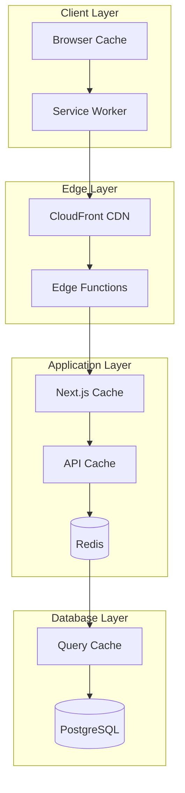

# キャッシュ戦略とパフォーマンス最適化設計書

## 目次
1. [概要](#概要)
2. [パフォーマンス目標](#パフォーマンス目標)
3. [キャッシュアーキテクチャ](#キャッシュアーキテクチャ)
4. [キャッシュ戦略](#キャッシュ戦略)
5. [パフォーマンス最適化](#パフォーマンス最適化)
6. [実装仕様](#実装仕様)
7. [監視とチューニング](#監視とチューニング)

## 概要

### 設計方針
- **多層キャッシュ**: ブラウザ、CDN、アプリケーション、データベース各層でキャッシュ
- **インテリジェント無効化**: 依存関係を考慮した賢いキャッシュ無効化
- **プリフェッチ**: ユーザー行動予測による先読み
- **最小レイテンシ**: エッジコンピューティングとCDNの活用
- **リアルタイム性**: 必要な部分のみリアルタイム更新

### 対象システム
- フロントエンド（Next.js）
- API層（Next.js API Routes）
- データベース（PostgreSQL）
- キャッシュストア（Redis）
- CDN（CloudFront）
- 検索エンジン（Elasticsearch）

## パフォーマンス目標

### Web Vitals目標値

| メトリクス | 目標値 | 現在値（想定） | 改善率 |
|-----------|--------|---------------|---------|
| **LCP** (Largest Contentful Paint) | < 2.5s | 4.0s | 37.5% |
| **FID** (First Input Delay) | < 100ms | 200ms | 50% |
| **CLS** (Cumulative Layout Shift) | < 0.1 | 0.2 | 50% |
| **FCP** (First Contentful Paint) | < 1.8s | 3.0s | 40% |
| **TTFB** (Time to First Byte) | < 600ms | 1000ms | 40% |
| **INP** (Interaction to Next Paint) | < 200ms | 300ms | 33% |

### API応答時間目標

| エンドポイントタイプ | P50 | P95 | P99 |
|---------------------|-----|-----|-----|
| 静的コンテンツ | 10ms | 50ms | 100ms |
| 動的コンテンツ（キャッシュヒット） | 20ms | 100ms | 200ms |
| 動的コンテンツ（キャッシュミス） | 100ms | 500ms | 1000ms |
| 検索 | 50ms | 200ms | 500ms |
| ファイルアップロード | 500ms | 2000ms | 5000ms |

## キャッシュアーキテクチャ

### 多層キャッシュ構成



### キャッシュ層の役割

| レイヤー | 対象データ | TTL | ストレージ |
|---------|-----------|-----|-----------|
| **ブラウザキャッシュ** | 静的アセット、API応答 | 1時間-1年 | LocalStorage, Memory |
| **Service Worker** | オフラインデータ | 無期限 | Cache Storage |
| **CDN** | 静的ファイル、画像 | 1日-1年 | Edge Location |
| **Next.js キャッシュ** | SSG/ISRページ | 1分-無期限 | ファイルシステム |
| **Redis** | セッション、頻繁アクセスデータ | 5分-24時間 | メモリ |
| **データベースキャッシュ** | クエリ結果 | 1分-1時間 | メモリ |

## キャッシュ戦略

### 1. ページキャッシュ戦略

```typescript
// キャッシュ戦略定義
export const cacheStrategies = {
  // 静的ページ（変更頻度: 極低）
  static: {
    strategy: 'SSG',
    revalidate: false,
    cdn: {
      maxAge: 31536000, // 1年
      sMaxAge: 31536000,
      staleWhileRevalidate: 0
    }
  },
  
  // 準静的ページ（変更頻度: 低）
  semiStatic: {
    strategy: 'ISR',
    revalidate: 3600, // 1時間
    cdn: {
      maxAge: 60,
      sMaxAge: 3600,
      staleWhileRevalidate: 86400
    }
  },
  
  // 動的ページ（変更頻度: 中）
  dynamic: {
    strategy: 'SSR',
    revalidate: 60, // 1分
    cdn: {
      maxAge: 0,
      sMaxAge: 60,
      staleWhileRevalidate: 300
    }
  },
  
  // リアルタイムページ（変更頻度: 高）
  realtime: {
    strategy: 'CSR',
    revalidate: 0,
    cdn: {
      maxAge: 0,
      sMaxAge: 0,
      staleWhileRevalidate: 0
    }
  }
};

// ページごとのキャッシュ設定
export const pageCache = {
  '/': 'semiStatic',                    // トップページ
  '/articles': 'dynamic',               // 記事一覧
  '/articles/[slug]': 'semiStatic',    // 記事詳細
  '/trending': 'dynamic',              // トレンド
  '/users/[username]': 'semiStatic',   // プロフィール
  '/dashboard': 'realtime',            // ダッシュボード
  '/search': 'dynamic'                 // 検索結果
};
```

### 2. APIキャッシュ戦略

```typescript
// src/lib/cache/api-cache.ts
import { Redis } from '@upstash/redis';
import { LRUCache } from 'lru-cache';

export class APICache {
  private redis: Redis;
  private memoryCache: LRUCache<string, any>;
  
  constructor() {
    this.redis = new Redis({
      url: process.env.REDIS_URL,
      token: process.env.REDIS_TOKEN
    });
    
    // メモリキャッシュ（L1キャッシュ）
    this.memoryCache = new LRUCache({
      max: 500, // 最大500エントリ
      ttl: 1000 * 60 * 5, // 5分
      updateAgeOnGet: true,
      updateAgeOnHas: true
    });
  }
  
  // マルチレベルキャッシュ
  async get(key: string): Promise<any> {
    // L1: メモリキャッシュ
    const memCached = this.memoryCache.get(key);
    if (memCached) return memCached;
    
    // L2: Redis
    const redisCached = await this.redis.get(key);
    if (redisCached) {
      this.memoryCache.set(key, redisCached);
      return redisCached;
    }
    
    return null;
  }
  
  async set(
    key: string,
    value: any,
    ttl?: number
  ): Promise<void> {
    // L1: メモリキャッシュ
    this.memoryCache.set(key, value);
    
    // L2: Redis
    if (ttl) {
      await this.redis.setex(key, ttl, value);
    } else {
      await this.redis.set(key, value);
    }
  }
  
  // キャッシュ無効化
  async invalidate(pattern: string): Promise<void> {
    // パターンマッチングで無効化
    const keys = await this.redis.keys(pattern);
    
    if (keys.length > 0) {
      await this.redis.del(...keys);
      
      // メモリキャッシュも無効化
      for (const key of keys) {
        this.memoryCache.delete(key);
      }
    }
  }
  
  // タグベースキャッシュ無効化
  async invalidateByTags(tags: string[]): Promise<void> {
    for (const tag of tags) {
      const keys = await this.redis.smembers(`tag:${tag}`);
      if (keys.length > 0) {
        await this.redis.del(...keys);
        await this.redis.del(`tag:${tag}`);
        
        for (const key of keys) {
          this.memoryCache.delete(key);
        }
      }
    }
  }
}
```

### 3. データベースクエリキャッシュ

```typescript
// src/lib/cache/query-cache.ts
import { Prisma } from '@prisma/client';
import crypto from 'crypto';

export class QueryCache {
  private cache: APICache;
  
  constructor(cache: APICache) {
    this.cache = cache;
  }
  
  // クエリ結果のキャッシュ
  async cachedQuery<T>(
    query: () => Promise<T>,
    options: {
      key?: string;
      ttl?: number;
      tags?: string[];
      dependencies?: string[];
    } = {}
  ): Promise<T> {
    // キャッシュキー生成
    const cacheKey = options.key || this.generateKey(query.toString());
    
    // キャッシュ確認
    const cached = await this.cache.get(cacheKey);
    if (cached) {
      console.log(`Cache hit: ${cacheKey}`);
      return cached;
    }
    
    // データベースクエリ実行
    console.log(`Cache miss: ${cacheKey}`);
    const result = await query();
    
    // キャッシュ保存
    await this.cache.set(cacheKey, result, options.ttl || 300);
    
    // タグ関連付け
    if (options.tags) {
      for (const tag of options.tags) {
        await this.cache.redis.sadd(`tag:${tag}`, cacheKey);
      }
    }
    
    return result;
  }
  
  // クエリキーの生成
  private generateKey(query: string): string {
    return `query:${crypto
      .createHash('sha256')
      .update(query)
      .digest('hex')
      .substring(0, 16)}`;
  }
  
  // Prismaミドルウェア
  prismaMiddleware(): Prisma.Middleware {
    return async (params, next) => {
      // 読み取りクエリのみキャッシュ
      if (params.action === 'findMany' || 
          params.action === 'findFirst' ||
          params.action === 'findUnique') {
        
        const cacheKey = `prisma:${params.model}:${params.action}:${JSON.stringify(params.args)}`;
        const cached = await this.cache.get(cacheKey);
        
        if (cached) {
          return cached;
        }
        
        const result = await next(params);
        await this.cache.set(cacheKey, result, 60); // 1分キャッシュ
        
        return result;
      }
      
      // 書き込み操作時はキャッシュ無効化
      if (params.action === 'create' ||
          params.action === 'update' ||
          params.action === 'delete') {
        
        // モデル関連のキャッシュを無効化
        await this.cache.invalidate(`prisma:${params.model}:*`);
      }
      
      return next(params);
    };
  }
}
```

### 4. 静的アセット最適化

```typescript
// next.config.js
module.exports = {
  // 画像最適化
  images: {
    domains: ['cdn.zenn-clone.dev'],
    formats: ['image/avif', 'image/webp'],
    deviceSizes: [640, 750, 828, 1080, 1200, 1920],
    imageSizes: [16, 32, 48, 64, 96, 128, 256],
    minimumCacheTTL: 60 * 60 * 24 * 365, // 1年
  },
  
  // 静的ファイル圧縮
  compress: true,
  
  // バンドル最適化
  webpack: (config, { isServer }) => {
    // Tree shaking
    config.optimization.usedExports = true;
    config.optimization.sideEffects = false;
    
    // Code splitting
    if (!isServer) {
      config.optimization.splitChunks = {
        chunks: 'all',
        cacheGroups: {
          default: false,
          vendors: false,
          framework: {
            name: 'framework',
            chunks: 'all',
            test: /(?<!node_modules.*)[\\/]node_modules[\\/](react|react-dom|scheduler|prop-types|use-subscription)[\\/]/,
            priority: 40,
            enforce: true,
          },
          lib: {
            test(module) {
              return module.size() > 160000 &&
                /node_modules[/\\]/.test(module.identifier());
            },
            name(module) {
              const hash = crypto.createHash('sha1');
              hash.update(module.identifier());
              return hash.digest('hex').substring(0, 8);
            },
            priority: 30,
            minChunks: 1,
            reuseExistingChunk: true,
          },
          commons: {
            name: 'commons',
            minChunks: 2,
            priority: 20,
          },
          shared: {
            name(module, chunks) {
              return crypto
                .createHash('sha1')
                .update(chunks.reduce((acc, chunk) => acc + chunk.name, ''))
                .digest('hex') + (isServer ? '.server' : '.client');
            },
            priority: 10,
            minChunks: 2,
            reuseExistingChunk: true,
          },
        },
        maxAsyncRequests: 30,
        maxInitialRequests: 30,
      };
    }
    
    return config;
  },
  
  // HTTP/2 Server Push
  experimental: {
    serverPush: true,
  },
};
```

## パフォーマンス最適化

### 1. Critical Rendering Path最適化

```typescript
// src/app/layout.tsx
import { Inter } from 'next/font/google';

// フォント最適化
const inter = Inter({
  subsets: ['latin'],
  display: 'swap', // FOUT対策
  preload: true,
  fallback: ['system-ui', 'arial'],
  adjustFontFallback: true, // CLS対策
});

export default function RootLayout({
  children
}: {
  children: React.ReactNode;
}) {
  return (
    <html lang="ja" className={inter.className}>
      <head>
        {/* Critical CSS インライン化 */}
        <style dangerouslySetInnerHTML={{
          __html: getCriticalCSS()
        }} />
        
        {/* リソースヒント */}
        <link rel="preconnect" href="https://cdn.zenn-clone.dev" />
        <link rel="dns-prefetch" href="https://api.zenn-clone.dev" />
        
        {/* 重要リソースのプリロード */}
        <link
          rel="preload"
          href="/api/user"
          as="fetch"
          crossOrigin="anonymous"
        />
        
        {/* 次ページのプリフェッチ */}
        <link
          rel="prefetch"
          href="/articles"
          as="document"
        />
      </head>
      <body>
        {/* インライン初期状態 */}
        <script dangerouslySetInnerHTML={{
          __html: `window.__INITIAL_STATE__ = ${JSON.stringify(getInitialState())}`
        }} />
        
        {children}
        
        {/* 非同期スクリプト */}
        <script async src="/analytics.js" />
      </body>
    </html>
  );
}
```

### 2. React最適化

```typescript
// src/hooks/useOptimized.ts
import { useMemo, useCallback, useRef, useEffect } from 'react';
import { useInView } from 'react-intersection-observer';

// メモ化フック
export function useOptimizedData<T>(
  fetcher: () => Promise<T>,
  deps: any[]
): T | undefined {
  const [data, setData] = useState<T>();
  const [loading, setLoading] = useState(true);
  
  // 依存配列のメモ化
  const memoizedDeps = useMemo(() => deps, deps);
  
  // フェッチ関数のメモ化
  const memoizedFetcher = useCallback(fetcher, memoizedDeps);
  
  useEffect(() => {
    let cancelled = false;
    
    const fetchData = async () => {
      setLoading(true);
      try {
        const result = await memoizedFetcher();
        if (!cancelled) {
          setData(result);
        }
      } finally {
        if (!cancelled) {
          setLoading(false);
        }
      }
    };
    
    fetchData();
    
    return () => {
      cancelled = true;
    };
  }, [memoizedFetcher]);
  
  return data;
}

// 遅延読み込みコンポーネント
export function LazyComponent({
  component: Component,
  placeholder = <div>Loading...</div>,
  ...props
}) {
  const { ref, inView } = useInView({
    threshold: 0.1,
    triggerOnce: true,
    rootMargin: '100px',
  });
  
  return (
    <div ref={ref}>
      {inView ? <Component {...props} /> : placeholder}
    </div>
  );
}

// 仮想スクロール実装
export function VirtualList({
  items,
  height,
  renderItem,
  overscan = 5
}) {
  const [scrollTop, setScrollTop] = useState(0);
  const scrollElementRef = useRef<HTMLDivElement>(null);
  
  const startIndex = Math.max(
    0,
    Math.floor(scrollTop / height) - overscan
  );
  
  const endIndex = Math.min(
    items.length - 1,
    Math.ceil((scrollTop + window.innerHeight) / height) + overscan
  );
  
  const visibleItems = items.slice(startIndex, endIndex + 1);
  
  return (
    <div
      ref={scrollElementRef}
      style={{ height: items.length * height, position: 'relative' }}
      onScroll={(e) => setScrollTop(e.currentTarget.scrollTop)}
    >
      {visibleItems.map((item, index) => (
        <div
          key={startIndex + index}
          style={{
            position: 'absolute',
            top: (startIndex + index) * height,
            height,
            width: '100%',
          }}
        >
          {renderItem(item, startIndex + index)}
        </div>
      ))}
    </div>
  );
}
```

### 3. データフェッチ最適化

```typescript
// src/lib/fetch/optimized-fetcher.ts
import { SWRConfig, useSWR } from 'swr';

// バッチングフェッチャー
class BatchFetcher {
  private queue: Map<string, {
    resolve: (value: any) => void;
    reject: (error: any) => void;
  }[]> = new Map();
  
  private timer: NodeJS.Timeout | null = null;
  
  async fetch(url: string): Promise<any> {
    return new Promise((resolve, reject) => {
      if (!this.queue.has(url)) {
        this.queue.set(url, []);
      }
      
      this.queue.get(url)!.push({ resolve, reject });
      
      if (!this.timer) {
        this.timer = setTimeout(() => this.flush(), 10);
      }
    });
  }
  
  private async flush() {
    const batch = Array.from(this.queue.entries());
    this.queue.clear();
    this.timer = null;
    
    // バッチリクエスト
    try {
      const response = await fetch('/api/batch', {
        method: 'POST',
        body: JSON.stringify({
          requests: batch.map(([url]) => ({ url }))
        })
      });
      
      const results = await response.json();
      
      // 結果を各リクエストに配布
      batch.forEach(([url, callbacks], index) => {
        const result = results[index];
        
        if (result.error) {
          callbacks.forEach(({ reject }) => reject(result.error));
        } else {
          callbacks.forEach(({ resolve }) => resolve(result.data));
        }
      });
    } catch (error) {
      batch.forEach(([_, callbacks]) => {
        callbacks.forEach(({ reject }) => reject(error));
      });
    }
  }
}

// SWR設定
export const swrConfig = {
  // グローバルフェッチャー
  fetcher: (url: string) => batchFetcher.fetch(url),
  
  // デデュープ設定
  dedupingInterval: 2000,
  
  // リトライ設定
  errorRetryCount: 3,
  errorRetryInterval: 5000,
  
  // リバリデーション設定
  revalidateOnFocus: false,
  revalidateOnReconnect: true,
  revalidateIfStale: true,
  
  // キャッシュ設定
  refreshInterval: 0,
  refreshWhenHidden: false,
  refreshWhenOffline: false,
  
  // フォールバック
  fallback: {},
  
  // プロバイダー設定
  provider: () => new Map(),
};

// プリフェッチ
export async function prefetchData(urls: string[]) {
  const promises = urls.map(url =>
    fetch(url).then(res => res.json())
  );
  
  const results = await Promise.allSettled(promises);
  
  // SWRキャッシュに保存
  results.forEach((result, index) => {
    if (result.status === 'fulfilled') {
      mutate(urls[index], result.value);
    }
  });
}
```

### 4. レンダリング最適化

```typescript
// src/lib/render/optimizations.ts

// React 18 Suspense境界
export function withSuspense<T extends {}>(
  Component: React.ComponentType<T>,
  Fallback: React.ComponentType = () => <div>Loading...</div>
) {
  return React.forwardRef<any, T>((props, ref) => (
    <Suspense fallback={<Fallback />}>
      <Component {...props} ref={ref} />
    </Suspense>
  ));
}

// Streaming SSR
export async function streamingSSR(
  Component: React.ComponentType,
  props: any
): Promise<ReadableStream> {
  const { renderToPipeableStream } = await import('react-dom/server');
  
  return new Promise((resolve, reject) => {
    const { pipe, abort } = renderToPipeableStream(
      <Component {...props} />,
      {
        onShellReady() {
          resolve(pipe);
        },
        onError(error) {
          reject(error);
        },
        onAllReady() {
          // すべてのSuspense境界が解決
        },
      }
    );
    
    // タイムアウト設定
    setTimeout(abort, 5000);
  });
}

// Progressive Enhancement
export function ProgressiveImage({
  src,
  placeholder,
  alt,
  ...props
}) {
  const [currentSrc, setCurrentSrc] = useState(placeholder);
  const [isLoading, setIsLoading] = useState(true);
  
  useEffect(() => {
    const img = new Image();
    img.src = src;
    
    img.onload = () => {
      setCurrentSrc(src);
      setIsLoading(false);
    };
    
    return () => {
      img.onload = null;
    };
  }, [src]);
  
  return (
    <div className="relative">
      
      {isLoading && (
        <div className="absolute inset-0 bg-gray-200 animate-pulse" />
      )}
    </div>
  );
}
```

### 5. ネットワーク最適化

```typescript
// src/lib/network/optimizer.ts

// HTTP/2 Server Push
export function serverPush(response: Response, resources: string[]) {
  resources.forEach(resource => {
    response.headers.append(
      'Link',
      `<${resource}>; rel=preload; as=script`
    );
  });
}

// Resource Hints
export function generateResourceHints(page: string): string[] {
  const hints: string[] = [];
  
  // ページ別リソースヒント
  const pageHints = {
    '/': [
      '<https://cdn.zenn-clone.dev>; rel=preconnect',
      '</api/trending>; rel=prefetch',
    ],
    '/articles': [
      '</api/articles?page=2>; rel=prefetch',
    ],
  };
  
  return pageHints[page] || [];
}

// Connection Management
export class ConnectionManager {
  private pool: Map<string, WebSocket> = new Map();
  
  getConnection(url: string): WebSocket {
    if (!this.pool.has(url)) {
      const ws = new WebSocket(url);
      
      ws.onopen = () => {
        console.log(`WebSocket connected: ${url}`);
      };
      
      ws.onerror = (error) => {
        console.error(`WebSocket error: ${url}`, error);
        this.pool.delete(url);
      };
      
      ws.onclose = () => {
        this.pool.delete(url);
      };
      
      this.pool.set(url, ws);
    }
    
    return this.pool.get(url)!;
  }
  
  closeAll() {
    this.pool.forEach(ws => ws.close());
    this.pool.clear();
  }
}

// Request Batching
export class RequestBatcher {
  private batch: Array<{
    url: string;
    options?: RequestInit;
    resolve: (value: any) => void;
    reject: (error: any) => void;
  }> = [];
  
  private timer: NodeJS.Timeout | null = null;
  private maxBatchSize = 10;
  private batchDelay = 10; // ms
  
  async request(url: string, options?: RequestInit): Promise<any> {
    return new Promise((resolve, reject) => {
      this.batch.push({ url, options, resolve, reject });
      
      if (this.batch.length >= this.maxBatchSize) {
        this.flush();
      } else if (!this.timer) {
        this.timer = setTimeout(() => this.flush(), this.batchDelay);
      }
    });
  }
  
  private async flush() {
    const currentBatch = [...this.batch];
    this.batch = [];
    
    if (this.timer) {
      clearTimeout(this.timer);
      this.timer = null;
    }
    
    try {
      const response = await fetch('/api/batch', {
        method: 'POST',
        headers: { 'Content-Type': 'application/json' },
        body: JSON.stringify({
          requests: currentBatch.map(({ url, options }) => ({
            url,
            ...options
          }))
        })
      });
      
      const results = await response.json();
      
      currentBatch.forEach((req, index) => {
        if (results[index].error) {
          req.reject(results[index].error);
        } else {
          req.resolve(results[index].data);
        }
      });
    } catch (error) {
      currentBatch.forEach(req => req.reject(error));
    }
  }
}
```

## 実装仕様

### 1. Redisキャッシュ実装

```typescript
// src/lib/redis/client.ts
import { Redis } from '@upstash/redis';
import { Pool } from '@neondatabase/serverless';

export class CacheManager {
  private redis: Redis;
  private pool: Pool;
  
  constructor() {
    this.redis = new Redis({
      url: process.env.REDIS_URL!,
      token: process.env.REDIS_TOKEN!,
    });
    
    this.pool = new Pool({
      connectionString: process.env.DATABASE_URL!,
    });
  }
  
  // キャッシュ戦略実装
  async cachingStrategy<T>(
    key: string,
    fetcher: () => Promise<T>,
    options: CacheOptions = {}
  ): Promise<T> {
    const {
      ttl = 300, // デフォルト5分
      staleWhileRevalidate = 60, // デフォルト1分
      tags = [],
      invalidatePattern,
    } = options;
    
    // キャッシュ取得
    const cached = await this.redis.get<CachedData<T>>(key);
    
    if (cached) {
      const now = Date.now();
      const age = now - cached.timestamp;
      
      // フレッシュなデータ
      if (age < ttl * 1000) {
        return cached.data;
      }
      
      // stale-while-revalidate期間内
      if (age < (ttl + staleWhileRevalidate) * 1000) {
        // バックグラウンドで更新
        this.revalidateInBackground(key, fetcher, ttl, tags);
        return cached.data;
      }
    }
    
    // キャッシュミス or 期限切れ
    const data = await fetcher();
    
    // キャッシュ保存
    await this.redis.setex(
      key,
      ttl + staleWhileRevalidate,
      {
        data,
        timestamp: Date.now(),
        tags,
      }
    );
    
    // タグ管理
    for (const tag of tags) {
      await this.redis.sadd(`tag:${tag}`, key);
    }
    
    return data;
  }
  
  // バックグラウンド更新
  private async revalidateInBackground<T>(
    key: string,
    fetcher: () => Promise<T>,
    ttl: number,
    tags: string[]
  ) {
    try {
      const data = await fetcher();
      await this.redis.setex(
        key,
        ttl,
        {
          data,
          timestamp: Date.now(),
          tags,
        }
      );
    } catch (error) {
      console.error(`Background revalidation failed for ${key}:`, error);
    }
  }
  
  // キャッシュ無効化
  async invalidate(pattern: string) {
    const keys = await this.redis.keys(pattern);
    if (keys.length > 0) {
      await this.redis.del(...keys);
    }
  }
  
  // タグベース無効化
  async invalidateByTags(tags: string[]) {
    for (const tag of tags) {
      const keys = await this.redis.smembers(`tag:${tag}`);
      if (keys.length > 0) {
        await this.redis.del(...keys);
        await this.redis.del(`tag:${tag}`);
      }
    }
  }
}
```

### 2. Edge Caching実装

```typescript
// src/middleware.ts
import { NextRequest, NextResponse } from 'next/server';

export async function middleware(request: NextRequest) {
  const url = request.nextUrl;
  const pathname = url.pathname;
  
  // キャッシュ制御ヘッダー設定
  const response = NextResponse.next();
  
  // 静的アセット
  if (pathname.startsWith('/static/')) {
    response.headers.set(
      'Cache-Control',
      'public, max-age=31536000, immutable'
    );
  }
  
  // API エンドポイント
  else if (pathname.startsWith('/api/')) {
    const cacheConfig = getAPICacheConfig(pathname);
    response.headers.set('Cache-Control', cacheConfig);
    
    // Vary ヘッダー設定
    response.headers.set('Vary', 'Accept-Encoding, Authorization');
    
    // ETag生成
    const etag = await generateETag(request);
    if (etag) {
      response.headers.set('ETag', etag);
      
      // 条件付きリクエスト処理
      const ifNoneMatch = request.headers.get('If-None-Match');
      if (ifNoneMatch === etag) {
        return new NextResponse(null, { status: 304 });
      }
    }
  }
  
  // ページ
  else {
    const cacheConfig = getPageCacheConfig(pathname);
    response.headers.set('Cache-Control', cacheConfig);
  }
  
  // CDN制御ヘッダー
  response.headers.set('CDN-Cache-Control', getCDNCacheControl(pathname));
  
  // Cloudflare APO対応
  if (process.env.CF_APO_ENABLED === 'true') {
    response.headers.set('CF-Cache-Status', 'DYNAMIC');
    response.headers.set('CF-APO-Via', 'origin');
  }
  
  return response;
}

function getAPICacheConfig(pathname: string): string {
  const configs = {
    '/api/articles': 'public, s-maxage=60, stale-while-revalidate=300',
    '/api/trending': 'public, s-maxage=300, stale-while-revalidate=600',
    '/api/user': 'private, no-cache',
    '/api/auth': 'no-store',
  };
  
  for (const [pattern, config] of Object.entries(configs)) {
    if (pathname.startsWith(pattern)) {
      return config;
    }
  }
  
  return 'public, s-maxage=10';
}

function getPageCacheConfig(pathname: string): string {
  const configs = {
    '/': 'public, s-maxage=60, stale-while-revalidate=300',
    '/articles': 'public, s-maxage=30, stale-while-revalidate=60',
    '/dashboard': 'private, no-cache',
  };
  
  return configs[pathname] || 'public, s-maxage=10';
}

export const config = {
  matcher: ['/((?!_next/static|favicon.ico).*)'],
};
```

### 3. Service Worker実装

```typescript
// public/sw.js
const CACHE_VERSION = 'v1';
const CACHE_NAME = `zenn-clone-${CACHE_VERSION}`;

// キャッシュ対象
const CACHE_URLS = [
  '/',
  '/offline',
  '/manifest.json',
  '/static/css/main.css',
  '/static/js/main.js',
];

// インストール
self.addEventListener('install', (event) => {
  event.waitUntil(
    caches.open(CACHE_NAME).then((cache) => {
      return cache.addAll(CACHE_URLS);
    })
  );
  
  self.skipWaiting();
});

// アクティベート
self.addEventListener('activate', (event) => {
  event.waitUntil(
    caches.keys().then((cacheNames) => {
      return Promise.all(
        cacheNames
          .filter((cacheName) => cacheName !== CACHE_NAME)
          .map((cacheName) => caches.delete(cacheName))
      );
    })
  );
  
  self.clients.claim();
});

// フェッチ戦略
self.addEventListener('fetch', (event) => {
  const { request } = event;
  const url = new URL(request.url);
  
  // API リクエスト: Network First
  if (url.pathname.startsWith('/api/')) {
    event.respondWith(networkFirst(request));
  }
  
  // 静的アセット: Cache First
  else if (url.pathname.match(/\.(js|css|png|jpg|jpeg|svg|woff2?)$/)) {
    event.respondWith(cacheFirst(request));
  }
  
  // ページ: Stale While Revalidate
  else {
    event.respondWith(staleWhileRevalidate(request));
  }
});

// Cache First戦略
async function cacheFirst(request) {
  const cache = await caches.open(CACHE_NAME);
  const cached = await cache.match(request);
  
  if (cached) {
    return cached;
  }
  
  try {
    const response = await fetch(request);
    if (response.ok) {
      cache.put(request, response.clone());
    }
    return response;
  } catch (error) {
    return caches.match('/offline');
  }
}

// Network First戦略
async function networkFirst(request) {
  try {
    const response = await fetch(request);
    if (response.ok) {
      const cache = await caches.open(CACHE_NAME);
      cache.put(request, response.clone());
    }
    return response;
  } catch (error) {
    const cached = await caches.match(request);
    return cached || new Response('Network error', { status: 503 });
  }
}

// Stale While Revalidate戦略
async function staleWhileRevalidate(request) {
  const cache = await caches.open(CACHE_NAME);
  const cached = await cache.match(request);
  
  const fetchPromise = fetch(request).then((response) => {
    if (response.ok) {
      cache.put(request, response.clone());
    }
    return response;
  });
  
  return cached || fetchPromise;
}

// バックグラウンド同期
self.addEventListener('sync', (event) => {
  if (event.tag === 'sync-articles') {
    event.waitUntil(syncArticles());
  }
});

async function syncArticles() {
  const cache = await caches.open(CACHE_NAME);
  
  // プリフェッチするURL
  const urls = [
    '/api/articles?page=1',
    '/api/trending',
  ];
  
  const promises = urls.map(async (url) => {
    try {
      const response = await fetch(url);
      await cache.put(url, response);
    } catch (error) {
      console.error(`Failed to sync ${url}:`, error);
    }
  });
  
  await Promise.all(promises);
}
```

## 監視とチューニング

### 1. パフォーマンス監視

```typescript
// src/lib/monitoring/performance.ts
export class PerformanceMonitor {
  private metrics: Map<string, number[]> = new Map();
  
  // Web Vitals収集
  collectWebVitals() {
    if (typeof window === 'undefined') return;
    
    // LCP
    new PerformanceObserver((list) => {
      const entries = list.getEntries();
      entries.forEach((entry) => {
        this.recordMetric('lcp', entry.startTime);
      });
    }).observe({ type: 'largest-contentful-paint', buffered: true });
    
    // FID
    new PerformanceObserver((list) => {
      const entries = list.getEntries();
      entries.forEach((entry: any) => {
        this.recordMetric('fid', entry.processingStart - entry.startTime);
      });
    }).observe({ type: 'first-input', buffered: true });
    
    // CLS
    let clsScore = 0;
    new PerformanceObserver((list) => {
      const entries = list.getEntries();
      entries.forEach((entry: any) => {
        if (!entry.hadRecentInput) {
          clsScore += entry.value;
          this.recordMetric('cls', clsScore);
        }
      });
    }).observe({ type: 'layout-shift', buffered: true });
    
    // Custom metrics
    this.measureCustomMetrics();
  }
  
  // カスタムメトリクス
  private measureCustomMetrics() {
    // API応答時間
    const originalFetch = window.fetch;
    window.fetch = async (...args) => {
      const start = performance.now();
      try {
        const response = await originalFetch(...args);
        const duration = performance.now() - start;
        this.recordMetric('api_response_time', duration);
        return response;
      } catch (error) {
        const duration = performance.now() - start;
        this.recordMetric('api_error_time', duration);
        throw error;
      }
    };
    
    // React render時間
    if (process.env.NODE_ENV === 'development') {
      const { unstable_trace } = require('scheduler/tracing');
      unstable_trace('render', performance.now(), () => {
        // Render tracking
      });
    }
  }
  
  // メトリクス記録
  private recordMetric(name: string, value: number) {
    if (!this.metrics.has(name)) {
      this.metrics.set(name, []);
    }
    
    const values = this.metrics.get(name)!;
    values.push(value);
    
    // 最大1000件まで保持
    if (values.length > 1000) {
      values.shift();
    }
    
    // 閾値チェック
    this.checkThresholds(name, value);
  }
  
  // 閾値チェック
  private checkThresholds(name: string, value: number) {
    const thresholds = {
      lcp: 2500,
      fid: 100,
      cls: 0.1,
      api_response_time: 1000,
    };
    
    if (thresholds[name] && value > thresholds[name]) {
      this.reportIssue(name, value, thresholds[name]);
    }
  }
  
  // レポート送信
  private reportIssue(metric: string, value: number, threshold: number) {
    fetch('/api/monitoring/report', {
      method: 'POST',
      headers: { 'Content-Type': 'application/json' },
      body: JSON.stringify({
        metric,
        value,
        threshold,
        timestamp: Date.now(),
        url: window.location.href,
        userAgent: navigator.userAgent,
      }),
    });
  }
  
  // 統計情報取得
  getStats(metric: string) {
    const values = this.metrics.get(metric);
    if (!values || values.length === 0) return null;
    
    const sorted = [...values].sort((a, b) => a - b);
    
    return {
      min: sorted[0],
      max: sorted[sorted.length - 1],
      avg: values.reduce((a, b) => a + b, 0) / values.length,
      median: sorted[Math.floor(sorted.length / 2)],
      p75: sorted[Math.floor(sorted.length * 0.75)],
      p95: sorted[Math.floor(sorted.length * 0.95)],
      p99: sorted[Math.floor(sorted.length * 0.99)],
    };
  }
}
```

### 2. キャッシュヒット率監視

```typescript
// src/lib/monitoring/cache-monitor.ts
export class CacheMonitor {
  private hits = 0;
  private misses = 0;
  private evictions = 0;
  
  recordHit() {
    this.hits++;
    this.updateMetrics();
  }
  
  recordMiss() {
    this.misses++;
    this.updateMetrics();
  }
  
  recordEviction() {
    this.evictions++;
    this.updateMetrics();
  }
  
  private updateMetrics() {
    const total = this.hits + this.misses;
    if (total === 0) return;
    
    const hitRate = (this.hits / total) * 100;
    
    // CloudWatch に送信
    if (process.env.AWS_REGION) {
      const cloudwatch = new CloudWatch({
        region: process.env.AWS_REGION,
      });
      
      cloudwatch.putMetricData({
        Namespace: 'ZennClone/Cache',
        MetricData: [
          {
            MetricName: 'HitRate',
            Value: hitRate,
            Unit: 'Percent',
            Timestamp: new Date(),
          },
        ],
      });
    }
    
    // ローカルログ
    console.log(`Cache Hit Rate: ${hitRate.toFixed(2)}%`);
  }
  
  getStats() {
    const total = this.hits + this.misses;
    return {
      hits: this.hits,
      misses: this.misses,
      evictions: this.evictions,
      hitRate: total > 0 ? (this.hits / total) * 100 : 0,
    };
  }
}
```

## まとめ

このキャッシュ戦略とパフォーマンス最適化により、以下を実現します：

1. **多層キャッシュ**による高速レスポンス
2. **インテリジェントな無効化**による一貫性維持
3. **最適化されたレンダリング**による優れたUX
4. **詳細な監視**による継続的改善

目標とするWeb Vitalsスコアを達成し、ユーザーに高速で快適な体験を提供します。

---

*最終更新: 2025-09-05*