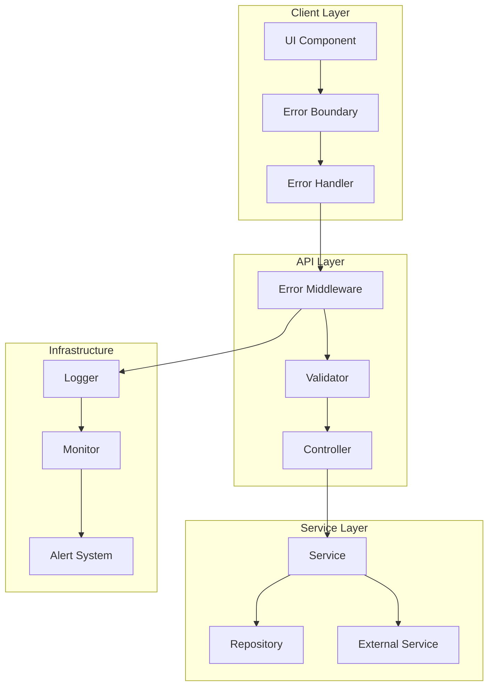

# エラーハンドリング設計書

## 1. 概要

### 1.1 目的
Zennクローンアプリケーションにおける統一的なエラーハンドリング戦略を定義し、ユーザー体験の向上、デバッグの効率化、システムの安定性を実現する。

### 1.2 基本原則
- **Fail Fast**: エラーは早期に検出し、適切に処理する
- **Graceful Degradation**: エラー時も可能な限りサービスを継続
- **透明性**: ユーザーには分かりやすく、開発者には詳細な情報を提供
- **一貫性**: アプリケーション全体で統一されたエラー処理
- **セキュリティ**: センシティブな情報は露出しない

### 1.3 エラー分類
- **クライアントエラー (4xx)**: ユーザーの操作に起因するエラー
- **サーバーエラー (5xx)**: システム内部のエラー
- **ビジネスロジックエラー**: アプリケーション固有のルール違反
- **外部サービスエラー**: 連携サービスのエラー

## 2. エラー処理アーキテクチャ

### 2.1 エラー処理フロー



### 2.2 エラー階層構造

```typescript
// errors/base.error.ts
export abstract class BaseError extends Error {
  public readonly id: string;
  public readonly timestamp: Date;
  public readonly isOperational: boolean;
  
  constructor(
    public readonly code: string,
    public readonly statusCode: number,
    message: string,
    isOperational = true,
    public readonly details?: any,
    public readonly cause?: Error
  ) {
    super(message);
    this.id = this.generateErrorId();
    this.timestamp = new Date();
    this.isOperational = isOperational;
    
    Error.captureStackTrace(this, this.constructor);
    Object.setPrototypeOf(this, new.target.prototype);
  }
  
  private generateErrorId(): string {
    return `${this.code}-${Date.now()}-${Math.random().toString(36).substr(2, 9)}`;
  }
  
  toJSON(): Record<string, any> {
    return {
      id: this.id,
      code: this.code,
      message: this.message,
      statusCode: this.statusCode,
      timestamp: this.timestamp,
      details: this.details,
    };
  }
}
```

## 3. エラークラス定義

### 3.1 クライアントエラー (4xx)

```typescript
// errors/client-errors.ts

export class ValidationError extends BaseError {
  constructor(message: string, details?: any) {
    super('VALIDATION_ERROR', 400, message, true, details);
  }
}

export class UnauthorizedError extends BaseError {
  constructor(message = 'Unauthorized access') {
    super('UNAUTHORIZED', 401, message, true);
  }
}

export class ForbiddenError extends BaseError {
  constructor(message = 'Access forbidden', resource?: string) {
    super('FORBIDDEN', 403, message, true, { resource });
  }
}

export class NotFoundError extends BaseError {
  constructor(resource: string, identifier?: string) {
    const message = identifier 
      ? `${resource} with identifier ${identifier} not found`
      : `${resource} not found`;
    super('NOT_FOUND', 404, message, true, { resource, identifier });
  }
}

export class ConflictError extends BaseError {
  constructor(message: string, conflictingResource?: string) {
    super('CONFLICT', 409, message, true, { conflictingResource });
  }
}

export class RateLimitError extends BaseError {
  constructor(limit: number, window: string, retryAfter?: number) {
    super(
      'RATE_LIMIT_EXCEEDED',
      429,
      `Rate limit of ${limit} requests per ${window} exceeded`,
      true,
      { limit, window, retryAfter }
    );
  }
}
```

### 3.2 サーバーエラー (5xx)

```typescript
// errors/server-errors.ts

export class InternalServerError extends BaseError {
  constructor(message = 'Internal server error', cause?: Error) {
    super('INTERNAL_SERVER_ERROR', 500, message, false, null, cause);
  }
}

export class DatabaseError extends BaseError {
  constructor(operation: string, cause?: Error) {
    super(
      'DATABASE_ERROR',
      500,
      `Database operation failed: ${operation}`,
      false,
      { operation },
      cause
    );
  }
}

export class ExternalServiceError extends BaseError {
  constructor(service: string, operation: string, cause?: Error) {
    super(
      'EXTERNAL_SERVICE_ERROR',
      502,
      `External service ${service} failed during ${operation}`,
      false,
      { service, operation },
      cause
    );
  }
}

export class ServiceUnavailableError extends BaseError {
  constructor(service: string, retryAfter?: number) {
    super(
      'SERVICE_UNAVAILABLE',
      503,
      `Service ${service} is temporarily unavailable`,
      true,
      { service, retryAfter }
    );
  }
}

export class TimeoutError extends BaseError {
  constructor(operation: string, timeout: number) {
    super(
      'TIMEOUT_ERROR',
      504,
      `Operation ${operation} timed out after ${timeout}ms`,
      true,
      { operation, timeout }
    );
  }
}
```

### 3.3 ビジネスロジックエラー

```typescript
// errors/business-errors.ts

export class BusinessLogicError extends BaseError {
  constructor(code: string, message: string, details?: any) {
    super(`BUSINESS_${code}`, 422, message, true, details);
  }
}

export class InsufficientCreditsError extends BusinessLogicError {
  constructor(required: number, available: number) {
    super(
      'INSUFFICIENT_CREDITS',
      `Insufficient credits. Required: ${required}, Available: ${available}`,
      { required, available }
    );
  }
}

export class ContentPolicyViolationError extends BusinessLogicError {
  constructor(reason: string, content?: string) {
    super(
      'CONTENT_POLICY_VIOLATION',
      `Content violates policy: ${reason}`,
      { reason, content: content?.substring(0, 100) }
    );
  }
}

export class SubscriptionRequiredError extends BusinessLogicError {
  constructor(feature: string, requiredPlan: string) {
    super(
      'SUBSCRIPTION_REQUIRED',
      `Feature "${feature}" requires ${requiredPlan} plan`,
      { feature, requiredPlan }
    );
  }
}

export class DuplicateResourceError extends BusinessLogicError {
  constructor(resource: string, field: string, value: string) {
    super(
      'DUPLICATE_RESOURCE',
      `${resource} with ${field} "${value}" already exists`,
      { resource, field, value }
    );
  }
}
```

## 4. エラーミドルウェア実装

### 4.1 Express エラーミドルウェア

```typescript
// middleware/error.middleware.ts
import { Request, Response, NextFunction } from 'express';
import { BaseError } from '@/errors/base.error';
import { Logger } from '@/services/logger';

export class ErrorMiddleware {
  private logger: Logger;

  constructor() {
    this.logger = new Logger('ErrorMiddleware');
  }

  handle() {
    return (
      error: Error,
      req: Request,
      res: Response,
      next: NextFunction
    ): void => {
      // エラーログ記録
      this.logError(error, req);
      
      // エラーレスポンス送信
      this.sendErrorResponse(error, res);
      
      // 非操作エラーの場合はプロセス終了を検討
      if (error instanceof BaseError && !error.isOperational) {
        this.handleCriticalError(error);
      }
    };
  }

  private logError(error: Error, req: Request): void {
    const errorInfo = {
      message: error.message,
      stack: error.stack,
      url: req.url,
      method: req.method,
      ip: req.ip,
      userId: req.user?.id,
      timestamp: new Date().toISOString(),
    };

    if (error instanceof BaseError) {
      this.logger.error('Application error', {
        ...errorInfo,
        errorId: error.id,
        code: error.code,
        statusCode: error.statusCode,
        details: error.details,
      });
    } else {
      this.logger.error('Unexpected error', errorInfo);
    }
  }

  private sendErrorResponse(error: Error, res: Response): void {
    if (res.headersSent) {
      return;
    }

    if (error instanceof BaseError) {
      res.status(error.statusCode).json({
        success: false,
        error: {
          id: error.id,
          code: error.code,
          message: error.message,
          details: this.sanitizeDetails(error.details),
          timestamp: error.timestamp,
        },
      });
    } else {
      // 予期しないエラーの場合は詳細を隠蔽
      res.status(500).json({
        success: false,
        error: {
          code: 'INTERNAL_ERROR',
          message: 'An unexpected error occurred',
          timestamp: new Date(),
        },
      });
    }
  }

  private sanitizeDetails(details: any): any {
    // 本番環境では機密情報を削除
    if (process.env.NODE_ENV === 'production') {
      return this.removeSensitiveInfo(details);
    }
    return details;
  }

  private removeSensitiveInfo(obj: any): any {
    if (!obj) return obj;
    
    const sensitiveKeys = ['password', 'token', 'secret', 'key', 'credential'];
    const sanitized = { ...obj };
    
    Object.keys(sanitized).forEach(key => {
      if (sensitiveKeys.some(sensitive => key.toLowerCase().includes(sensitive))) {
        sanitized[key] = '[REDACTED]';
      } else if (typeof sanitized[key] === 'object') {
        sanitized[key] = this.removeSensitiveInfo(sanitized[key]);
      }
    });
    
    return sanitized;
  }

  private handleCriticalError(error: BaseError): void {
    this.logger.fatal('Critical error occurred', {
      errorId: error.id,
      code: error.code,
      message: error.message,
    });
    
    // グレースフルシャットダウン
    setTimeout(() => {
      process.exit(1);
    }, 1000);
  }
}
```

### 4.2 非同期エラーハンドラー

```typescript
// utils/async-handler.ts
import { Request, Response, NextFunction } from 'express';

type AsyncFunction = (
  req: Request,
  res: Response,
  next: NextFunction
) => Promise<any>;

export function asyncHandler(fn: AsyncFunction) {
  return (req: Request, res: Response, next: NextFunction): void => {
    Promise.resolve(fn(req, res, next)).catch(next);
  };
}

// 使用例
router.get('/articles/:id', asyncHandler(async (req, res) => {
  const article = await articleService.findById(req.params.id);
  if (!article) {
    throw new NotFoundError('Article', req.params.id);
  }
  res.json(article);
}));
```

## 5. フロントエンドエラー処理

### 5.1 React Error Boundary

```tsx
// components/ErrorBoundary.tsx
import React, { Component, ErrorInfo, ReactNode } from 'react';
import { ErrorFallback } from './ErrorFallback';
import { errorReporter } from '@/services/error-reporter';

interface Props {
  children: ReactNode;
  fallback?: ReactNode;
  onError?: (error: Error, errorInfo: ErrorInfo) => void;
}

interface State {
  hasError: boolean;
  error: Error | null;
  errorInfo: ErrorInfo | null;
  errorId: string | null;
}

export class ErrorBoundary extends Component<Props, State> {
  constructor(props: Props) {
    super(props);
    this.state = {
      hasError: false,
      error: null,
      errorInfo: null,
      errorId: null,
    };
  }

  static getDerivedStateFromError(error: Error): State {
    const errorId = `ui-${Date.now()}-${Math.random().toString(36).substr(2, 9)}`;
    
    return {
      hasError: true,
      error,
      errorInfo: null,
      errorId,
    };
  }

  componentDidCatch(error: Error, errorInfo: ErrorInfo): void {
    // エラーレポート送信
    errorReporter.report({
      error,
      errorInfo,
      errorId: this.state.errorId!,
      context: {
        component: errorInfo.componentStack,
        url: window.location.href,
        userAgent: navigator.userAgent,
      },
    });

    // カスタムエラーハンドラー呼び出し
    if (this.props.onError) {
      this.props.onError(error, errorInfo);
    }
  }

  resetError = (): void => {
    this.setState({
      hasError: false,
      error: null,
      errorInfo: null,
      errorId: null,
    });
  };

  render(): ReactNode {
    if (this.state.hasError) {
      if (this.props.fallback) {
        return this.props.fallback;
      }

      return (
        <ErrorFallback
          error={this.state.error!}
          errorId={this.state.errorId!}
          resetError={this.resetError}
        />
      );
    }

    return this.props.children;
  }
}
```

### 5.2 エラーフォールバックコンポーネント

```tsx
// components/ErrorFallback.tsx
import React from 'react';
import { AlertCircle, RefreshCw, Home } from 'lucide-react';

interface ErrorFallbackProps {
  error: Error;
  errorId: string;
  resetError: () => void;
}

export const ErrorFallback: React.FC<ErrorFallbackProps> = ({
  error,
  errorId,
  resetError,
}) => {
  const isDevelopment = process.env.NODE_ENV === 'development';

  return (
    <div className="error-fallback">
      <div className="error-icon">
        <AlertCircle size={48} />
      </div>
      
      <h1>予期しないエラーが発生しました</h1>
      
      <p className="error-message">
        申し訳ございません。エラーが発生しました。
        問題が続く場合は、サポートまでお問い合わせください。
      </p>
      
      <div className="error-id">
        エラーID: <code>{errorId}</code>
      </div>
      
      {isDevelopment && (
        <details className="error-details">
          <summary>エラー詳細（開発モードのみ表示）</summary>
          <pre>{error.stack}</pre>
        </details>
      )}
      
      <div className="error-actions">
        <button onClick={resetError} className="btn-retry">
          <RefreshCw size={16} />
          再試行
        </button>
        
        <a href="/" className="btn-home">
          <Home size={16} />
          ホームへ戻る
        </a>
      </div>
    </div>
  );
};
```

### 5.3 API エラーハンドリング

```typescript
// services/api-client.ts
import axios, { AxiosError, AxiosInstance, AxiosRequestConfig } from 'axios';
import { toast } from 'react-toastify';

export class ApiClient {
  private client: AxiosInstance;
  private retryConfig = {
    retries: 3,
    retryDelay: 1000,
    retryCondition: (error: AxiosError) => {
      return (
        error.code === 'ECONNABORTED' ||
        error.code === 'ETIMEDOUT' ||
        (error.response?.status || 0) >= 500
      );
    },
  };

  constructor(baseURL: string) {
    this.client = axios.create({
      baseURL,
      timeout: 10000,
      headers: {
        'Content-Type': 'application/json',
      },
    });

    this.setupInterceptors();
  }

  private setupInterceptors(): void {
    // リクエストインターセプター
    this.client.interceptors.request.use(
      (config) => {
        const token = localStorage.getItem('accessToken');
        if (token) {
          config.headers.Authorization = `Bearer ${token}`;
        }
        return config;
      },
      (error) => {
        return Promise.reject(error);
      }
    );

    // レスポンスインターセプター
    this.client.interceptors.response.use(
      (response) => response,
      async (error: AxiosError) => {
        const originalRequest = error.config as AxiosRequestConfig & {
          _retry?: boolean;
          _retryCount?: number;
        };

        // リトライロジック
        if (
          this.retryConfig.retryCondition(error) &&
          !originalRequest._retry &&
          (originalRequest._retryCount || 0) < this.retryConfig.retries
        ) {
          originalRequest._retry = true;
          originalRequest._retryCount = (originalRequest._retryCount || 0) + 1;

          await new Promise(resolve => 
            setTimeout(resolve, this.retryConfig.retryDelay)
          );

          return this.client(originalRequest);
        }

        // エラーハンドリング
        this.handleApiError(error);

        return Promise.reject(error);
      }
    );
  }

  private handleApiError(error: AxiosError): void {
    if (error.response) {
      // サーバーからのエラーレスポンス
      const { status, data } = error.response as any;

      switch (status) {
        case 400:
          this.showValidationErrors(data.error?.details);
          break;
        case 401:
          this.handleUnauthorized();
          break;
        case 403:
          toast.error('アクセス権限がありません');
          break;
        case 404:
          toast.error('リソースが見つかりません');
          break;
        case 429:
          toast.error('リクエストが多すぎます。しばらく待ってから再試行してください');
          break;
        case 500:
          toast.error('サーバーエラーが発生しました');
          break;
        default:
          toast.error(data.error?.message || 'エラーが発生しました');
      }
    } else if (error.request) {
      // ネットワークエラー
      toast.error('ネットワークエラーが発生しました');
    } else {
      // その他のエラー
      toast.error('予期しないエラーが発生しました');
    }
  }

  private showValidationErrors(details: any): void {
    if (details && typeof details === 'object') {
      Object.entries(details).forEach(([field, errors]) => {
        if (Array.isArray(errors)) {
          errors.forEach(error => toast.error(`${field}: ${error}`));
        }
      });
    } else {
      toast.error('入力内容にエラーがあります');
    }
  }

  private handleUnauthorized(): void {
    // トークンをクリア
    localStorage.removeItem('accessToken');
    localStorage.removeItem('refreshToken');
    
    // ログインページへリダイレクト
    window.location.href = '/login?redirect=' + encodeURIComponent(window.location.pathname);
  }

  async get<T>(url: string, config?: AxiosRequestConfig): Promise<T> {
    const response = await this.client.get<T>(url, config);
    return response.data;
  }

  async post<T>(url: string, data?: any, config?: AxiosRequestConfig): Promise<T> {
    const response = await this.client.post<T>(url, data, config);
    return response.data;
  }

  async put<T>(url: string, data?: any, config?: AxiosRequestConfig): Promise<T> {
    const response = await this.client.put<T>(url, data, config);
    return response.data;
  }

  async delete<T>(url: string, config?: AxiosRequestConfig): Promise<T> {
    const response = await this.client.delete<T>(url, config);
    return response.data;
  }
}
```

## 6. エラーロギング

### 6.1 ロガー実装

```typescript
// services/logger.ts
import winston from 'winston';
import DailyRotateFile from 'winston-daily-rotate-file';

export class Logger {
  private logger: winston.Logger;

  constructor(context?: string) {
    this.logger = winston.createLogger({
      level: process.env.LOG_LEVEL || 'info',
      format: winston.format.combine(
        winston.format.timestamp(),
        winston.format.errors({ stack: true }),
        winston.format.metadata({
          fillWith: ['context', 'userId', 'requestId', 'errorId'],
        }),
        winston.format.json()
      ),
      defaultMeta: { context },
      transports: this.createTransports(),
    });
  }

  private createTransports(): winston.transport[] {
    const transports: winston.transport[] = [];

    // コンソール出力
    if (process.env.NODE_ENV !== 'production') {
      transports.push(
        new winston.transports.Console({
          format: winston.format.combine(
            winston.format.colorize(),
            winston.format.simple()
          ),
        })
      );
    }

    // ファイル出力（エラーログ）
    transports.push(
      new DailyRotateFile({
        filename: 'logs/error-%DATE%.log',
        datePattern: 'YYYY-MM-DD',
        level: 'error',
        maxFiles: '30d',
        maxSize: '20m',
      })
    );

    // ファイル出力（全ログ）
    transports.push(
      new DailyRotateFile({
        filename: 'logs/combined-%DATE%.log',
        datePattern: 'YYYY-MM-DD',
        maxFiles: '14d',
        maxSize: '20m',
      })
    );

    return transports;
  }

  error(message: string, meta?: any): void {
    this.logger.error(message, meta);
  }

  warn(message: string, meta?: any): void {
    this.logger.warn(message, meta);
  }

  info(message: string, meta?: any): void {
    this.logger.info(message, meta);
  }

  debug(message: string, meta?: any): void {
    this.logger.debug(message, meta);
  }

  fatal(message: string, meta?: any): void {
    this.logger.error(message, { ...meta, level: 'fatal' });
  }
}
```

### 6.2 構造化ログ

```typescript
// services/structured-logger.ts
export class StructuredLogger {
  private logger: Logger;

  constructor(context: string) {
    this.logger = new Logger(context);
  }

  logHttpRequest(req: Request, res: Response, responseTime: number): void {
    this.logger.info('HTTP Request', {
      method: req.method,
      url: req.url,
      statusCode: res.statusCode,
      responseTime,
      ip: req.ip,
      userAgent: req.get('user-agent'),
      userId: req.user?.id,
    });
  }

  logDatabaseQuery(query: string, params: any[], duration: number): void {
    this.logger.debug('Database Query', {
      query: this.sanitizeQuery(query),
      paramCount: params.length,
      duration,
    });
  }

  logExternalApiCall(
    service: string,
    method: string,
    url: string,
    statusCode: number,
    duration: number
  ): void {
    this.logger.info('External API Call', {
      service,
      method,
      url,
      statusCode,
      duration,
    });
  }

  logBusinessEvent(event: string, details: any): void {
    this.logger.info('Business Event', {
      event,
      details,
      timestamp: new Date().toISOString(),
    });
  }

  logSecurityEvent(event: string, details: any): void {
    this.logger.warn('Security Event', {
      event,
      details,
      timestamp: new Date().toISOString(),
    });
  }

  private sanitizeQuery(query: string): string {
    // パスワードやトークンなどの機密情報を削除
    return query.replace(/password\s*=\s*'[^']*'/gi, "password='[REDACTED]'");
  }
}
```

## 7. エラーモニタリング

### 7.1 Sentry統合

```typescript
// services/sentry.service.ts
import * as Sentry from '@sentry/node';
import { ProfilingIntegration } from '@sentry/profiling-node';

export class SentryService {
  initialize(): void {
    if (process.env.NODE_ENV === 'production') {
      Sentry.init({
        dsn: process.env.SENTRY_DSN,
        environment: process.env.NODE_ENV,
        integrations: [
          new ProfilingIntegration(),
          new Sentry.Integrations.Http({ tracing: true }),
          new Sentry.Integrations.Express({
            router: true,
            transaction: true,
          }),
        ],
        tracesSampleRate: 0.1,
        profilesSampleRate: 0.1,
        beforeSend: (event, hint) => {
          // 機密情報のフィルタリング
          return this.filterSensitiveData(event);
        },
      });
    }
  }

  captureException(error: Error, context?: any): void {
    Sentry.withScope((scope) => {
      if (context) {
        scope.setContext('additional', context);
      }
      Sentry.captureException(error);
    });
  }

  captureMessage(message: string, level: Sentry.SeverityLevel): void {
    Sentry.captureMessage(message, level);
  }

  setUser(user: { id: string; email?: string; username?: string }): void {
    Sentry.setUser(user);
  }

  clearUser(): void {
    Sentry.setUser(null);
  }

  private filterSensitiveData(event: Sentry.Event): Sentry.Event {
    // リクエストヘッダーから機密情報を削除
    if (event.request?.headers) {
      delete event.request.headers.authorization;
      delete event.request.headers.cookie;
    }

    // エラーメッセージから機密情報を削除
    if (event.exception?.values) {
      event.exception.values = event.exception.values.map(value => ({
        ...value,
        value: this.sanitizeErrorMessage(value.value || ''),
      }));
    }

    return event;
  }

  private sanitizeErrorMessage(message: string): string {
    // パスワードやトークンを含む可能性のあるメッセージをサニタイズ
    return message
      .replace(/password[=:]\s*['"][^'"]+['"]/gi, 'password=[REDACTED]')
      .replace(/token[=:]\s*['"][^'"]+['"]/gi, 'token=[REDACTED]')
      .replace(/api[_-]?key[=:]\s*['"][^'"]+['"]/gi, 'api_key=[REDACTED]');
  }
}
```

### 7.2 カスタムメトリクス

```typescript
// services/error-metrics.ts
import { Counter, Histogram, register } from 'prom-client';

export class ErrorMetrics {
  private errorCounter: Counter<string>;
  private errorDuration: Histogram<string>;

  constructor() {
    this.errorCounter = new Counter({
      name: 'app_errors_total',
      help: 'Total number of errors',
      labelNames: ['type', 'code', 'method', 'path'],
    });

    this.errorDuration = new Histogram({
      name: 'error_handling_duration_seconds',
      help: 'Error handling duration in seconds',
      labelNames: ['type'],
      buckets: [0.001, 0.01, 0.1, 0.5, 1, 2, 5],
    });

    register.registerMetric(this.errorCounter);
    register.registerMetric(this.errorDuration);
  }

  incrementError(
    type: string,
    code: string,
    method: string,
    path: string
  ): void {
    this.errorCounter.inc({ type, code, method, path });
  }

  recordErrorHandlingTime(type: string, duration: number): void {
    this.errorDuration.observe({ type }, duration / 1000);
  }

  getMetrics(): Promise<string> {
    return register.metrics();
  }
}
```

## 8. エラーリカバリー戦略

### 8.1 サーキットブレーカー

```typescript
// utils/circuit-breaker.ts
export class CircuitBreaker {
  private failures = 0;
  private lastFailureTime?: Date;
  private state: 'CLOSED' | 'OPEN' | 'HALF_OPEN' = 'CLOSED';

  constructor(
    private readonly threshold: number = 5,
    private readonly timeout: number = 60000,
    private readonly resetTimeout: number = 30000
  ) {}

  async execute<T>(fn: () => Promise<T>): Promise<T> {
    if (this.state === 'OPEN') {
      if (this.shouldAttemptReset()) {
        this.state = 'HALF_OPEN';
      } else {
        throw new ServiceUnavailableError('Circuit breaker is OPEN', this.timeout);
      }
    }

    try {
      const result = await fn();
      this.onSuccess();
      return result;
    } catch (error) {
      this.onFailure();
      throw error;
    }
  }

  private onSuccess(): void {
    if (this.state === 'HALF_OPEN') {
      this.reset();
    }
  }

  private onFailure(): void {
    this.failures++;
    this.lastFailureTime = new Date();

    if (this.failures >= this.threshold) {
      this.state = 'OPEN';
    }
  }

  private shouldAttemptReset(): boolean {
    return (
      this.lastFailureTime &&
      Date.now() - this.lastFailureTime.getTime() >= this.resetTimeout
    );
  }

  private reset(): void {
    this.failures = 0;
    this.lastFailureTime = undefined;
    this.state = 'CLOSED';
  }

  getState(): string {
    return this.state;
  }

  getFailures(): number {
    return this.failures;
  }
}
```

### 8.2 リトライメカニズム

```typescript
// utils/retry.ts
export interface RetryOptions {
  maxAttempts?: number;
  delay?: number;
  backoffMultiplier?: number;
  maxDelay?: number;
  retryCondition?: (error: any) => boolean;
  onRetry?: (error: any, attempt: number) => void;
}

export async function retry<T>(
  fn: () => Promise<T>,
  options: RetryOptions = {}
): Promise<T> {
  const {
    maxAttempts = 3,
    delay = 1000,
    backoffMultiplier = 2,
    maxDelay = 30000,
    retryCondition = () => true,
    onRetry = () => {},
  } = options;

  let lastError: any;
  let currentDelay = delay;

  for (let attempt = 1; attempt <= maxAttempts; attempt++) {
    try {
      return await fn();
    } catch (error) {
      lastError = error;

      if (attempt === maxAttempts || !retryCondition(error)) {
        throw error;
      }

      onRetry(error, attempt);

      await new Promise(resolve => setTimeout(resolve, currentDelay));

      currentDelay = Math.min(
        currentDelay * backoffMultiplier,
        maxDelay
      );
    }
  }

  throw lastError;
}

// 使用例
const result = await retry(
  () => fetchDataFromExternalAPI(),
  {
    maxAttempts: 5,
    delay: 1000,
    backoffMultiplier: 1.5,
    retryCondition: (error) => error.response?.status >= 500,
    onRetry: (error, attempt) => {
      console.log(`Retry attempt ${attempt} after error:`, error.message);
    },
  }
);
```

## 9. エラー通知

### 9.1 アラート設定

```typescript
// services/alert.service.ts
export class AlertService {
  private readonly channels: AlertChannel[] = [];

  constructor() {
    this.initializeChannels();
  }

  private initializeChannels(): void {
    if (process.env.SLACK_WEBHOOK_URL) {
      this.channels.push(new SlackAlertChannel(process.env.SLACK_WEBHOOK_URL));
    }

    if (process.env.EMAIL_ALERTS_ENABLED === 'true') {
      this.channels.push(new EmailAlertChannel());
    }

    if (process.env.PAGERDUTY_API_KEY) {
      this.channels.push(new PagerDutyAlertChannel(process.env.PAGERDUTY_API_KEY));
    }
  }

  async sendAlert(alert: Alert): Promise<void> {
    const promises = this.channels
      .filter(channel => channel.shouldSend(alert))
      .map(channel => channel.send(alert));

    await Promise.allSettled(promises);
  }

  async sendCriticalAlert(
    title: string,
    message: string,
    details?: any
  ): Promise<void> {
    await this.sendAlert({
      level: 'CRITICAL',
      title,
      message,
      details,
      timestamp: new Date(),
    });
  }
}

interface Alert {
  level: 'INFO' | 'WARNING' | 'ERROR' | 'CRITICAL';
  title: string;
  message: string;
  details?: any;
  timestamp: Date;
}

abstract class AlertChannel {
  abstract send(alert: Alert): Promise<void>;
  
  shouldSend(alert: Alert): boolean {
    return alert.level === 'CRITICAL' || alert.level === 'ERROR';
  }
}

class SlackAlertChannel extends AlertChannel {
  constructor(private webhookUrl: string) {
    super();
  }

  async send(alert: Alert): Promise<void> {
    const color = this.getColor(alert.level);
    
    await fetch(this.webhookUrl, {
      method: 'POST',
      headers: { 'Content-Type': 'application/json' },
      body: JSON.stringify({
        attachments: [{
          color,
          title: alert.title,
          text: alert.message,
          fields: alert.details ? this.formatDetails(alert.details) : [],
          footer: 'Zenn Clone Alert System',
          ts: Math.floor(alert.timestamp.getTime() / 1000),
        }],
      }),
    });
  }

  private getColor(level: string): string {
    switch (level) {
      case 'CRITICAL': return '#FF0000';
      case 'ERROR': return '#FF6B6B';
      case 'WARNING': return '#FFA500';
      default: return '#36A64F';
    }
  }

  private formatDetails(details: any): any[] {
    return Object.entries(details).map(([key, value]) => ({
      title: key,
      value: typeof value === 'object' ? JSON.stringify(value) : value,
      short: true,
    }));
  }
}
```

## 10. テスト戦略

### 10.1 エラーハンドリングテスト

```typescript
// tests/error-handling.test.ts
import { describe, it, expect, jest } from '@jest/globals';
import { ErrorMiddleware } from '@/middleware/error.middleware';
import { ValidationError, NotFoundError } from '@/errors';

describe('Error Handling Tests', () => {
  let errorMiddleware: ErrorMiddleware;

  beforeEach(() => {
    errorMiddleware = new ErrorMiddleware();
  });

  describe('ErrorMiddleware', () => {
    it('should handle ValidationError correctly', () => {
      const error = new ValidationError('Invalid input', { field: 'email' });
      const req = {} as any;
      const res = {
        status: jest.fn().mockReturnThis(),
        json: jest.fn(),
        headersSent: false,
      } as any;
      const next = jest.fn();

      errorMiddleware.handle()(error, req, res, next);

      expect(res.status).toHaveBeenCalledWith(400);
      expect(res.json).toHaveBeenCalledWith(
        expect.objectContaining({
          success: false,
          error: expect.objectContaining({
            code: 'VALIDATION_ERROR',
            message: 'Invalid input',
          }),
        })
      );
    });

    it('should handle unexpected errors', () => {
      const error = new Error('Unexpected error');
      const req = {} as any;
      const res = {
        status: jest.fn().mockReturnThis(),
        json: jest.fn(),
        headersSent: false,
      } as any;
      const next = jest.fn();

      errorMiddleware.handle()(error, req, res, next);

      expect(res.status).toHaveBeenCalledWith(500);
      expect(res.json).toHaveBeenCalledWith(
        expect.objectContaining({
          success: false,
          error: expect.objectContaining({
            code: 'INTERNAL_ERROR',
            message: 'An unexpected error occurred',
          }),
        })
      );
    });
  });

  describe('Retry Mechanism', () => {
    it('should retry on failure', async () => {
      let attempts = 0;
      const fn = jest.fn().mockImplementation(() => {
        attempts++;
        if (attempts < 3) {
          throw new Error('Temporary failure');
        }
        return 'Success';
      });

      const result = await retry(fn, { maxAttempts: 3, delay: 10 });

      expect(result).toBe('Success');
      expect(fn).toHaveBeenCalledTimes(3);
    });

    it('should throw after max attempts', async () => {
      const fn = jest.fn().mockRejectedValue(new Error('Persistent failure'));

      await expect(
        retry(fn, { maxAttempts: 2, delay: 10 })
      ).rejects.toThrow('Persistent failure');

      expect(fn).toHaveBeenCalledTimes(2);
    });
  });

  describe('Circuit Breaker', () => {
    it('should open circuit after threshold', async () => {
      const circuitBreaker = new CircuitBreaker(3, 1000);
      const fn = jest.fn().mockRejectedValue(new Error('Service error'));

      // 失敗を3回繰り返す
      for (let i = 0; i < 3; i++) {
        try {
          await circuitBreaker.execute(fn);
        } catch {}
      }

      expect(circuitBreaker.getState()).toBe('OPEN');

      // Circuit Open状態で実行を試みる
      await expect(
        circuitBreaker.execute(fn)
      ).rejects.toThrow('Circuit breaker is OPEN');
    });
  });
});
```

## 11. エラー処理のベストプラクティス

### 11.1 Do's and Don'ts

#### Do's ✅
- エラーは早期に検出し、適切な階層で処理する
- エラーメッセージはユーザーフレンドリーにする
- すべてのエラーをログに記録する
- エラー時も可能な限りサービスを継続する
- エラーIDを生成して追跡可能にする
- 非同期処理では必ずエラーハンドリングを実装する
- エラーバウンダリーを使用してUIクラッシュを防ぐ

#### Don'ts ❌
- エラーを握りつぶさない（catch して何もしない）
- スタックトレースをユーザーに見せない
- 機密情報をエラーメッセージに含めない
- 同じエラーを複数回ログに記録しない
- エラー処理でさらなるエラーを発生させない
- グローバルなtry-catchに頼らない

### 11.2 エラー処理チェックリスト

- [ ] カスタムエラークラスを定義
- [ ] エラーミドルウェアを実装
- [ ] ロギング戦略を策定
- [ ] モニタリングツールを統合
- [ ] エラーバウンダリーを設置
- [ ] リトライメカニズムを実装
- [ ] サーキットブレーカーを導入
- [ ] アラート通知を設定
- [ ] エラーメトリクスを収集
- [ ] エラー処理をテスト

---

*最終更新: 2025-09-05*
*バージョン: 1.0.0*