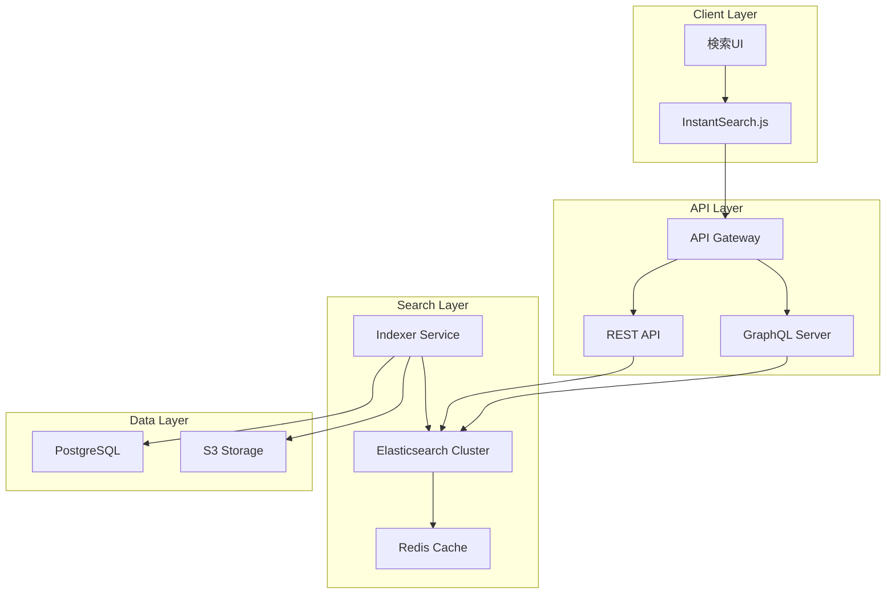
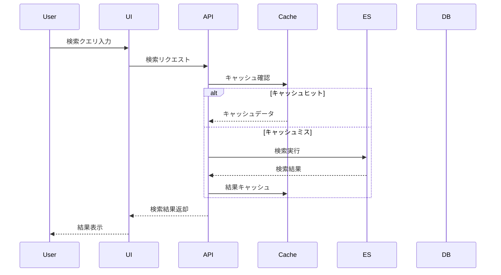

# 検索・全文検索システム設計書

## 1. 概要

### 1.1 目的
Zennクローンにおける高速かつ高精度な検索機能の実現を目的とし、記事・書籍・スクラップ・ユーザー・タグなどの多様なコンテンツに対する横断的な検索機能を提供する。

### 1.2 スコープ
- 全文検索（記事本文、タイトル、サマリー）
- ファセット検索（カテゴリ、タグ、著者）
- オートコンプリート・サジェスト機能
- 検索結果のランキング・スコアリング
- 日本語検索の最適化

### 1.3 技術スタック
- **検索エンジン**: Elasticsearch 8.x / Algolia（代替）
- **日本語解析**: Kuromoji（形態素解析）
- **キャッシング**: Redis
- **API**: GraphQL（検索専用エンドポイント）
- **クライアント**: InstantSearch.js

## 2. アーキテクチャ設計

### 2.1 システム構成図



### 2.2 データフロー



## 3. Elasticsearchインデックス設計

### 3.1 インデックス構造

#### 3.1.1 記事インデックス (articles)

```json
{
  "mappings": {
    "properties": {
      "id": { "type": "keyword" },
      "slug": { "type": "keyword" },
      "title": {
        "type": "text",
        "analyzer": "kuromoji_analyzer",
        "fields": {
          "keyword": { "type": "keyword" },
          "suggest": { "type": "completion" }
        }
      },
      "body": {
        "type": "text",
        "analyzer": "kuromoji_analyzer"
      },
      "summary": {
        "type": "text",
        "analyzer": "kuromoji_analyzer"
      },
      "tags": {
        "type": "nested",
        "properties": {
          "id": { "type": "keyword" },
          "name": { "type": "keyword" },
          "displayName": { "type": "text" }
        }
      },
      "author": {
        "properties": {
          "id": { "type": "keyword" },
          "username": { "type": "keyword" },
          "displayName": {
            "type": "text",
            "analyzer": "kuromoji_analyzer"
          }
        }
      },
      "type": { "type": "keyword" },
      "publishedAt": { "type": "date" },
      "updatedAt": { "type": "date" },
      "likeCount": { "type": "integer" },
      "commentCount": { "type": "integer" },
      "viewCount": { "type": "integer" },
      "readingTime": { "type": "integer" },
      "emoji": { "type": "keyword" },
      "topics": { "type": "keyword" },
      "isPublic": { "type": "boolean" },
      "isPinned": { "type": "boolean" }
    }
  },
  "settings": {
    "analysis": {
      "analyzer": {
        "kuromoji_analyzer": {
          "type": "custom",
          "tokenizer": "kuromoji_tokenizer",
          "filter": [
            "kuromoji_baseform",
            "kuromoji_part_of_speech",
            "kuromoji_number",
            "kuromoji_stemmer",
            "lowercase",
            "synonym_filter"
          ]
        }
      },
      "filter": {
        "synonym_filter": {
          "type": "synonym",
          "synonyms_path": "synonyms/tech_synonyms.txt"
        }
      }
    }
  }
}
```

#### 3.1.2 書籍インデックス (books)

```json
{
  "mappings": {
    "properties": {
      "id": { "type": "keyword" },
      "slug": { "type": "keyword" },
      "title": {
        "type": "text",
        "analyzer": "kuromoji_analyzer",
        "fields": {
          "keyword": { "type": "keyword" },
          "suggest": { "type": "completion" }
        }
      },
      "description": {
        "type": "text",
        "analyzer": "kuromoji_analyzer"
      },
      "chapters": {
        "type": "nested",
        "properties": {
          "id": { "type": "keyword" },
          "title": { "type": "text", "analyzer": "kuromoji_analyzer" },
          "content": { "type": "text", "analyzer": "kuromoji_analyzer" },
          "order": { "type": "integer" }
        }
      },
      "price": { "type": "integer" },
      "isFree": { "type": "boolean" },
      "author": {
        "properties": {
          "id": { "type": "keyword" },
          "username": { "type": "keyword" },
          "displayName": { "type": "text" }
        }
      },
      "publishedAt": { "type": "date" },
      "updatedAt": { "type": "date" },
      "purchaseCount": { "type": "integer" },
      "reviewScore": { "type": "float" },
      "reviewCount": { "type": "integer" },
      "tags": { "type": "keyword" }
    }
  }
}
```

#### 3.1.3 スクラップインデックス (scraps)

```json
{
  "mappings": {
    "properties": {
      "id": { "type": "keyword" },
      "title": {
        "type": "text",
        "analyzer": "kuromoji_analyzer",
        "fields": {
          "keyword": { "type": "keyword" }
        }
      },
      "comments": {
        "type": "nested",
        "properties": {
          "id": { "type": "keyword" },
          "content": { "type": "text", "analyzer": "kuromoji_analyzer" },
          "author": { "type": "keyword" },
          "createdAt": { "type": "date" }
        }
      },
      "author": {
        "properties": {
          "id": { "type": "keyword" },
          "username": { "type": "keyword" },
          "displayName": { "type": "text" }
        }
      },
      "isPublic": { "type": "boolean" },
      "isClosed": { "type": "boolean" },
      "createdAt": { "type": "date" },
      "updatedAt": { "type": "date" },
      "commentCount": { "type": "integer" },
      "tags": { "type": "keyword" }
    }
  }
}
```

#### 3.1.4 ユーザーインデックス (users)

```json
{
  "mappings": {
    "properties": {
      "id": { "type": "keyword" },
      "username": {
        "type": "keyword",
        "fields": {
          "suggest": { "type": "completion" }
        }
      },
      "displayName": {
        "type": "text",
        "analyzer": "kuromoji_analyzer"
      },
      "bio": {
        "type": "text",
        "analyzer": "kuromoji_analyzer"
      },
      "skills": { "type": "keyword" },
      "articlesCount": { "type": "integer" },
      "booksCount": { "type": "integer" },
      "scrapsCount": { "type": "integer" },
      "followersCount": { "type": "integer" },
      "totalLikes": { "type": "integer" },
      "joinedAt": { "type": "date" },
      "isVerified": { "type": "boolean" }
    }
  }
}
```

### 3.2 同義語辞書 (tech_synonyms.txt)

```text
# プログラミング言語
JS,JavaScript,ジャバスクリプト
TS,TypeScript,タイプスクリプト
py,python,パイソン
rb,ruby,ルビー
go,golang,ゴー言語

# フレームワーク
react,リアクト
vue,ビュー
angular,アンギュラー
next,nextjs,next.js
nuxt,nuxtjs,nuxt.js

# データベース
DB,database,データベース
RDB,RDBMS,リレーショナルデータベース
NoSQL,ノーエスキューエル
postgres,postgresql,ポストグレス
mysql,マイエスキューエル

# 開発手法
CI,継続的インテグレーション
CD,継続的デリバリー
TDD,テスト駆動開発
DDD,ドメイン駆動設計

# クラウド
AWS,Amazon Web Services
GCP,Google Cloud Platform
Azure,Microsoft Azure
```

## 4. 検索機能実装

### 4.1 基本検索

```typescript
// services/search/elasticsearch.service.ts
import { Client } from '@elastic/elasticsearch';
import { SearchRequest, SearchResponse } from './types';

export class ElasticsearchService {
  private client: Client;

  constructor() {
    this.client = new Client({
      node: process.env.ELASTICSEARCH_URL,
      auth: {
        username: process.env.ELASTICSEARCH_USERNAME,
        password: process.env.ELASTICSEARCH_PASSWORD,
      },
    });
  }

  async search(request: SearchRequest): Promise<SearchResponse> {
    const { query, filters, pagination, sort } = request;

    const body = {
      query: this.buildQuery(query, filters),
      aggs: this.buildAggregations(filters),
      highlight: this.buildHighlight(),
      from: (pagination.page - 1) * pagination.size,
      size: pagination.size,
      sort: this.buildSort(sort),
    };

    const response = await this.client.search({
      index: this.getIndices(filters.type),
      body,
    });

    return this.formatResponse(response);
  }

  private buildQuery(query: string, filters: Filters) {
    return {
      bool: {
        must: [
          {
            multi_match: {
              query,
              fields: [
                'title^3',
                'summary^2',
                'body',
                'tags.name^2',
                'author.displayName',
              ],
              type: 'best_fields',
              analyzer: 'kuromoji_analyzer',
            },
          },
        ],
        filter: this.buildFilters(filters),
        should: [
          {
            rank_feature: {
              field: 'likeCount',
              boost: 1.5,
            },
          },
          {
            rank_feature: {
              field: 'viewCount',
              boost: 1.2,
            },
          },
        ],
      },
    };
  }

  private buildFilters(filters: Filters) {
    const filterClauses = [];

    if (filters.type) {
      filterClauses.push({ term: { type: filters.type } });
    }

    if (filters.tags?.length) {
      filterClauses.push({
        nested: {
          path: 'tags',
          query: {
            terms: { 'tags.name': filters.tags },
          },
        },
      });
    }

    if (filters.author) {
      filterClauses.push({ term: { 'author.username': filters.author } });
    }

    if (filters.dateRange) {
      filterClauses.push({
        range: {
          publishedAt: {
            gte: filters.dateRange.from,
            lte: filters.dateRange.to,
          },
        },
      });
    }

    return filterClauses;
  }
}
```

### 4.2 オートコンプリート

```typescript
// services/search/autocomplete.service.ts
export class AutocompleteService {
  async suggest(prefix: string, type?: string): Promise<Suggestion[]> {
    const indices = type ? [type] : ['articles', 'books', 'users'];
    
    const body = {
      suggest: {
        title_suggest: {
          prefix,
          completion: {
            field: 'title.suggest',
            size: 5,
            fuzzy: {
              fuzziness: 'AUTO',
            },
          },
        },
        user_suggest: {
          prefix,
          completion: {
            field: 'username.suggest',
            size: 3,
          },
        },
      },
    };

    const response = await this.client.search({
      index: indices,
      body,
    });

    return this.formatSuggestions(response);
  }

  async searchAsYouType(query: string): Promise<QuickResults> {
    const body = {
      query: {
        multi_match: {
          query,
          type: 'bool_prefix',
          fields: [
            'title',
            'title._2gram',
            'title._3gram',
          ],
        },
      },
      size: 5,
      _source: ['id', 'title', 'type', 'author', 'emoji'],
    };

    const response = await this.client.search({
      index: ['articles', 'books', 'scraps'],
      body,
    });

    return this.formatQuickResults(response);
  }
}
```

### 4.3 ファセット検索

```typescript
// services/search/faceted-search.service.ts
export class FacetedSearchService {
  async searchWithFacets(request: FacetedSearchRequest) {
    const body = {
      query: this.buildQuery(request),
      aggs: {
        tags: {
          nested: {
            path: 'tags',
          },
          aggs: {
            tag_names: {
              terms: {
                field: 'tags.name',
                size: 20,
              },
            },
          },
        },
        authors: {
          terms: {
            field: 'author.username',
            size: 10,
          },
        },
        types: {
          terms: {
            field: 'type',
          },
        },
        date_histogram: {
          date_histogram: {
            field: 'publishedAt',
            calendar_interval: 'month',
          },
        },
        price_ranges: {
          range: {
            field: 'price',
            ranges: [
              { to: 500 },
              { from: 500, to: 1000 },
              { from: 1000, to: 3000 },
              { from: 3000 },
            ],
          },
        },
      },
      post_filter: this.buildPostFilter(request.selectedFacets),
    };

    return await this.executeSearch(body);
  }
}
```

## 5. GraphQL API実装

### 5.1 スキーマ定義

```graphql
type Query {
  search(
    query: String!
    type: SearchType
    filters: SearchFilters
    pagination: PaginationInput
    sort: SortInput
  ): SearchResult!
  
  suggest(
    prefix: String!
    type: SearchType
    limit: Int = 5
  ): [Suggestion!]!
  
  searchAsYouType(
    query: String!
    limit: Int = 5
  ): QuickSearchResult!
}

enum SearchType {
  ALL
  ARTICLE
  BOOK
  SCRAP
  USER
}

input SearchFilters {
  tags: [String!]
  authors: [String!]
  dateRange: DateRangeInput
  priceRange: PriceRangeInput
  isPublic: Boolean
  isFree: Boolean
}

input DateRangeInput {
  from: DateTime!
  to: DateTime!
}

input PriceRangeInput {
  min: Int
  max: Int
}

input PaginationInput {
  page: Int = 1
  size: Int = 20
}

input SortInput {
  field: SortField!
  order: SortOrder!
}

enum SortField {
  RELEVANCE
  PUBLISHED_AT
  UPDATED_AT
  LIKE_COUNT
  VIEW_COUNT
  PRICE
}

enum SortOrder {
  ASC
  DESC
}

type SearchResult {
  items: [SearchItem!]!
  facets: Facets!
  pagination: Pagination!
  totalCount: Int!
  took: Int!
}

union SearchItem = Article | Book | Scrap | User

type Facets {
  tags: [FacetBucket!]!
  authors: [FacetBucket!]!
  types: [FacetBucket!]!
  dateHistogram: [DateBucket!]!
  priceRanges: [RangeBucket!]!
}

type FacetBucket {
  key: String!
  count: Int!
}

type DateBucket {
  date: DateTime!
  count: Int!
}

type RangeBucket {
  from: Int
  to: Int
  count: Int!
}

type Suggestion {
  text: String!
  type: SearchType!
  metadata: JSON
}

type QuickSearchResult {
  articles: [Article!]!
  books: [Book!]!
  scraps: [Scrap!]!
  users: [User!]!
}
```

### 5.2 リゾルバー実装

```typescript
// resolvers/search.resolver.ts
import { Resolver, Query, Args } from '@nestjs/graphql';
import { SearchService } from '../services/search.service';

@Resolver()
export class SearchResolver {
  constructor(private searchService: SearchService) {}

  @Query(() => SearchResult)
  async search(
    @Args('query') query: string,
    @Args('type', { nullable: true }) type?: SearchType,
    @Args('filters', { nullable: true }) filters?: SearchFilters,
    @Args('pagination', { nullable: true }) pagination?: PaginationInput,
    @Args('sort', { nullable: true }) sort?: SortInput,
  ): Promise<SearchResult> {
    return this.searchService.search({
      query,
      type,
      filters: filters || {},
      pagination: pagination || { page: 1, size: 20 },
      sort: sort || { field: 'RELEVANCE', order: 'DESC' },
    });
  }

  @Query(() => [Suggestion])
  async suggest(
    @Args('prefix') prefix: string,
    @Args('type', { nullable: true }) type?: SearchType,
    @Args('limit', { defaultValue: 5 }) limit?: number,
  ): Promise<Suggestion[]> {
    return this.searchService.suggest(prefix, type, limit);
  }

  @Query(() => QuickSearchResult)
  async searchAsYouType(
    @Args('query') query: string,
    @Args('limit', { defaultValue: 5 }) limit?: number,
  ): Promise<QuickSearchResult> {
    return this.searchService.searchAsYouType(query, limit);
  }
}
```

## 6. インデクシング戦略

### 6.1 リアルタイムインデクシング

```typescript
// services/indexing/realtime-indexer.ts
import { Injectable } from '@nestjs/common';
import { OnEvent } from '@nestjs/event-emitter';

@Injectable()
export class RealtimeIndexer {
  @OnEvent('article.created')
  async handleArticleCreated(payload: ArticleCreatedEvent) {
    await this.indexArticle(payload.article);
  }

  @OnEvent('article.updated')
  async handleArticleUpdated(payload: ArticleUpdatedEvent) {
    await this.updateArticleIndex(payload.article);
  }

  @OnEvent('article.deleted')
  async handleArticleDeleted(payload: ArticleDeletedEvent) {
    await this.deleteFromIndex('articles', payload.articleId);
  }

  private async indexArticle(article: Article) {
    const document = this.transformToDocument(article);
    
    await this.elasticsearchService.index({
      index: 'articles',
      id: article.id,
      body: document,
      refresh: 'wait_for',
    });

    // キャッシュ無効化
    await this.cacheService.invalidatePattern(`search:*${article.id}*`);
  }
}
```

### 6.2 バッチインデクシング

```typescript
// services/indexing/batch-indexer.ts
import { Injectable } from '@nestjs/common';
import { Cron } from '@nestjs/schedule';

@Injectable()
export class BatchIndexer {
  @Cron('0 2 * * *') // 毎日午前2時
  async reindexAll() {
    await this.reindexArticles();
    await this.reindexBooks();
    await this.reindexScraps();
    await this.reindexUsers();
    await this.updateSearchMetrics();
  }

  private async reindexArticles() {
    const batchSize = 1000;
    let offset = 0;
    let hasMore = true;

    while (hasMore) {
      const articles = await this.articleRepository.find({
        take: batchSize,
        skip: offset,
        relations: ['tags', 'author'],
      });

      if (articles.length === 0) {
        hasMore = false;
        break;
      }

      await this.bulkIndex('articles', articles);
      offset += batchSize;
    }
  }

  private async bulkIndex(index: string, documents: any[]) {
    const body = documents.flatMap((doc) => [
      { index: { _index: index, _id: doc.id } },
      this.transformToDocument(doc),
    ]);

    await this.elasticsearchService.bulk({ body });
  }
}
```

## 7. 検索最適化

### 7.1 スコアリングアルゴリズム

```typescript
// services/search/scoring.service.ts
export class ScoringService {
  calculateScore(document: any): number {
    const baseScore = document._score || 0;
    
    // 時間減衰
    const ageInDays = this.getDaysSince(document.publishedAt);
    const timeDecay = Math.exp(-0.01 * ageInDays);
    
    // エンゲージメントスコア
    const engagementScore = 
      (document.likeCount * 2) +
      (document.commentCount * 3) +
      (document.viewCount * 0.1);
    
    // 著者の信頼度
    const authorTrust = document.author.isVerified ? 1.5 : 1.0;
    
    // 最終スコア計算
    return (
      baseScore * 1.0 +
      timeDecay * 0.3 +
      Math.log(engagementScore + 1) * 0.4 +
      authorTrust * 0.3
    );
  }
}
```

### 7.2 パーソナライゼーション

```typescript
// services/search/personalization.service.ts
export class PersonalizationService {
  async personalizeResults(
    results: SearchResult[],
    userId: string
  ): Promise<SearchResult[]> {
    const userPreferences = await this.getUserPreferences(userId);
    const userHistory = await this.getUserHistory(userId);
    
    return results.map(result => ({
      ...result,
      personalScore: this.calculatePersonalScore(
        result,
        userPreferences,
        userHistory
      ),
    })).sort((a, b) => b.personalScore - a.personalScore);
  }

  private calculatePersonalScore(
    result: any,
    preferences: UserPreferences,
    history: UserHistory
  ): number {
    let score = result.score;
    
    // タグの一致度
    const tagMatch = this.calculateTagMatch(
      result.tags,
      preferences.favoredTags
    );
    score += tagMatch * 0.3;
    
    // 著者のフォロー状態
    if (preferences.followedAuthors.includes(result.author.id)) {
      score *= 1.5;
    }
    
    // 既読記事の重み付け
    if (history.readArticles.includes(result.id)) {
      score *= 0.7;
    }
    
    return score;
  }
}
```

## 8. キャッシング戦略

### 8.1 検索結果キャッシュ

```typescript
// services/cache/search-cache.service.ts
export class SearchCacheService {
  private readonly TTL = 300; // 5分

  async getCachedResults(cacheKey: string): Promise<SearchResult | null> {
    const cached = await this.redis.get(cacheKey);
    return cached ? JSON.parse(cached) : null;
  }

  async cacheResults(
    cacheKey: string,
    results: SearchResult
  ): Promise<void> {
    await this.redis.setex(
      cacheKey,
      this.TTL,
      JSON.stringify(results)
    );
  }

  generateCacheKey(request: SearchRequest): string {
    const normalized = {
      q: request.query.toLowerCase().trim(),
      t: request.type,
      f: this.normalizeFilters(request.filters),
      p: request.pagination,
      s: request.sort,
    };
    
    return `search:${crypto
      .createHash('md5')
      .update(JSON.stringify(normalized))
      .digest('hex')}`;
  }
}
```

### 8.2 クエリキャッシュ

```typescript
// middleware/search-cache.middleware.ts
export class SearchCacheMiddleware {
  async use(req: Request, res: Response, next: NextFunction) {
    if (req.method !== 'GET') {
      return next();
    }

    const cacheKey = this.generateCacheKey(req);
    const cached = await this.cacheService.get(cacheKey);

    if (cached) {
      res.setHeader('X-Cache', 'HIT');
      res.setHeader('Cache-Control', 'public, max-age=300');
      return res.json(cached);
    }

    res.setHeader('X-Cache', 'MISS');
    next();
  }
}
```

## 9. 検索UI実装

### 9.1 InstantSearch実装

```tsx
// components/Search/InstantSearch.tsx
import React from 'react';
import {
  InstantSearch,
  SearchBox,
  Hits,
  RefinementList,
  Pagination,
  Stats,
  CurrentRefinements,
  ClearRefinements,
  Configure,
} from 'react-instantsearch-hooks-web';
import { instantMeiliSearch } from '@meilisearch/instant-meilisearch';

const searchClient = instantMeiliSearch(
  process.env.NEXT_PUBLIC_SEARCH_URL,
  process.env.NEXT_PUBLIC_SEARCH_API_KEY
);

export const Search: React.FC = () => {
  return (
    <InstantSearch searchClient={searchClient} indexName="articles">
      <Configure hitsPerPage={20} />
      
      <div className="search-container">
        <div className="search-header">
          <SearchBox
            placeholder="記事、書籍、スクラップを検索..."
            classNames={{
              root: 'search-box',
              input: 'search-input',
              submit: 'search-submit',
              reset: 'search-reset',
            }}
          />
          <Stats />
        </div>

        <div className="search-body">
          <aside className="search-filters">
            <div className="filter-group">
              <h3>タイプ</h3>
              <RefinementList attribute="type" />
            </div>
            
            <div className="filter-group">
              <h3>タグ</h3>
              <RefinementList
                attribute="tags.name"
                limit={10}
                showMore={true}
              />
            </div>
            
            <div className="filter-group">
              <h3>著者</h3>
              <RefinementList
                attribute="author.displayName"
                limit={5}
              />
            </div>
            
            <CurrentRefinements />
            <ClearRefinements />
          </aside>

          <main className="search-results">
            <Hits hitComponent={Hit} />
            <Pagination />
          </main>
        </div>
      </div>
    </InstantSearch>
  );
};
```

### 9.2 検索結果コンポーネント

```tsx
// components/Search/SearchResult.tsx
import React from 'react';
import { Highlight, Snippet } from 'react-instantsearch-hooks-web';
import Link from 'next/link';

interface HitProps {
  hit: {
    objectID: string;
    type: 'article' | 'book' | 'scrap';
    slug: string;
    title: string;
    summary: string;
    author: {
      username: string;
      displayName: string;
      avatar: string;
    };
    tags: Array<{ name: string; displayName: string }>;
    publishedAt: string;
    likeCount: number;
    commentCount: number;
    emoji?: string;
  };
}

export const Hit: React.FC<HitProps> = ({ hit }) => {
  const getUrl = () => {
    switch (hit.type) {
      case 'article':
        return `/articles/${hit.slug}`;
      case 'book':
        return `/books/${hit.slug}`;
      case 'scrap':
        return `/scraps/${hit.objectID}`;
      default:
        return '#';
    }
  };

  return (
    <article className="search-hit">
      <Link href={getUrl()} className="hit-link">
        <div className="hit-header">
          {hit.emoji && <span className="hit-emoji">{hit.emoji}</span>}
          <h3 className="hit-title">
            <Highlight attribute="title" hit={hit} />
          </h3>
        </div>
        
        <div className="hit-summary">
          <Snippet attribute="summary" hit={hit} />
        </div>
        
        <div className="hit-meta">
          <div className="hit-author">
            
            <span>{hit.author.displayName}</span>
          </div>
          
          <div className="hit-tags">
            {hit.tags.map(tag => (
              <span key={tag.name} className="tag">
                {tag.displayName}
              </span>
            ))}
          </div>
          
          <div className="hit-stats">
            <span>💙 {hit.likeCount}</span>
            <span>💬 {hit.commentCount}</span>
          </div>
        </div>
      </Link>
    </article>
  );
};
```

## 10. モニタリング・分析

### 10.1 検索メトリクス

```typescript
// services/analytics/search-analytics.service.ts
export class SearchAnalyticsService {
  async trackSearch(
    query: string,
    results: number,
    userId?: string
  ): Promise<void> {
    await this.analyticsClient.track({
      event: 'search',
      properties: {
        query,
        resultsCount: results,
        userId,
        timestamp: new Date(),
      },
    });

    // 検索クエリの保存
    await this.saveSearchQuery(query, results);
  }

  async trackClickThrough(
    resultId: string,
    position: number,
    query: string
  ): Promise<void> {
    await this.analyticsClient.track({
      event: 'search_click',
      properties: {
        resultId,
        position,
        query,
        timestamp: new Date(),
      },
    });

    // CTR計算のためのデータ保存
    await this.updateClickThroughRate(query, position);
  }

  async getPopularSearches(
    timeRange: TimeRange
  ): Promise<PopularSearch[]> {
    return await this.searchRepository
      .createQueryBuilder('search')
      .select('search.query', 'query')
      .addSelect('COUNT(*)', 'count')
      .where('search.createdAt >= :start', { start: timeRange.start })
      .andWhere('search.createdAt <= :end', { end: timeRange.end })
      .groupBy('search.query')
      .orderBy('count', 'DESC')
      .limit(50)
      .getRawMany();
  }
}
```

### 10.2 検索品質指標

```typescript
// services/analytics/search-quality.service.ts
export class SearchQualityService {
  async calculateMetrics(): Promise<SearchQualityMetrics> {
    return {
      // クリック率
      ctr: await this.calculateCTR(),
      
      // 平均クリック位置
      averageClickPosition: await this.calculateAveragePosition(),
      
      // ゼロ結果率
      zeroResultsRate: await this.calculateZeroResultsRate(),
      
      // 検索離脱率
      bounceRate: await this.calculateBounceRate(),
      
      // 平均検索時間
      averageSearchTime: await this.calculateAverageSearchTime(),
      
      // 再検索率
      reformulationRate: await this.calculateReformulationRate(),
    };
  }

  private async calculateCTR(): Promise<number> {
    const searches = await this.getSearches();
    const clicks = await this.getClicks();
    
    return (clicks / searches) * 100;
  }

  private async calculateAveragePosition(): Promise<number> {
    const clicks = await this.clickRepository.find();
    
    if (clicks.length === 0) return 0;
    
    const totalPosition = clicks.reduce(
      (sum, click) => sum + click.position,
      0
    );
    
    return totalPosition / clicks.length;
  }
}
```

## 11. パフォーマンス最適化

### 11.1 クエリ最適化

```yaml
# elasticsearch/optimize.yml
index:
  number_of_shards: 3
  number_of_replicas: 1
  refresh_interval: 5s
  max_result_window: 10000
  
  # 検索最適化
  search:
    slowlog:
      threshold:
        query:
          warn: 10s
          info: 5s
          debug: 2s
        fetch:
          warn: 1s
          info: 800ms
          debug: 500ms
  
  # メモリ最適化
  queries:
    cache:
      enabled: true
      size: 10%
  
  # 圧縮設定
  codec: best_compression
```

### 11.2 インデックス最適化

```typescript
// scripts/optimize-indices.ts
export async function optimizeIndices() {
  // インデックスのフォースマージ
  await client.indices.forcemerge({
    index: ['articles', 'books', 'scraps', 'users'],
    max_num_segments: 1,
  });

  // インデックスのリフレッシュ
  await client.indices.refresh({
    index: '_all',
  });

  // キャッシュのクリア
  await client.indices.clearCache({
    index: '_all',
    query: true,
    fielddata: true,
    request: true,
  });

  // インデックス統計の更新
  await client.indices.stats({
    index: '_all',
  });
}
```

## 12. セキュリティ考慮事項

### 12.1 検索セキュリティ

```typescript
// middleware/search-security.middleware.ts
export class SearchSecurityMiddleware {
  async use(req: Request, res: Response, next: NextFunction) {
    // SQLインジェクション対策
    const query = this.sanitizeQuery(req.query.q);
    
    // レート制限
    const rateLimited = await this.checkRateLimit(req.ip);
    if (rateLimited) {
      return res.status(429).json({ error: 'Too many requests' });
    }
    
    // 検索クエリの長さ制限
    if (query.length > 1000) {
      return res.status(400).json({ error: 'Query too long' });
    }
    
    // 特殊文字のエスケープ
    req.query.q = this.escapeElasticsearchQuery(query);
    
    next();
  }

  private sanitizeQuery(query: string): string {
    // HTMLタグの削除
    query = query.replace(/<[^>]*>/g, '');
    
    // 特殊文字のエスケープ
    query = query.replace(/[&<>"']/g, (match) => {
      const escapeMap: Record<string, string> = {
        '&': '&amp;',
        '<': '&lt;',
        '>': '&gt;',
        '"': '&quot;',
        "'": '&#39;',
      };
      return escapeMap[match];
    });
    
    return query;
  }

  private escapeElasticsearchQuery(query: string): string {
    // Elasticsearch特殊文字のエスケープ
    return query.replace(
      /[+\-=&|!(){}[\]^"~*?:\\]/g,
      '\\$&'
    );
  }
}
```

### 12.2 アクセス制御

```typescript
// guards/search-access.guard.ts
export class SearchAccessGuard {
  async canActivate(context: ExecutionContext): Promise<boolean> {
    const request = context.switchToHttp().getRequest();
    const user = request.user;

    // 非公開コンテンツの検索制限
    if (!user) {
      request.searchFilters = { isPublic: true };
    } else {
      request.searchFilters = await this.buildUserFilters(user);
    }

    return true;
  }

  private async buildUserFilters(user: User) {
    const filters: any = {};

    // 自分の非公開コンテンツは検索可能
    if (user.id) {
      filters.or = [
        { isPublic: true },
        { 'author.id': user.id },
      ];
    }

    // ブロックしたユーザーのコンテンツを除外
    const blockedUsers = await this.getBlockedUsers(user.id);
    if (blockedUsers.length > 0) {
      filters.not = {
        'author.id': blockedUsers,
      };
    }

    return filters;
  }
}
```

## 13. トラブルシューティング

### 13.1 よくある問題と解決策

| 問題 | 原因 | 解決策 |
|------|------|--------|
| 検索結果が0件 | インデックスが空 | バッチインデクシングを実行 |
| 検索が遅い | キャッシュミス | キャッシュTTLを調整 |
| 日本語検索が機能しない | アナライザー設定ミス | Kuromojiプラグインを確認 |
| メモリ不足 | インデックスサイズ過大 | シャード数を増やす |
| 検索結果の関連性が低い | スコアリング設定 | ブースト値を調整 |

### 13.2 デバッグツール

```bash
# Elasticsearch動作確認
curl -X GET "localhost:9200/_cat/health?v"

# インデックス確認
curl -X GET "localhost:9200/_cat/indices?v"

# 検索クエリのプロファイリング
curl -X GET "localhost:9200/articles/_search" \
  -H 'Content-Type: application/json' \
  -d '{
    "profile": true,
    "query": {
      "match": { "title": "JavaScript" }
    }
  }'

# アナライザーのテスト
curl -X POST "localhost:9200/_analyze" \
  -H 'Content-Type: application/json' \
  -d '{
    "analyzer": "kuromoji_analyzer",
    "text": "東京スカイツリーから見た景色"
  }'
```

## 14. 今後の拡張計画

### 14.1 機能追加ロードマップ

- **Phase 1**: ベクトル検索（セマンティック検索）
- **Phase 2**: 音声検索対応
- **Phase 3**: 画像検索機能
- **Phase 4**: AIによる検索結果要約
- **Phase 5**: リアルタイムコラボレーション検索

### 14.2 技術的改善

- Elasticsearchクラスターの拡張
- 機械学習モデルの統合
- 多言語対応（英語、中国語）
- GraphQL Subscriptionsによるリアルタイム検索
- エッジロケーションでの検索キャッシュ

---

*最終更新: 2025-09-05*
*バージョン: 1.0.0*