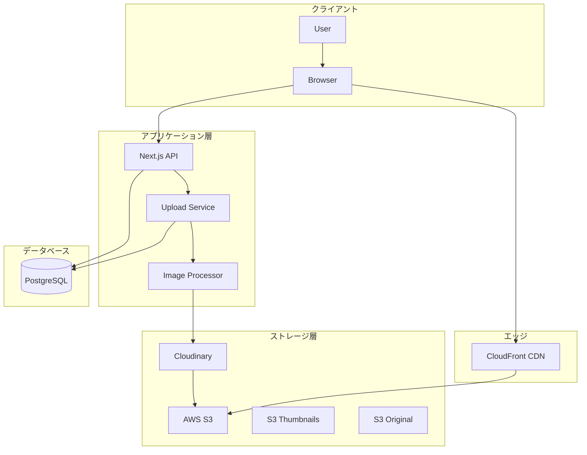
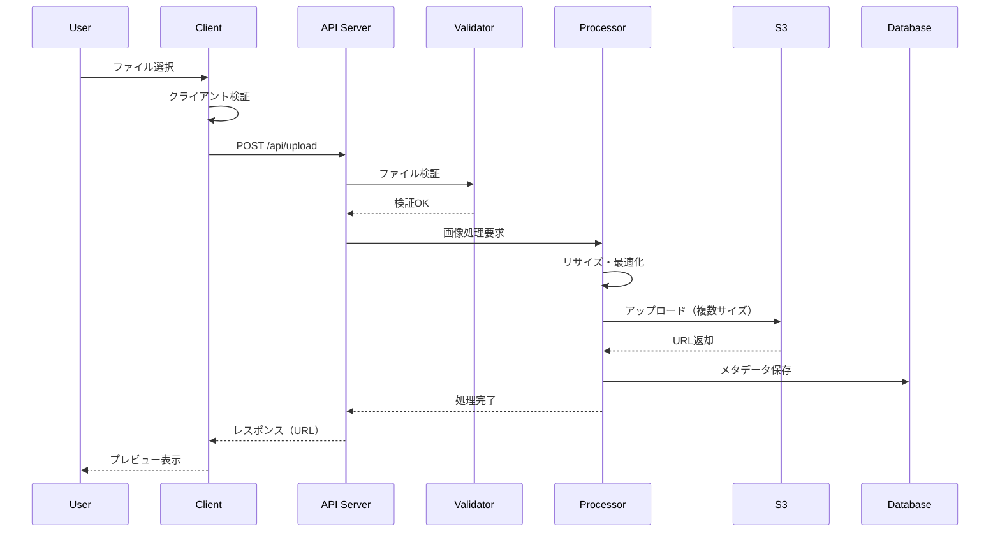
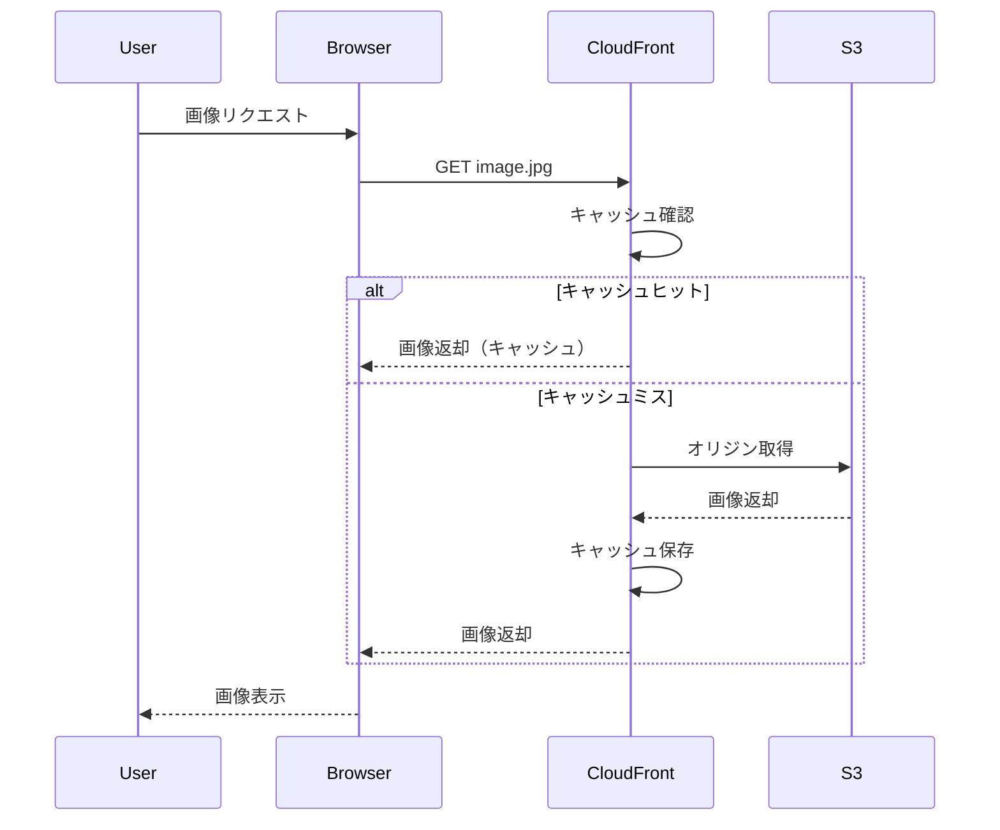

# ファイルストレージ戦略設計書

## 目次
1. [概要](#概要)
2. [要件分析](#要件分析)
3. [技術選定](#技術選定)
4. [アーキテクチャ設計](#アーキテクチャ設計)
5. [実装仕様](#実装仕様)
6. [セキュリティ設計](#セキュリティ設計)
7. [コスト最適化](#コスト最適化)
8. [災害復旧計画](#災害復旧計画)

## 概要

### 設計方針
- **スケーラビリティ**: トラフィック増加に対応可能
- **高可用性**: 99.99%以上のアップタイム
- **パフォーマンス**: 高速な画像配信
- **セキュリティ**: 安全なファイルアップロード・アクセス制御
- **コスト効率**: 使用量に応じた課金モデル

### 対象ファイル
- ユーザーアバター画像
- 記事・書籍のカバー画像
- 記事内の画像・動画
- PDFなどのドキュメント
- コードスニペットの添付ファイル

## 要件分析

### 機能要件

| 項目 | 要件 |
|------|------|
| ファイルサイズ | 最大50MB/ファイル |
| 画像フォーマット | JPEG, PNG, WebP, AVIF, GIF, SVG |
| 動画フォーマット | MP4, WebM |
| ドキュメント | PDF, ZIP |
| 同時アップロード | 最大10ファイル |
| ストレージ容量 | 無制限（実質） |
| 帯域幅 | 月間10TB以上 |

### 非機能要件

| 項目 | 要件 |
|------|------|
| レスポンス時間 | < 100ms (キャッシュヒット時) |
| アップロード速度 | > 10Mbps |
| 可用性 | 99.99% |
| データ保持期間 | 無期限（削除まで） |
| バックアップ | 日次バックアップ |
| 暗号化 | 保存時・転送時暗号化 |

## 技術選定

### ストレージサービス比較

| サービス | メリット | デメリット | コスト | 選定 |
|---------|--------|----------|--------|------|
| **AWS S3 + CloudFront** | 高可用性、グローバルCDN、豊富な機能 | 複雑な料金体系 | $0.023/GB + CDN費用 | ✅ |
| Cloudflare R2 + CDN | エグレス無料、シンプル | 機能が限定的 | $0.015/GB | - |
| Google Cloud Storage | 統合が容易 | CDNが別途必要 | $0.020/GB + CDN費用 | - |
| Vercel Blob | Next.js統合 | 容量制限あり | $0.030/GB | - |
| 自前サーバー | 完全制御 | 運用コスト高 | サーバー費用 | - |

### 画像処理サービス

| サービス | 機能 | コスト | 選定 |
|---------|------|--------|------|
| **Cloudinary** | 豊富な変換機能、AI機能 | 月25GB無料、その後従量課金 | ✅ |
| ImageKit | リアルタイム変換 | 月20GB無料 | - |
| Sharp (自前) | 完全制御、無料 | 処理負荷高 | 予備 |

## アーキテクチャ設計

### システム構成図



### データフロー

#### アップロードフロー


#### 配信フロー


## 実装仕様

### 1. ストレージ構造

```
s3://zenn-clone-storage/
├── avatars/
│   ├── {user_id}/
│   │   ├── original.jpg
│   │   ├── 256x256.webp
│   │   └── 64x64.webp
├── articles/
│   ├── {article_id}/
│   │   ├── cover/
│   │   │   ├── original.jpg
│   │   │   ├── 1200x630.webp  # OGP
│   │   │   └── 600x315.webp   # サムネイル
│   │   └── content/
│   │       ├── {image_id}/
│   │       │   ├── original.jpg
│   │       │   ├── 800w.webp
│   │       │   └── 400w.webp
├── books/
│   └── {book_id}/
│       └── ... (同様の構造)
└── temp/
    └── {session_id}/
        └── {temp_files}  # 一時ファイル（24時間で自動削除）
```

### 2. アップロード実装

```typescript
// src/lib/upload/uploader.ts
import { S3Client, PutObjectCommand } from '@aws-sdk/client-s3';
import { getSignedUrl } from '@aws-sdk/s3-request-presigner';
import sharp from 'sharp';
import { v4 as uuidv4 } from 'uuid';

export class FileUploader {
  private s3Client: S3Client;
  
  constructor() {
    this.s3Client = new S3Client({
      region: process.env.AWS_REGION,
      credentials: {
        accessKeyId: process.env.AWS_ACCESS_KEY_ID!,
        secretAccessKey: process.env.AWS_SECRET_ACCESS_KEY!
      }
    });
  }
  
  // 直接アップロード用の署名付きURL生成
  async generatePresignedUrl(
    key: string,
    contentType: string,
    metadata?: Record<string, string>
  ): Promise<string> {
    const command = new PutObjectCommand({
      Bucket: process.env.S3_BUCKET_NAME,
      Key: key,
      ContentType: contentType,
      Metadata: metadata
    });
    
    return await getSignedUrl(this.s3Client, command, {
      expiresIn: 3600 // 1時間
    });
  }
  
  // サーバーサイドアップロード
  async upload(
    file: File | Buffer,
    path: string,
    options?: UploadOptions
  ): Promise<UploadResult> {
    const buffer = file instanceof File 
      ? Buffer.from(await file.arrayBuffer())
      : file;
    
    // ファイル検証
    await this.validateFile(buffer, options);
    
    // 画像処理
    const processed = await this.processImage(buffer, options);
    
    // S3アップロード
    const results = await Promise.all(
      processed.map(async ({ buffer, suffix, metadata }) => {
        const key = `${path}/${suffix}`;
        await this.uploadToS3(buffer, key, metadata);
        return {
          key,
          url: this.getPublicUrl(key),
          size: buffer.length,
          ...metadata
        };
      })
    );
    
    return {
      original: results[0],
      variants: results.slice(1)
    };
  }
  
  private async processImage(
    buffer: Buffer,
    options?: UploadOptions
  ): Promise<ProcessedImage[]> {
    const results: ProcessedImage[] = [];
    
    // オリジナル画像のメタデータ取得
    const metadata = await sharp(buffer).metadata();
    
    // オリジナル保存
    results.push({
      buffer,
      suffix: `original.${metadata.format}`,
      metadata: {
        width: metadata.width,
        height: metadata.height,
        format: metadata.format
      }
    });
    
    // 各サイズバリアント生成
    if (options?.variants) {
      for (const variant of options.variants) {
        const processed = await sharp(buffer)
          .resize(variant.width, variant.height, {
            fit: variant.fit || 'cover',
            withoutEnlargement: true
          })
          .webp({ quality: variant.quality || 85 })
          .toBuffer();
        
        results.push({
          buffer: processed,
          suffix: `${variant.width}x${variant.height}.webp`,
          metadata: {
            width: variant.width,
            height: variant.height,
            format: 'webp'
          }
        });
      }
    }
    
    return results;
  }
  
  private async validateFile(
    buffer: Buffer,
    options?: UploadOptions
  ): Promise<void> {
    // ファイルサイズチェック
    const maxSize = options?.maxSize || 50 * 1024 * 1024; // 50MB
    if (buffer.length > maxSize) {
      throw new Error(`File size exceeds ${maxSize} bytes`);
    }
    
    // ファイルタイプチェック（マジックナンバー）
    const fileType = await this.detectFileType(buffer);
    const allowedTypes = options?.allowedTypes || [
      'image/jpeg',
      'image/png',
      'image/webp',
      'image/gif'
    ];
    
    if (!allowedTypes.includes(fileType)) {
      throw new Error(`File type ${fileType} not allowed`);
    }
    
    // ウイルススキャン（オプション）
    if (options?.scanVirus) {
      await this.scanVirus(buffer);
    }
  }
  
  private async uploadToS3(
    buffer: Buffer,
    key: string,
    metadata?: Record<string, any>
  ): Promise<void> {
    await this.s3Client.send(
      new PutObjectCommand({
        Bucket: process.env.S3_BUCKET_NAME,
        Key: key,
        Body: buffer,
        ContentType: metadata?.contentType || 'application/octet-stream',
        CacheControl: 'public, max-age=31536000, immutable',
        Metadata: metadata
      })
    );
  }
  
  private getPublicUrl(key: string): string {
    return `https://${process.env.CLOUDFRONT_DOMAIN}/${key}`;
  }
}
```

### 3. 画像最適化

```typescript
// src/lib/upload/optimizer.ts
export interface ImageOptimizationConfig {
  // アバター用設定
  avatar: {
    sizes: [64, 128, 256];
    formats: ['webp', 'avif'];
    quality: 85;
  };
  
  // 記事カバー用設定
  articleCover: {
    sizes: [
      { width: 1200, height: 630 },  // OGP
      { width: 600, height: 315 },   // サムネイル
      { width: 300, height: 158 }    // 小サムネイル
    ];
    formats: ['webp', 'avif'];
    quality: 85;
  };
  
  // 記事内画像用設定
  contentImage: {
    sizes: [400, 800, 1200, 1600];
    formats: ['webp', 'avif'];
    quality: 85;
    lazyLoad: true;
  };
}

export class ImageOptimizer {
  async optimizeForWeb(
    input: Buffer,
    config: OptimizationConfig
  ): Promise<OptimizedImage[]> {
    const results: OptimizedImage[] = [];
    
    // 各フォーマットで処理
    for (const format of config.formats) {
      // 各サイズで処理
      for (const size of config.sizes) {
        const optimized = await sharp(input)
          .resize(size, null, {
            withoutEnlargement: true
          })
          [format]({
            quality: config.quality,
            effort: 6 // 圧縮レベル（0-6）
          })
          .toBuffer();
        
        results.push({
          buffer: optimized,
          format,
          width: size,
          mimeType: `image/${format}`
        });
      }
    }
    
    return results;
  }
  
  // レスポンシブ画像用のsrcset生成
  generateSrcSet(images: OptimizedImage[]): string {
    return images
      .map(img => `${img.url} ${img.width}w`)
      .join(', ');
  }
  
  // Picture要素用のソース生成
  generatePictureSources(images: OptimizedImage[]): PictureSource[] {
    const grouped = this.groupByFormat(images);
    
    return Object.entries(grouped).map(([format, imgs]) => ({
      type: `image/${format}`,
      srcset: this.generateSrcSet(imgs),
      sizes: this.generateSizes(imgs)
    }));
  }
}
```

### 4. CDN設定

```typescript
// infrastructure/cloudfront.tf
resource "aws_cloudfront_distribution" "cdn" {
  origin {
    domain_name = aws_s3_bucket.storage.bucket_regional_domain_name
    origin_id   = "S3-${aws_s3_bucket.storage.id}"
    
    s3_origin_config {
      origin_access_identity = aws_cloudfront_origin_access_identity.oai.cloudfront_access_identity_path
    }
  }
  
  enabled             = true
  is_ipv6_enabled     = true
  default_root_object = "index.html"
  
  # キャッシュ設定
  default_cache_behavior {
    allowed_methods  = ["GET", "HEAD", "OPTIONS"]
    cached_methods   = ["GET", "HEAD"]
    target_origin_id = "S3-${aws_s3_bucket.storage.id}"
    
    forwarded_values {
      query_string = true
      headers      = ["Origin", "Access-Control-Request-Method"]
      
      cookies {
        forward = "none"
      }
    }
    
    viewer_protocol_policy = "redirect-to-https"
    min_ttl                = 0
    default_ttl            = 86400    # 1日
    max_ttl                = 31536000 # 1年
    compress               = true
  }
  
  # 画像用キャッシュ設定
  ordered_cache_behavior {
    path_pattern     = "/images/*"
    allowed_methods  = ["GET", "HEAD"]
    cached_methods   = ["GET", "HEAD"]
    target_origin_id = "S3-${aws_s3_bucket.storage.id}"
    
    forwarded_values {
      query_string = false
      cookies {
        forward = "none"
      }
    }
    
    viewer_protocol_policy = "redirect-to-https"
    min_ttl                = 0
    default_ttl            = 604800   # 7日
    max_ttl                = 31536000 # 1年
    compress               = true
  }
  
  # 地理的制限
  restrictions {
    geo_restriction {
      restriction_type = "none"
    }
  }
  
  # SSL証明書
  viewer_certificate {
    cloudfront_default_certificate = true
  }
  
  # ログ設定
  logging_config {
    bucket = aws_s3_bucket.cdn_logs.bucket_domain_name
    prefix = "cloudfront/"
  }
  
  # WAF設定
  web_acl_id = aws_wafv2_web_acl.cdn_waf.arn
}
```

### 5. クライアント実装

```typescript
// src/components/upload/ImageUploader.tsx
'use client';

import { useState, useCallback } from 'react';
import { useDropzone } from 'react-dropzone';

export function ImageUploader({
  onUpload,
  maxSize = 50 * 1024 * 1024,
  accept = {
    'image/*': ['.png', '.jpg', '.jpeg', '.gif', '.webp']
  }
}: ImageUploaderProps) {
  const [uploading, setUploading] = useState(false);
  const [progress, setProgress] = useState(0);
  
  const uploadFile = async (file: File) => {
    setUploading(true);
    
    try {
      // 1. プレサインドURL取得
      const { uploadUrl, fileId } = await fetch('/api/upload/presign', {
        method: 'POST',
        headers: { 'Content-Type': 'application/json' },
        body: JSON.stringify({
          filename: file.name,
          contentType: file.type,
          size: file.size
        })
      }).then(res => res.json());
      
      // 2. S3に直接アップロード
      const xhr = new XMLHttpRequest();
      
      xhr.upload.addEventListener('progress', (e) => {
        if (e.lengthComputable) {
          setProgress((e.loaded / e.total) * 100);
        }
      });
      
      await new Promise((resolve, reject) => {
        xhr.onload = () => {
          if (xhr.status === 200) {
            resolve(xhr.response);
          } else {
            reject(new Error(`Upload failed: ${xhr.status}`));
          }
        };
        
        xhr.onerror = reject;
        xhr.open('PUT', uploadUrl);
        xhr.setRequestHeader('Content-Type', file.type);
        xhr.send(file);
      });
      
      // 3. アップロード完了通知
      const result = await fetch('/api/upload/complete', {
        method: 'POST',
        headers: { 'Content-Type': 'application/json' },
        body: JSON.stringify({ fileId })
      }).then(res => res.json());
      
      onUpload(result);
    } catch (error) {
      console.error('Upload failed:', error);
      throw error;
    } finally {
      setUploading(false);
      setProgress(0);
    }
  };
  
  const onDrop = useCallback(async (acceptedFiles: File[]) => {
    for (const file of acceptedFiles) {
      await uploadFile(file);
    }
  }, []);
  
  const { getRootProps, getInputProps, isDragActive } = useDropzone({
    onDrop,
    accept,
    maxSize,
    multiple: true
  });
  
  return (
    <div
      {...getRootProps()}
      className={`
        border-2 border-dashed rounded-lg p-6
        ${isDragActive ? 'border-blue-500 bg-blue-50' : 'border-gray-300'}
        ${uploading ? 'opacity-50 cursor-not-allowed' : 'cursor-pointer'}
      `}
    >
      <input {...getInputProps()} disabled={uploading} />
      
      {uploading ? (
        <div className="text-center">
          <div className="mb-2">アップロード中... {Math.round(progress)}%</div>
          <div className="w-full bg-gray-200 rounded-full h-2">
            <div
              className="bg-blue-500 h-2 rounded-full transition-all"
              style={{ width: `${progress}%` }}
            />
          </div>
        </div>
      ) : isDragActive ? (
        <p className="text-center text-blue-500">
          ファイルをドロップしてください
        </p>
      ) : (
        <div className="text-center">
          <svg className="mx-auto h-12 w-12 text-gray-400" fill="none" viewBox="0 0 24 24" stroke="currentColor">
            <path strokeLinecap="round" strokeLinejoin="round" strokeWidth={2} d="M7 16a4 4 0 01-.88-7.903A5 5 0 1115.9 6L16 6a5 5 0 011 9.9M15 13l-3-3m0 0l-3 3m3-3v12" />
          </svg>
          <p className="mt-2 text-sm text-gray-600">
            クリックまたはドラッグ＆ドロップでファイルを選択
          </p>
          <p className="text-xs text-gray-500 mt-1">
            最大{maxSize / 1024 / 1024}MBまで
          </p>
        </div>
      )}
    </div>
  );
}
```

### 6. 画像表示コンポーネント

```typescript
// src/components/image/OptimizedImage.tsx
'use client';

import { useState } from 'react';
import Image from 'next/image';

interface OptimizedImageProps {
  src: string;
  alt: string;
  width?: number;
  height?: number;
  sizes?: string;
  priority?: boolean;
  className?: string;
  onLoad?: () => void;
}

export function OptimizedImage({
  src,
  alt,
  width,
  height,
  sizes = '100vw',
  priority = false,
  className,
  onLoad
}: OptimizedImageProps) {
  const [isLoading, setIsLoading] = useState(true);
  const [error, setError] = useState(false);
  
  // CDN URL生成
  const getCdnUrl = (src: string, params?: ImageParams) => {
    const base = process.env.NEXT_PUBLIC_CDN_URL;
    if (!params) return `${base}${src}`;
    
    const query = new URLSearchParams({
      w: params.width?.toString() || '',
      h: params.height?.toString() || '',
      q: params.quality?.toString() || '85',
      f: params.format || 'auto'
    });
    
    return `${base}${src}?${query}`;
  };
  
  if (error) {
    return (
      <div className={`bg-gray-200 ${className}`}>
        <div className="flex items-center justify-center h-full">
          <span className="text-gray-400">画像を読み込めません</span>
        </div>
      </div>
    );
  }
  
  return (
    <div className={`relative ${className}`}>
      {isLoading && (
        <div className="absolute inset-0 bg-gray-200 animate-pulse" />
      )}
      
      <picture>
        {/* AVIF版 */}
        <source
          type="image/avif"
          srcSet={`
            ${getCdnUrl(src, { width: 400, format: 'avif' })} 400w,
            ${getCdnUrl(src, { width: 800, format: 'avif' })} 800w,
            ${getCdnUrl(src, { width: 1200, format: 'avif' })} 1200w
          `}
          sizes={sizes}
        />
        
        {/* WebP版 */}
        <source
          type="image/webp"
          srcSet={`
            ${getCdnUrl(src, { width: 400, format: 'webp' })} 400w,
            ${getCdnUrl(src, { width: 800, format: 'webp' })} 800w,
            ${getCdnUrl(src, { width: 1200, format: 'webp' })} 1200w
          `}
          sizes={sizes}
        />
        
        {/* フォールバック */}
        <Image
          src={getCdnUrl(src)}
          alt={alt}
          width={width}
          height={height}
          sizes={sizes}
          priority={priority}
          onLoad={() => {
            setIsLoading(false);
            onLoad?.();
          }}
          onError={() => setError(true)}
          className={`
            ${isLoading ? 'opacity-0' : 'opacity-100'}
            transition-opacity duration-300
          `}
        />
      </picture>
    </div>
  );
}
```

## セキュリティ設計

### 1. アクセス制御

```typescript
// S3バケットポリシー
{
  "Version": "2012-10-17",
  "Statement": [
    {
      "Sid": "AllowCloudFrontAccess",
      "Effect": "Allow",
      "Principal": {
        "AWS": "arn:aws:iam::cloudfront:user/CloudFront Origin Access Identity XXXXX"
      },
      "Action": "s3:GetObject",
      "Resource": "arn:aws:s3:::zenn-clone-storage/*"
    },
    {
      "Sid": "DenyDirectAccess",
      "Effect": "Deny",
      "Principal": "*",
      "Action": "s3:*",
      "Resource": [
        "arn:aws:s3:::zenn-clone-storage/*",
        "arn:aws:s3:::zenn-clone-storage"
      ],
      "Condition": {
        "StringNotEquals": {
          "AWS:SourceArn": "arn:aws:cloudfront::XXXXX:distribution/XXXXX"
        }
      }
    }
  ]
}
```

### 2. アップロードセキュリティ

```typescript
// src/lib/upload/security.ts
export class UploadSecurity {
  // ファイルタイプ検証（マジックナンバー）
  async validateFileType(buffer: Buffer): Promise<boolean> {
    const signatures = {
      jpg: [0xFF, 0xD8, 0xFF],
      png: [0x89, 0x50, 0x4E, 0x47],
      gif: [0x47, 0x49, 0x46],
      webp: [0x52, 0x49, 0x46, 0x46]
    };
    
    for (const [type, signature] of Object.entries(signatures)) {
      if (this.checkSignature(buffer, signature)) {
        return true;
      }
    }
    
    return false;
  }
  
  // ウイルススキャン（ClamAV）
  async scanVirus(buffer: Buffer): Promise<ScanResult> {
    // ClamAVサーバーに接続
    const scanner = new ClamAV({
      host: process.env.CLAMAV_HOST,
      port: parseInt(process.env.CLAMAV_PORT || '3310')
    });
    
    const result = await scanner.scan(buffer);
    
    if (result.isInfected) {
      throw new Error(`Virus detected: ${result.virus}`);
    }
    
    return result;
  }
  
  // コンテンツフィルタリング（NSFW検出）
  async checkNSFW(buffer: Buffer): Promise<NSFWResult> {
    // TensorFlow.js or Cloud Vision API
    const result = await this.nsfwDetector.classify(buffer);
    
    if (result.isNSFW && result.confidence > 0.8) {
      throw new Error('Inappropriate content detected');
    }
    
    return result;
  }
}
```

### 3. WAF設定

```hcl
# infrastructure/waf.tf
resource "aws_wafv2_web_acl" "cdn_waf" {
  name  = "zenn-clone-cdn-waf"
  scope = "CLOUDFRONT"
  
  default_action {
    allow {}
  }
  
  # レート制限ルール
  rule {
    name     = "RateLimitRule"
    priority = 1
    
    statement {
      rate_based_statement {
        limit              = 2000
        aggregate_key_type = "IP"
      }
    }
    
    action {
      block {}
    }
  }
  
  # SQLインジェクション対策
  rule {
    name     = "SQLiRule"
    priority = 2
    
    statement {
      managed_rule_group_statement {
        vendor_name = "AWS"
        name        = "AWSManagedRulesSQLiRuleSet"
      }
    }
    
    override_action {
      none {}
    }
  }
  
  # 既知の悪意あるIP対策
  rule {
    name     = "IPReputationRule"
    priority = 3
    
    statement {
      managed_rule_group_statement {
        vendor_name = "AWS"
        name        = "AWSManagedRulesIPReputationList"
      }
    }
    
    override_action {
      none {}
    }
  }
}
```

## コスト最適化

### 1. ストレージクラス最適化

```typescript
// S3ライフサイクルポリシー
{
  "Rules": [
    {
      "Id": "ArchiveOldFiles",
      "Status": "Enabled",
      "Transitions": [
        {
          "Days": 30,
          "StorageClass": "STANDARD_IA"
        },
        {
          "Days": 90,
          "StorageClass": "GLACIER"
        }
      ]
    },
    {
      "Id": "DeleteTempFiles",
      "Status": "Enabled",
      "Prefix": "temp/",
      "Expiration": {
        "Days": 1
      }
    },
    {
      "Id": "DeleteOldVersions",
      "Status": "Enabled",
      "NoncurrentVersionExpiration": {
        "NoncurrentDays": 30
      }
    }
  ]
}
```

### 2. CDN最適化

```typescript
// キャッシュ戦略
const cacheStrategies = {
  // 静的アセット（長期キャッシュ）
  static: {
    'Cache-Control': 'public, max-age=31536000, immutable',
    'Expires': new Date(Date.now() + 365 * 24 * 60 * 60 * 1000)
  },
  
  // 動的コンテンツ（短期キャッシュ）
  dynamic: {
    'Cache-Control': 'public, max-age=3600, s-maxage=3600',
    'Expires': new Date(Date.now() + 60 * 60 * 1000)
  },
  
  // プライベートコンテンツ（キャッシュなし）
  private: {
    'Cache-Control': 'private, no-cache, no-store',
    'Expires': new Date(0)
  }
};
```

### 3. 帯域幅最適化

```typescript
// 画像の遅延読み込み
export function LazyImage({ src, alt, ...props }) {
  const [isInView, setIsInView] = useState(false);
  const imgRef = useRef<HTMLDivElement>(null);
  
  useEffect(() => {
    const observer = new IntersectionObserver(
      ([entry]) => {
        if (entry.isIntersecting) {
          setIsInView(true);
          observer.disconnect();
        }
      },
      { threshold: 0.1, rootMargin: '50px' }
    );
    
    if (imgRef.current) {
      observer.observe(imgRef.current);
    }
    
    return () => observer.disconnect();
  }, []);
  
  return (
    <div ref={imgRef}>
      {isInView ? (
        <OptimizedImage src={src} alt={alt} {...props} />
      ) : (
        <div className="bg-gray-200 animate-pulse" />
      )}
    </div>
  );
}
```

## 災害復旧計画

### バックアップ戦略

```yaml
backup_strategy:
  # S3クロスリージョンレプリケーション
  replication:
    source: ap-northeast-1  # 東京
    destination: us-west-2  # オレゴン
    frequency: continuous
  
  # 定期バックアップ
  scheduled_backup:
    frequency: daily
    retention: 30_days
    storage_class: GLACIER_DEEP_ARCHIVE
  
  # ポイントインタイムリカバリ
  point_in_time:
    enabled: true
    retention_period: 7_days
```

### 障害復旧手順

1. **データ損失時**
   - S3バージョニングから復元
   - クロスリージョンレプリカから復元
   - Glacierアーカイブから復元

2. **CDN障害時**
   - オリジンフェイルオーバー
   - 別CDNプロバイダーへ切り替え
   - 直接S3アクセス（緊急時）

3. **完全障害時**
   - DRサイトへ切り替え
   - バックアップから完全復元
   - DNSフェイルオーバー

## モニタリング

### メトリクス監視

```typescript
// CloudWatch メトリクス
const metrics = {
  storage: [
    'BucketSizeBytes',
    'NumberOfObjects'
  ],
  cdn: [
    'Requests',
    'BytesDownloaded',
    'BytesUploaded',
    'OriginLatency',
    'CacheHitRate',
    '4xxErrorRate',
    '5xxErrorRate'
  ],
  performance: [
    'UploadLatency',
    'DownloadLatency',
    'ProcessingTime'
  ]
};

// アラート設定
const alerts = {
  highErrorRate: {
    metric: '5xxErrorRate',
    threshold: 1, // 1%
    period: 300, // 5分
    action: 'notify-ops'
  },
  lowCacheHit: {
    metric: 'CacheHitRate',
    threshold: 80, // 80%
    period: 3600, // 1時間
    action: 'notify-dev'
  }
};
```

## まとめ

このファイルストレージ戦略により、スケーラブルで高性能、かつセキュアなファイル管理システムを実現します。AWS S3とCloudFrontを中心に、画像最適化、セキュリティ、コスト最適化を考慮した包括的な設計となっています。

---

*最終更新: 2025-09-05*