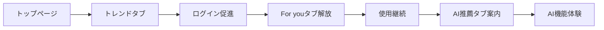
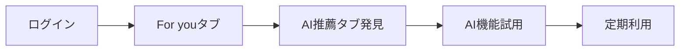

# タブレイアウト比較設計書

## 1. タブ配置の最終設計

### 1.1 確定したタブ順序
```
📈 トレンド | 👤 For you | 🤖 AI推薦 | 📚 記事 | 📖 本 | 💬 スクラップ
```

### 1.2 各タブの役割と違い

| タブ | アイコン | 対象ユーザー | コンテンツ | 主な機能 |
|------|----------|--------------|------------|----------|
| **トレンド** | 📈 | 全ユーザー | 人気・話題のコンテンツ | リアルタイムランキング |
| **For you** | 👤 | ログインユーザー | 基本的なパーソナライズ | 履歴・フォロー・いいね基準 |
| **AI推薦** | 🤖 | ログインユーザー | 高度なAI推薦 | 機械学習による深い分析 |
| **記事** | 📚 | 全ユーザー | すべての記事 | フィルタ・検索 |
| **本** | 📖 | 全ユーザー | すべての書籍 | 有料/無料フィルタ |
| **スクラップ** | 💬 | 全ユーザー | ディスカッション | Open/Closedフィルタ |

## 2. 「For you」と「AI推薦」の明確な差別化

### 2.1 For you タブ
```tsx
// components/Tabs/ForYouTab.tsx
export const ForYouTab: React.FC = () => {
  return (
    <div className="foryou-tab">
      <div className="foryou-header">
        <h2>For you</h2>
        <p>あなたの活動に基づくコンテンツ</p>
      </div>

      <div className="foryou-sections">
        {/* フォローユーザーの最新記事 */}
        <section className="following-content">
          <h3>フォロー中のユーザー</h3>
          <FollowingUserArticles />
        </section>

        {/* いいねした記事の関連 */}
        <section className="related-to-likes">
          <h3>いいねした記事の関連</h3>
          <RelatedToLikedArticles />
        </section>

        {/* 最近読んだトピック */}
        <section className="recent-topics">
          <h3>最近のトピック</h3>
          <RecentTopicArticles />
        </section>

        {/* 保存した記事の続き */}
        <section className="continue-reading">
          <h3>読みかけの記事</h3>
          <ContinueReadingList />
        </section>
      </div>
    </div>
  );
};
```

### 2.2 AI推薦タブ
```tsx
// components/Tabs/AIRecommendationsTab.tsx
export const AIRecommendationsTab: React.FC = () => {
  return (
    <div className="ai-recommendations-tab">
      <div className="ai-header">
        <div className="ai-branding">
          <Bot size={24} className="ai-icon" />
          <h2>AI推薦</h2>
          <span className="badge-new">NEW</span>
        </div>
        <p>機械学習による高度な推薦</p>
      </div>

      <div className="ai-features">
        {/* AIスマートピック */}
        <section className="ai-smart-picks">
          <h3>🧠 AIスマートピック</h3>
          <p>複数の要因を分析した最適な推薦</p>
          <AISmartPicks />
        </section>

        {/* スキル成長支援 */}
        <section className="skill-growth">
          <h3>📈 スキル成長パス</h3>
          <p>現在のレベルから次のステップへ</p>
          <SkillGrowthRecommendations />
        </section>

        {/* 新分野の発見 */}
        <section className="discovery">
          <h3>💡 新しい発見</h3>
          <p>あなたの可能性を広げる分野</p>
          <DiscoveryRecommendations />
        </section>

        {/* トレンド予測 */}
        <section className="trend-prediction">
          <h3>⚡ トレンド予測</h3>
          <p>これから話題になるトピック</p>
          <TrendPredictions />
        </section>
      </div>
    </div>
  );
};
```

## 3. 視覚的な差別化

### 3.1 タブのスタイリング

```scss
// styles/tabs.scss

.tabs-nav {
  display: flex;
  gap: 8px;
  padding: 16px;
  border-bottom: 1px solid #e5e7eb;
  
  .tab-button {
    padding: 8px 16px;
    border-radius: 8px;
    transition: all 0.2s ease;
    
    &:hover {
      background: #f3f4f6;
    }
    
    &.active {
      background: #2563eb;
      color: white;
    }
    
    // トレンドタブ
    &[data-tab="trending"] {
      &.active {
        background: #ff6b6b;
      }
    }
    
    // For youタブ
    &[data-tab="foryou"] {
      &.active {
        background: #4ecdc4;
      }
    }
    
    // AI推薦タブ - 特別な装飾
    &[data-tab="ai-recommendations"] {
      position: relative;
      
      // グラデーション背景
      &.active {
        background: linear-gradient(135deg, #667eea 0%, #764ba2 100%);
        box-shadow: 0 2px 10px rgba(102, 126, 234, 0.3);
      }
      
      // NEWバッジ
      .badge-new {
        position: absolute;
        top: -8px;
        right: -8px;
        background: #10b981;
        color: white;
        font-size: 10px;
        font-weight: bold;
        padding: 2px 6px;
        border-radius: 4px;
        animation: pulse 2s ease-in-out infinite;
      }
      
      // AI絵文字のアニメーション
      .ai-emoji {
        display: inline-block;
        animation: robot-blink 3s ease-in-out infinite;
      }
    }
  }
}

@keyframes pulse {
  0%, 100% { transform: scale(1); }
  50% { transform: scale(1.05); }
}

@keyframes robot-blink {
  0%, 90%, 100% { opacity: 1; }
  95% { opacity: 0.5; }
}
```

## 4. レスポンシブ対応

### 4.1 デスクトップ（1200px以上）
```
📈 トレンド | 👤 For you | 🤖 AI推薦 | 📚 記事 | 📖 本 | 💬 スクラップ
```

### 4.2 タブレット（768px-1199px）
```
📈 トレンド | 👤 For you | 🤖 AI推薦 | ⋯
```
- その他タブはドロップダウン

### 4.3 モバイル（767px以下）
```
📈 | 👤 | 🤖 | ⋯
```
- アイコンのみ表示
- 横スクロール可能

```tsx
// components/Tabs/ResponsiveTabs.tsx
export const ResponsiveTabs: React.FC = () => {
  const [showMore, setShowMore] = useState(false);
  const isMobile = useMediaQuery('(max-width: 767px)');
  const isTablet = useMediaQuery('(max-width: 1199px)');

  const mainTabs = ['trending', 'foryou', 'ai-recommendations'];
  const moreTabs = ['articles', 'books', 'scraps'];

  return (
    <div className="responsive-tabs">
      <div className="tabs-main">
        {mainTabs.map(tab => (
          <TabButton 
            key={tab} 
            tab={tab} 
            showLabel={!isMobile}
          />
        ))}
        
        {isTablet && (
          <button 
            className="more-button"
            onClick={() => setShowMore(!showMore)}
          >
            ⋯
          </button>
        )}
        
        {!isTablet && moreTabs.map(tab => (
          <TabButton key={tab} tab={tab} />
        ))}
      </div>
      
      {showMore && isTablet && (
        <div className="tabs-dropdown">
          {moreTabs.map(tab => (
            <TabButton key={tab} tab={tab} />
          ))}
        </div>
      )}
    </div>
  );
};
```

## 5. ユーザーフロー

### 5.1 新規ユーザーの体験


### 5.2 既存ユーザーの体験


## 6. A/Bテスト計画

### 6.1 テストパターン

| パターン | タブ順序 | 仮説 |
|----------|----------|------|
| A（現行） | トレンド → For you → AI推薦 | 段階的な体験 |
| B | トレンド → AI推薦 → For you | AI機能の強調 |
| C | AI推薦 → トレンド → For you | AI機能の最優先 |

### 6.2 測定指標
- タブクリック率
- 滞在時間
- エンゲージメント率
- コンバージョン率
- リテンション率

---

*最終更新: 2025-09-05*
*バージョン: 1.0.0*